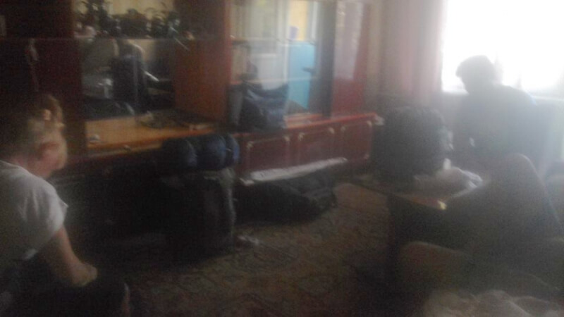
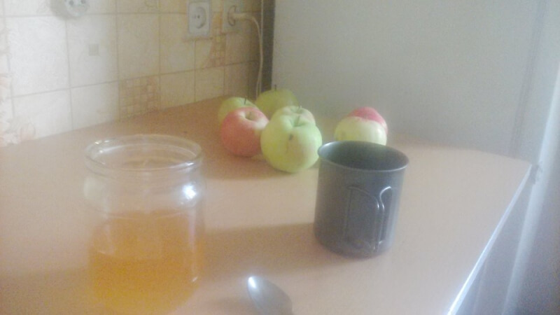
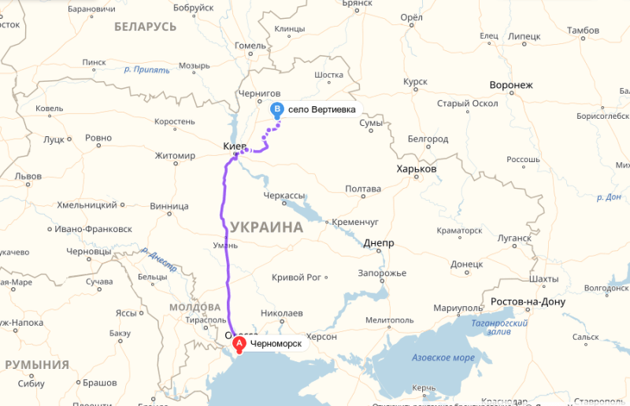
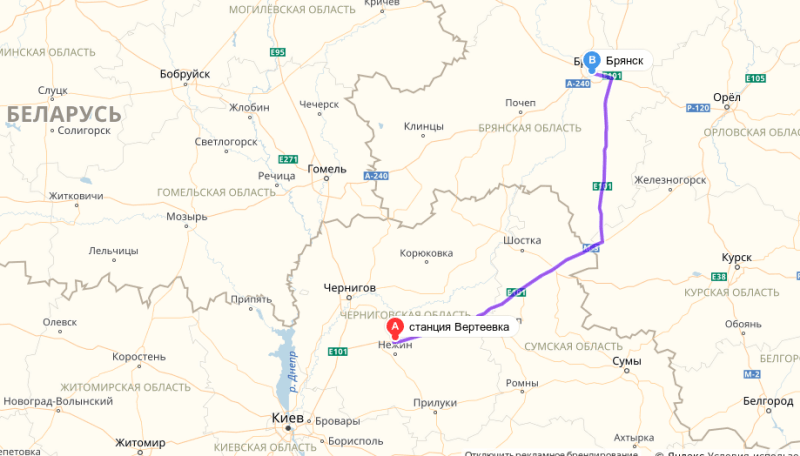
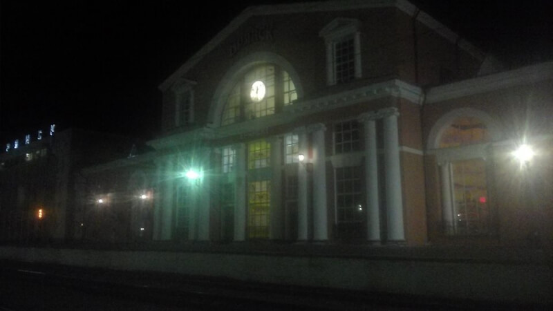

## Черноморск – Одесса – Киев – Вертиевка – Брянск

### 19 августа 2018, день первый.

Собирался не как всегда. Сложности вызывали накопленные оседлой жизнью вещи и необходимость съехать со снимаемой квартиры.

Распределил вещи, которые отправляю родителям с Леной и вещи первой необходимости, которые поедут с Оксаной в Киев. Дважды перепаковывал рюкзаки на отправку, чтобы утрамбовать все. И без доп. пакетов, понятно, не обошлось.

Но всё когда-нибудь заканчивается. 19 августа, на яблочный спас, плотно позавтракали остатками еды из холодильника, распихали постельное, слегка собрали мусор и в путь.

Сложили баулы на Нептуне – остановке 25-й маршрутки в Черноморске. Пока народ скучал на остановке, я быстро сходил к Сане, закинул ключи от хаты. Сначала посадили Лену с Валиком на 25-ку до жд, а потом погрузились на 70-ку сами. Выкинул остатки шмоток с Оксаной на 7-м небе и поехал, уже в одиночестве, на автовокзал Одессы.

У зазывалы узнал, где стоит маршрутка на Киев. Водила сказал, что места остались только по билетам и ехать придется на следующей, а времени впритык. Еще раз спросил водителя про места, рассказал о своих переживаниях не успеть на электричку. Он, внезапно, принял мои переживания и сам распереживался. Но мест то не было, хотя, я надеялся уболтать его на стоячее место. Подошло время отправления и, о фортуна, один билет не пришел! Водила меня берет независимо от очереди, я сажусь и надеюсь, что билет не явится в последнюю минуту. Все обошлось – еду в Киев!

Выезжал по жаре. Пока суетились, наверное целый литр воды с меня пОтом сошел! По дороге в Киев пару раз попали в немаленький дождь. А я уж и забыл, что кроме солнца и жары бывает другая погода. Вспоминаю, что палатку упаковал на самое дно! Ладно, разберемся.

В Киеве все привычно: с авто на жд вокзал – на метро, взял билет на электричку, съел пару беляшей и пошел на платформу ждать свой поезд. Подошла электричка, тронулись. Местность по дороге тоже знакомая – ехал спокойно и обдумывал варианты похода.

В Вертиевку приехал в 8 вечера. От электрички местные таксисты и встречающие очень быстро растащили почти всех пассажиров. И вот я иду по деревне в сторону трассы на первый в этом путешествии автостоп. По дороге, в одном из дворов, попросил водички, уточнил дорогу до трассы. Иду.

Вот и трасса. Только что-то она не очень соответствует моим ожиданиям и воспоминаниям 3-летней давности: узкая, раздолбанная, а местами совсем без покрытия дорога. Оказалось, что это трасса, да не та – эта ведет на Чернигов. Здесь я ловлю стремную машину, которая остановилась метров через 300. Я даже подумал, что они просто стали по своим делам, а когда проходил мимо, тогда и узнал, что они ждут меня. Короче, довезли до перекрестка – километра 2-3. Вот и мой первый стоп – с почином!

На трассе постопил с полчаса. Результата нет. Пошел на заправку, купил водички. Посидел, попил. Решил одеться – здесь не Одесса, вечером прохладно. Одел флиску и светоотражающий жилет. Нацепил на лоб фонарь. Стою, стоплю. Трафик все меньше, сил тоже. Часа в 22 решил забить на это дело и лечь спать.

Смотрю на подозрительно пасмурное небо, вспоминаю о палатке, утрамбованной на самое дно рюкзака и решаю спать на остановке, чтобы не перетряхивать вещи. А спальник сверху был.

Место не шибко удобное, зато безопасное на случай дождя. Машины слишком близко – шумно и ярко. Натянул капюшон спальника на глаза и одной проблемой стало меньше. Среди ночи, слышу, мимо остановки шаги пешеходов. Странно – до населенки далеко, автобусов нет... Высунул нос, смотрю: на перекрестке пара коллег пытается застопить. Тоже с фонарями ))) Мысленно желаю им удачи и проваливаюсь в сон. Периодически просыпаюсь от шума фур и смотрю на своих соседей: стоят, работают. Через какое-то время слышу шаги уже в другую сторону и решаю, что коллеги решили сменить позицию или, что вероятнее, как и я забить стопить в этом гиблом месте ночью и ждать утра.

### 20 августа 2018, день второй.

Проснулся на рассвете – спалось так себе. Утрамбовал рюкзак под взглядами гайцов, которые уже вышли на утреннюю зорьку. Отошел от них подальше и увидел палаточку вчерашних соседей – они, в отличие от меня, правильно палатку упаковали.

Стою, стоплю. Возле поля растут дикие яблони с гигантскими яблоками. Не удержался – спустился в кювет за парочкой. Стою, стоплю, грызу яблоки. Наконец уезжаю. До границы – полторы сотни, а местные даже не знают о ней – жесть какая-то! На 3-5 машинах доехал до последнего участка – впереди только таможня: до нее 35 км. На фургоне фольксваген едем на таможню. Мужик восхищается моими планами. Договариваемся на то, что на обратном пути расскажу о впечатлениях )))

Таможня. Быстро прохожу Украину. Обливаясь потом на дневной жаре, заполняю декларацию на Россию, прохожу. Все, первая граница пройдена. Убираю из кармана остатки украинской валюты, достаю поближе российскую.

Стою, стоплю. Машин на выходе мало, большинство переполнено. Долго... Пытаюсь привлечь к себе внимание жестикуляцией. Наконец, сработало! Остановилась машина с московскими номерами. Таки да – едет до Москвы, а мне то всего до Брянска! Удачка, однако!

Под Брянском десантируюсь на знакомой развязке, сворачиваю на знакомый съезд, спускаюсь. На узком съезде на обочине на травке сидит, спиной к трассе, барышня, которую принимаю за коллегу автостопщицу, типа упаковывается. Издали приветствую. Она разворачивается и сообщает что ей совершенно необходима моя помощь. Ну что ж, подхожу. Никакая она не коллега – пьяненькая, с миллионом пакованов, пытается собраться с духом и хотя бы встать. И проникновенным голосом интересуется, в какой стороне Москва и реально ли туда добраться. Успокаиваю, ориентирую ее в сторону местной столицы, иду дальше. С развязки спустился на знакомую дорогу – до города 9 км. Ловлю маршрутку, водила не очень просил денег, договорились. Еду бесплатно до автовокзала.

Всё, я в Брянске!

