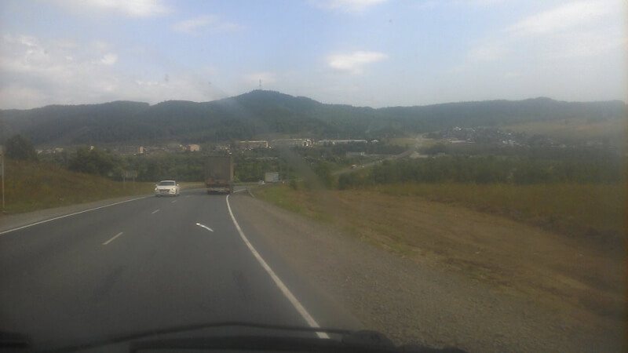
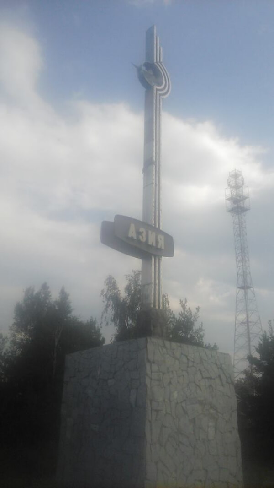

## Уфа – Миасс

### 30 августа 2018, день 12.

На ночь выключал телефон для экономии заряда. Так что проснулся не по времени, а по солнцу. Вышел на трассу. На ладе калине доехал до следующей развязки по объездной Уфы. Водитель – бледная девушка, у которой трое детей (не в машине))), которую бросил муж и она НИКОГДА не берет попутчиков, т.к. ужасно их боится. Я утвердил ее в этих страхах, заявив, что я очень опасен, а причинять ей вред начну, когда наши цели перестанут совпадать. Странно, но вполне благополучно вышел на очередной развязке.

В общем, по развязкам пробирался долго и мучительно. Перед одним из подъемов после развязки, прям внизу (я только примерялся к затяжному подъему по жаре) остановился мужичек. Он опередил меня вопросом: "Знаешь, как проехать в Салават?". Я, конечно, не оплошал и, уже садясь в машину, говорю: "Сейчас найдем", и, заодно, ставлю его перед фактом, что едем мы вместе. Ну, по дороге нашел на карте искомый город и повел мужичка по маршруту. Проехал километров 7 до очередной развязки.

Был парень, который очень уважает нашего брата, всегда везет по трассе, но сам не может вырваться из диктата семьи и страдает от этого.

Другой паренек тоже много лет планирует поехать на Байкал, но текучка никак не отпускает. Заразил его идеей делать всё и сейчас!

В общем, с очередной развязки еду на газели до Миасса! Водитель, Иван, очень общительный. Рассказал о южном Урале, через который мы ехали. Есть здесь и горы, и горные реки, и водопады, и сотни озер, в т.ч. соленые... Нет только моря ((( Услышал от него поговорку дальнобойщика: "Лучше северный Кавказ, чем южный Урал". Это из-за затяжных спусков и подъемов, часто длинной в десятки км. Показал гиблые места, на которых происходит большая часть аварий.

Высадил на перевале, где установлен знак, разделяющий Европу и Азию. Здесь, типа, проще, т.к. не надо въезжать в город, а ловить проходных.

Вот здесь я и залип! Проблема в том, что, как рассказал Иван, в Челябинской области еще есть дорожные банды и пару недель назад одну такую взяли. Вот я и переживаю, чтоб водители не принимали меня за члена такой банды. Остановилось всего машины 3, и все идут в Челябинск, а я, таки, хотел найти проходной на Курган/Омск. Дальнобои, что останавливались на отстой по хронографу, тоже ехали не туда, куда я стремился.

Понемногу начало тянуть тучи с гор, потом и гроза подтянулась. Стоял до последнего, пока не полило как из ведра. Под навесом неработающей заправки переоделся в штормовые шмотки. В перерывах, когда ливень снижал напор просто до сильного дождя, выходил стопить, как Вам уже понятно, неудачно.

Решил сделать перерыв, отвлечься, перестроиться, передохнуть, а, заодно, и перекусить. Короче, в кафешке взял еды, подогретой в микроволновке, и смотрел Симпсонов на гигантском, метра 2 по диагонали, ЭЛТ телеке!

Начало смеркаться, хотя дождик и ослаб до умеренного. Прошло пару машин, а потом со встречки ко мне вырулила жига шестерка. Водитель спросил куда мне нужно (я сказал стандартный маршрут до Кургана, Омска), уточнил, в состоянии ли я заправить машину. Я, соответственно, ответил, что еду издалека и еще дальше оговоренного маршрута. Он поинтересовался откуда и куда. И что, говорит, все бесплатно? Ну да, говорю. Он очень засомневался – это человек, который все переводит в деньги. В общем, спасибо, говорю, я так не поеду. Он сразу понял и поехал. Очередной таксист, подумал я.

Таксист сдал задним ходом, вышел, открыл багажник, говорит, поехали так. Прикольно! Я только переживал, чтобы он не завез меня в Миасс или Челябинск и чтоб мне ночью оттуда не пришлось выбираться. Спрашиваю, куда едем? Говорит, что он едет, а меня по пути. Я уточняю, по какому таки пути? Говорит, ну ты же говорил Курган, Омск – вот туда и поедем!

Я малость офигел – таксист, а везет "по пути" на 350-800км!!! Круто! А он решил еще меня добить. «Что бы ты, говорит, делал, если бы была машина не в Омск, а в Новосибирск — это же по пути на Байкал?» Это, говорю, было бы идеально! «Так я и еду в Новосибирск!»

Вот так мы и поехали.