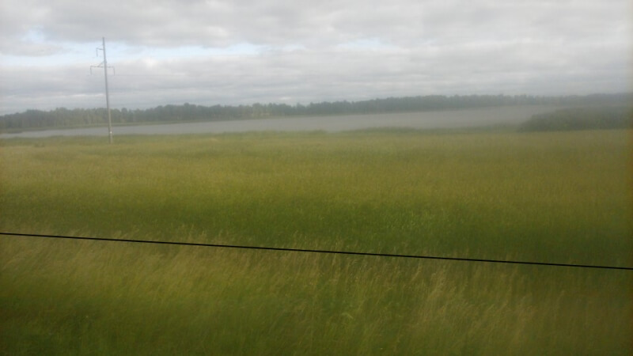
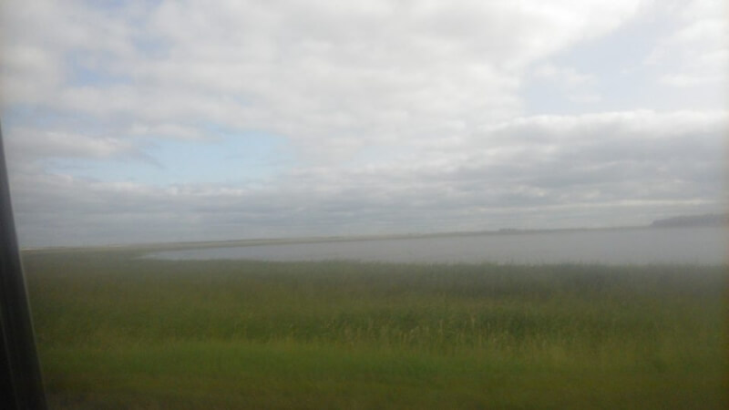
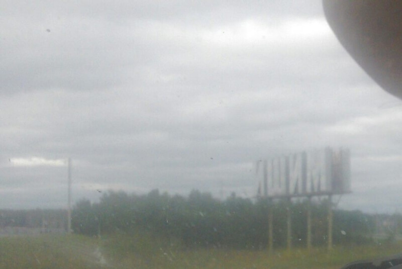
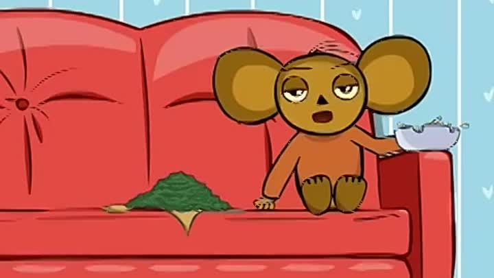
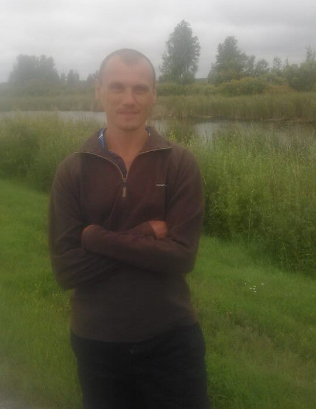
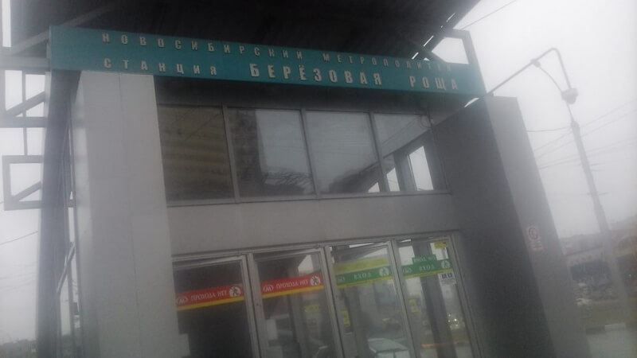
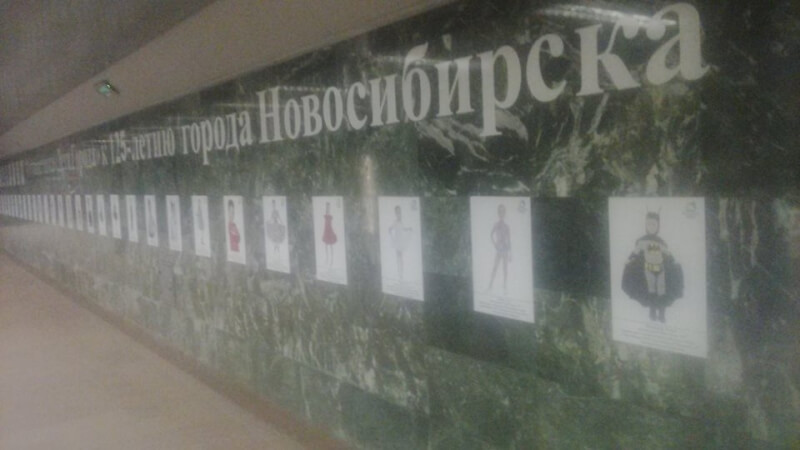

## Миасс – Челябинск – Курган – Ишим – Омск – Новосибирск

### 30 августа – 1 сентября 2018, дни 12-14.

В общем, еду с таксистом на жигули шестерке от знака начала Азии (80 км не доезжая Миасса), типа, в Новосибирск. Почему типа? Странная поездка получилась!

Водитель оказался забайкальским цыганом. А цыган, хоть и забайкальский, но выцыганит хоть что-то! Короче, начал топить, что довез бы меня, да ехать до Новосибирска не может, т.к. денег на топливо не хватает. На дорогу примерно надо 4,5 бака по 40 л, при цене 92-го – 40 руб/л, я насчитал 7200 руб. Цыган же хотел моего участия в 2 тыс. руб – с меня примерно 1 руб/км, что совсем неплохо. Я конечно же согласился: шутка ли, 2 тыс. км без пересадок, ожиданий, объездов городов! Тут понятно, что у цыгана, скорее всего, денег до дому хватило бы, но цыганская натура... Кроме того, были опасения, как бы не кинул и довез хотя бы до Омска. Но риск – благородное дело, а, кроме того, я бы такую сумму проел/пропил бы, пока добрался до Новосиба.

В общем, едем! Цыган рассказал, как он подобрал меня. Ехал он уже сутки, увидел меня, но проехал мимо. Потом вернулся (вот почему он вырулил со встречной полосы). Хотел подзаработать, но как узнал, куда я направляюсь, то сам обалдел и понял, что это судьба!

Подсел я к нему уже когда смеркалось. Проехали Миасс, Челябинск, и километров 150 в сторону Кургана. Перекусили в кафешке и решили остановиться поспать (уже было за полночь).

Утром, часов в 9, тронулись в путь. Но выспались мы так себе. Цыган вообще засыпал за рулем! Заехали попить кофе и позавтракать, потом, в другой кафешке, он принял холодный душ, потом заехали попить чаю... В общем, почти каждый час останавливались.

А природа вокруг постоянно менялась: до Челябинска были горы, до Кургана леса, а потом пошли болота и озера. Просто тысячи озер! Сначала среди леса, потом уже в степи. Очень красиво: море травы, а среди нее без всяких переходов – озеро, будто в траве вырезали дыру и заполнили водой. Причем, в пределах видимости их было с десяток!

На Омск ехали через Ишим. Через Петропавловск было бы на 250 км короче, а это 3 часа, что в нашем утомленном состоянии было очень много! Но прохождение таможни – это время, а, кроме того, на машину казахи требуют оформлять страховку даже с учетом того, что мы находились бы в Казахстане всего часа два; ну и дороги там похуже. В общем, едем в объезд, к тому же, "все так ездят!".

Не доезжая Кургана, закончился бензин. Заглохли как раз на объезде ремонта дороги. Цыган быстро поймал газон, который дотащил нас до заправки. Я уже здесь понял, что, если я хочу доехать до цели, то цыгана нужно контролировать не только, чтоб он не заснул, но и по расходу топлива. Прикинул по расстоянию, что за Ишимом нужно искать заправку.

Но что-то пошло не так. Я уже начал присматривать заправку, как нас остановили гайцы за непристегнутые ремни. Смотрю, а рядом заправка. Думаю, что сейчас цыган с инспектором разойдется и тогда заедем заправиться. А сам уже тоже периодически присыпаю. В общем, как в мульте "Гена НА": пока тронулись, я уж и забыл что заправка нужна. Через пару километров вспомнил и, чтобы снова не забыть, стал приговаривать, заправка-заправка-заправка... Но заправки все как то вдруг закончились. В общем, опять заглохли напротив какой-то деревни.

Начинало смеркаться. Цыган пытался голосовать, но без результата. Похохотали, что он тоже стал немного автостопером ))) Но смех смехом, а на улице холодно, темнеет, машины не останавливают, а мы стоим с пустым баком. Цыган замерз, забрался в кабину и предложил мне поголосовать. Я, конечно, попробовал больше для его успокоения, т.к. понимал, что это почти безнадежно: машин мало, в основном фуры, которые и бензина не сольют и на буксир не возьмут. К тому же сумерки – самое гнилое время для автостопа. Предложил сходить в деревню, спросить местных. Но, как известно, инициатива наказуема.

В общем иду я с канистрой от антифриза в деревню. Вижу, рядом база дорожных рабочих: техника, бытовки. Решил сначала зайти туда. У первого паренька спрашиваю, где можно бензином разжиться? Вон, говорит, ЗИЛ стоит. Кидай шланг в бак и цеди. "А по шапке не дадут?", – спрашиваю. Не знаю, говорит. Понял, что пацаны здесь правильные и я продолжил поиски. У другого мужичка спросил, кто мне может с бензом помочь, он направил к автобусу, ПАЗику. Подошел, спросил. Водила выдал баклаху с пятью литрами так необходимого нам топлива. Безвозмездно! Поблагодарил, пошел назад.

Уже спокойные, перелили топливо в бак, поехали. 5 литров, говорит цыган, хватает на 60-65 км, но заправиться надо по-любому! Едем, а заправок нет! Наконец нашли какую-то стремную, для грузовиков, но бенз там тоже был. Цыган вставил пистолет и пошел на кассу. Я уж и расслабился: думаю, зальет литров 5, а потом на газпромовской (у него там карта была) дольем до полного. Отъезжаем и... Через пару км глохнем!!! Оказалось, цыган решил, что топлива нам хватит еще километров на 30, заправок будет много, так что заправимся на нормальной. Как же он ругал себя, волосы на голове рвал! В общем, в голой степи, стоим уже в темноте. Я стал замерзать даже в машине, а цыган мерз на очень сильном ветру снаружи. Но нам опять повезло: парни на ладе 9-ке развернулись со встречки и дотянули до следующей заправки на буксире. Тут уж мы сначала налили 5 литров в канистру, долили в бак еще 5 литров и поехали к газпромовской, которая была напротив.

А усталость уже такая, что стали появляться галлюцинации. Дальше описал то, что вспомнилось.

Ишим. После кафешки видел кикимору вполне реальную. Маскировалась в заваленном дереве. Подошла вплотную к трассе, руки в боки, заглядывает в проезжающие машины. Уверен, если вернуться к тому дереву, ее там уже не будет (я считал, что она нас уже приметила и второй раз не покажется).

Видел машину, маневрирующую поперек нашей полосы. Поднял тревогу: цыган – тот уже почти никакой. Присмотрелись – там ничего. Но адреналин дал заряд бодрости минут на 15.

Видел водопады, в которых вместо воды текли и падали с высоты березы.

Уже ночью обнаружил, что крыша машины стала прозрачной: видел звездное небо сквозь крышу, узнавал знакомые созвездия. Причем, я прекрасно понимал, что это – галлюцинация, но она не уходила, даже когда я в упор разглядывал детали.

Уже на рассвете говорю, что чувствую себя почти в норме, только вот стаи птиц над деревьями кружат. Цыган говорит, что норм, он их тоже видит. Но что-то в них было не так. Начал присматриваться: приметил вдалеке дерево с птицами и жду, когда ближе подъедем, чтобы узнать что за птицы там. Но когда подъезжали, над деревом, с которого я не спускал глаз, никого не было, а вдалеке все равно кружили птицы. Причем, момента исчезновения я не замечал. Эта галлюцинация была самая долгая – часа полтора.

Про дорогу. В полночь заехали в Омск к какому-то местному авторитету забрать телефон, заправились. Состояние ужасное – каждые полчаса останавливаемся попрыгать, побегать, померзнуть, чтобы слегка взбодриться. Предложил остановиться поспать. Но завтра – 1 сентября, у цыгана четверо детей и ему к 12-ти в школу хочется пойти. Делаю примерный расчет: сейчас 2 ночи, ехать 650 км, скорость в таком состоянии около 80 км/час, значит ехать часов 8. Если прибавить остановки на чай, на попрыгать, то приедем не раньше 12-ти. Но мы уже с трудом не засыпаем. Нет, не так – с трудом просыпаемся!!! Я считал, что нереально ехать без остановки, цыган настаивал на том, что ехать надо. Порешили, если совсем невмоготу будет, станем.

Едем. Сквозь галлюцинации пытаюсь следить по капоту машины за направлением. Цыган уже совсем невменяемый, поэтому каждые минут 20 кричу, когда вижу, что уже едем на обочину. Кроме того, слежу в зеркало, чтобы сзади было чисто, а то, когда цыган просыпается, то от рывка машину тоже дергает в сторону, что может стать "предпосылкой к дорожному происшествию". Периодически смотрю, открыты ли у него глаза, прошу его спеть, а то мои разговоры его убаюкивать стали. А поёт цыган знатно!!! Он столько песен знает! В основном, народные. Пел и украинские, которых я и не знаю. А когда он поет, я почти спокоен: даже позволяю себе отключиться на пару секунд.

Едем, поём, прыгаем, пьем чай. В пути приговариваю: "не спишь?", "с обочины съедь", "держи дорогу". Прыгаем, пьем чай, едем, поём... Ночь казалась бесконечной! Хотя и день тоже не особо быстро прошел.

В общем, доехали до Новосибирска! Цыган довез меня до метро, мы попрощались и я поехал в хостел отсыпаться, отмываться, стираться. Чем и занимался до конца дня, 1 сентября.

