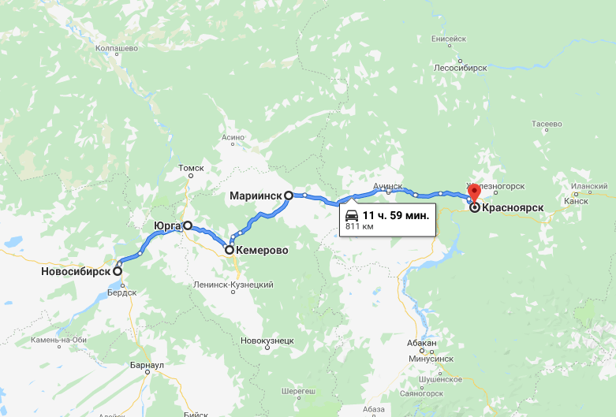

## Новосибирск – Кемерово – Красноярск

### 3 сентября 2018, день 16.

День был дождливый. Выезжал из Новосибирска на метро и маршрутке. Вышел на трассу. Ждал долго – час-полтора. Мужчина с женщиной, брат и сестра, провезли километров 100 – ехали на кладбище – их маме 90 лет. Угостили меня поминальным пончиком, помидором, конфетами. Припрятал их до худших времен. Потом с мужичком на Ниве доехал до какой-то деревни. У него узнал, что объездной вокруг Кемерово нет и можно смело въезжать в город. Тут застопил междугородний автобус как раз до Кемерово. Приехал на автовокзал, в справочной узнал, как выехать на трассу, купил билет до Мариинского поворота. Пока ждал автобус, перекусил сосиской в тесте. Поехал.

С поворота проехал на веселой 9-ке еще километров 100. Машина полная + ребенок в детском кресле + меня еще усадили. Из пассажиров: парень в армейской пилотке со звездой, девушка Катя, ребенок Наташа. Гнали быстро, громко слушали музыку. Наташа под музыку и уснула. В придорожном кафе они остались, я пошел стопить дальше.

Вечерело, холодало, дождь продолжался. Долго стоял безрезультатно. Хотелось выехать хотя бы за Мариинск, чтобы завтра не тратить время на его прохождение. Наконец, остановил ленд крузёра с госномером 100. Рассказал о своих намерениях ехать в сторону Красноярска. Поехали, я поинтересовался, куда едет мой попутчик. Говорит, до Мариинска. Ну ок, пойдет!

Сначала поспорили насчет политики Украины и России, да так, что он намеревался меня высадить ночью в неудобном месте – в отместку. Сгладил. Проехали точку показательной высадки, проехали Мариинск... Разговорились. Водитель оказался моим тезкой, увлекается альтернативной историей, большей частью России. Для поиска артефактов ездит по стране, организует экспедиции. Рассказал много неожиданных вещей. Домой приеду, разберусь подробнее.

Оказалось, что едем мы в Красноярск. Сергей, водитель круизера, оказывается, уже видел меня на трассе от Новосибирска, так что, говорит, судьба нам вместе ехать. Я заметил, что он уже начал уставать: жмурит и трет глаза, чтобы не засыпать. Памятуя цыгана (см. дни 12-14), пару раз, на поворотах, проверил его реакцию – пока норма, не вмешиваюсь. Под Ачинском наблюдали красивое зарево над алюминиевым комбинатом.

Заехали в кафе, поужинали. До Красноярска 200 км. Я начинаю прикидывать варианты ночевки ночью в незнакомом городе. На улице идет немаленький дождь, так что палатка – не самый лучший вариант – ее пока поставишь, весь промокнешь.

Заезжаем в Красноярск. Серега довозит до дорожной гостиницы, проверяет, что я заселяюсь и только потом уезжает.

Шестиместный номер стоит 750 руб и включает завтрак. В номере кроме меня никого – зачем платить больше?))) Уже полпервого ночи, так что сразу спать.

