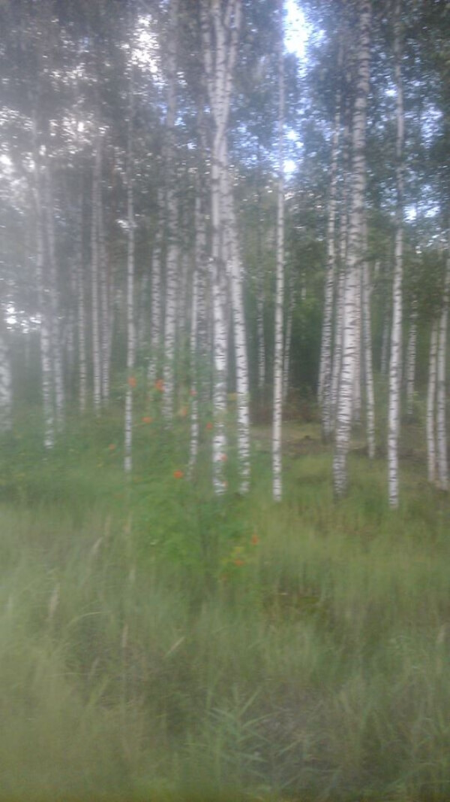
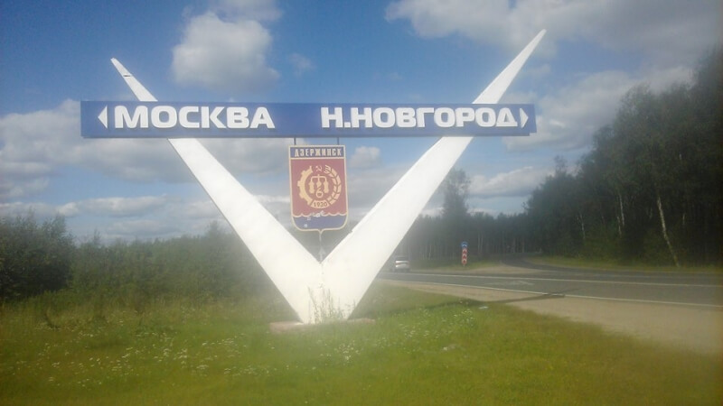
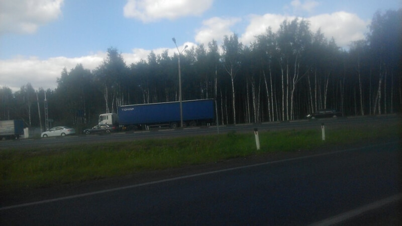

## Брянск – Москва – Владимир – Казань

### 20-23 августа 2018, дни 2-5.

Брянск. Здесь живут дорогие для меня люди! Сколько эмоций, сколько слов, разговоры ночи напролет (целых две). Но счастье не может быть вечным. Немного слёз, много теплых слов... Завтра в путь. Заснули на рассвете. Проснулся в 7 утра 22 августа. Решили еще поспать. Проснулся в 9 утра. Поздно... но можно.

Оделся, почистил зубы, взял упакованный вечером рюкзак. Его вчера всем миром паковали, такой себе аттракцион устроили ))) Не забыл и палатку сверху положить – вероятность дождей здесь поболее будет!

На завтрак тратить время уж жалко. Перекушу по пути.

Маршрутка до автовокзала, какая-то лепешка на рынке, еще маршрутка до выезда на трассу.

Вот и трасса М5 на Москву.

Стою, стоплю. Ничего – волну то пропустил (((

Зашел на заправку, купил водички. Попил.

Стою стоплю – нет волны!

Долго... Часа два. Взгляд то замылило уже – машины почти не распознаю, машу уж почти как тюлень. Нет не тюлень! Иногда просыпается сознание и пытаюсь стопить осознанно с применением тех. приемов.

Останавливается машина. Опознаю в ней такси. Яндекс-такси. Водила опускает окошко и интересуется куда мне. Чтобы быстро отшить, говорю, что в Москву (что-то около 500 км). Говорит: поехали. Интересуюсь, сколько денег хочет. Говорит, сочтемся. Странно всё это и разговор тоже странный. Сам то уж считаю пропущенные из-за него машины и подсчитываю вероятность моей поездки с ними. Чтобы окончательно отбить у него желание, говорю, что денег столько у меня нет. Говорит, садись так. Окончательно офигевший, сажусь. Познакомились – моего драйвера до Москвы звать Иваном. Он вез клиента из Внуковского аэропорта до Брянска, а теперь назад надо. По месту, заказов на Москву не нашлось и пришлось идти порожнем. Говорит, что до такси работал на авиазаводе. Но на Сирию заказы уменьшились и его сократили. Пошел в таксисты. Я тоже какие-то истории рассказывал... Короче, договорились, что сперва заедем в Пушкино: он заплатит аренду за машину, а потом он едет дорабатывать день и закинет меня куда нибудь. А неплохая идея то!

Едем, болтаем, восхищаемся пейзажами (он астраханский, а в Москве вся природа из камня), хохочем над дорожными сценками.

Для экономии, Иван построил маршрут в объезд платных магистралей. Погнали по селам, грунтовкам – стало еще веселей! В каком-то селе нашли дорожную столовку: кухня домашняя, сервис советский. "Девушка, дайте счет!", "Двести рублей с каждого, кричит она из кухни, сами несите, у меня руки грязные!".

Иван наотрез отказался чтобы я платил, да еще оба несъеденных пирожка завернул в салфетку мне в дорогу! Едем, болтаем, хохочем.

Но устал то он нормально – тыщу за полдня покрыть! Просит присматривать за ним, чтоб не уснул. Пытаемся разговорами прогнать сонливость. Для верности, решили заехать на мойку: и машину в порядок привести (по проселкам запылились) и самим проветриться, размяться. Тут уж я настоял и угощал кофе. Вроде попустило. Едем дальше.

Вот и Москва начинается. Пытаемся согласовать маршрут — вторая половина дня, наши планы немного меняются. Я то планировал в центр заехать: есть там знатная чебуречная – одна такая на всю Москву! Но поели мы нормально. И я решил не терять время – из Москвы то нелегко выбраться!

Высаживаюсь в районе Таганской. Иван еще поллитруху воды в дорогу дал – думаю, пригодится. Интеллигентного вида мужчину спрашиваю о проезде к Шоссе Энтузиастов. Заодно обсуждаем, является ли эта точка самой удаленной от центра. Решаем что таки да) Метро. Переход на Третьяковской. Мой выход – Шоссе Энтузиастов.

Как и прошлый раз, перепутал, на какую сторону выходить из метро. Надо идти не на Измайловскую!!! Она должна быть через дорогу!!! Перешел. На всякий случай уточнил, в какую сторону мне на Казань идти: да, не на автобусе. Пешком? Да! Ой нет, автостопом! Удивились, но направление уточнил!

Жутко сложная разметка. Разобрался, вылез почти на центр трассы, но место правильное – я не нарушаю и стою на безопасном островке. Вспоминаю, почему из трех полос все почему-то идут на самую дальнюю от меня. С грустью стоплю оставшийся на моей полосе жидкий трафик. Снова такси и снова бесплатно! До Балашихи, километров 30. Таксист подсказал место, откуда многие пытаются уехать, я согласился на него.

Здесь уже стал замерзать. Натянул флиску, светоотражающую жилетку. Стою, стоплю. Долго, с полчаса. Темно уж стало. Останавливается машина. Парень спросил меня, где въезд на заправку. Я показал назад, что он уже ее проехал. Но это Москва! Здесь проще доехать до следующей, чем вернуться назад. Я в свою очередь вписался к нему попутчиком. Парень явно мыслями где-то очень не здесь, но он автоматом кивнул, а я не заставил себя ждать )))

Нашли заправку, напоили машинку. Где-то здесь парень и заметил меня. Я быстренько поинтересовался его конечной точкой маршрута – Владимир. Неплохо! Но он очень спешит. Я так и не понял, услышал ли он меня? Осмотрелся. Машина какая-то нежилая: сиденья не подогнаны, в бардачках пусто, телефон с навигатором кое-как пристроен на торпеде и постоянно падает. Короче, звать его Андрей, он из Краснодара, прилетел на день повидаться с девушкой во Владимире, машина из проката. Пытается гнать, но почти на каждом километре камеры, боится, что до Владимира так он не доедет. Телефон падает, на скорости под 200 навигатор не успевает сообщать про камеры. Предложил свои услуги штурмана: взял в руки навигатор и надиктовывал: камера 70, камера 90, чисто, камера... Периодически застревали в пробках на ремонте дорог и светофорах. Его девушка звонит, интересуется, точно ли он приезжает и ждать ли ей его. Андрей расстраивается и еще резче жмет акселератор, жалея, что машина не очень спортивная. Фоткаю на его телефон стрелку спидометра, лежащую на упоре справа. Отсылает девушке. Камера 60, чисто, камера 90, камера...

Владимир. Тут уж я мониторю, чтобы не пропустить свой поворот на объездную. Выхожу, еле успевая выхватить свой рюкзак с заднего сиденья. Полночь.

Вспоминаю это место – не очень то удобное. Надо бы за поворот пройти с километр. Взваливаю рюкзак, осматриваюсь. И тут только замечаю в пяти мерах сзади фуру. В кабине горит свет: водитель с интересом наблюдал мой десант из болида ))) На автомате делаю пару шагов к повороту. Стоп, что это я? Разворачиваюсь. Жестами объясняю водителю свои цели и намерения. Он так же жестами говорит, что наши цели вполне совпадают и я могу присоединиться к нему в кабине и уж словами уточнить детали. Забираюсь в высокую кабину – моя первая фура в этом путешествии! Едем до поворота на Муром – это где-то треть объездной – километров 10. Развязка, помнится, там гиблая: от нее километров 5 пилить до удобной позиции. Соглашаюсь на заправку перед развязкой. Выхожу, смотрю на жидкую струйку трафика. Чувствую что это реально север: пар со рта идет, градусов 10 на улице. Вспоминаю о куртке, упакованной на дно рюкзака. Замерзаю слегка. Постопил, для приличия, минут 5 и пошел в лес искать полянку, ставить палатку да спать.

Проснулся часов в 8. Спал тепло и уютно. Позавтракал пирожками, что с Иваном не доели, запил его же водичкой и на трассу.

Вот здесь и поперло! Нет, ну не сразу, а чтоб не расслаблялся, минут 20 сначала постоял. Парень на субару вывез с объездной, потом, почти сразу машина до заправки. Здесь вспоминаю, что Нижний Новгород обходить очень сложно и нужно искать проходную. Тут же вижу фуру с казанскими номерами. Водителя нет, но движок работает. Стоплю прям перед ним, чтобы сразу водилу караулить. Подошел. Да, едет на Казань, но брать наотрез отказался. Ну и ладно, иду на более удобную позицию. Он трогает, для прикола стоплю его, останавливает! Говорит, что груз очень ценный, по всей кабине датчики и до Казани никак. Сажусь с мыслью уболтать на Казань. Но чувак тухлый, даже если б уболтал, то в такую даль с ним бы тяжко было б. Довез всего лишь до Гороховца. Зато я выяснил, что объездную Нижнего достроили и уже не надо огородами пробираться. Есть  таки от него польза!

Здесь сразу сел на УАЗик буханку и от его водителя узнал многое про местную живнось, болотистоть и историчность. Приятный собеседник! От Дзержинска на фургончике доезжаю до очередной своей станции, тут же останавливает дед-металлист на оке. Дед – супер: беспалые кожаные перчатки в заклепках, такая же жилетка, меховые сидушки, на торпеде всякое барахло металюг 70х! Круто!

В городке на первом светофоре схожу. Вижу на втором светофоре двух девчонок, пытающих тюленью удачу. Осмотрелся: у меня позиция — зачёт: фильтрую внутренний трафик и юзаю только транзит. Девочки же всех подряд раздражают. Через минуту гружусь во фруктовую будку. Знакомьтесь – Славик, мой драйвер до Казани! Идет с перегрузом, на горки только на пониженной передаче заходит. Но после Нижнего это уже не мешает – полоса почти везде без обгонной и поэтому все ползут паровозиком. Славик три раза в неделю ездит этим маршрутом и до минуты рассчитывает время. Окончательно добил меня на одном из светофоров в пробке. Когда подъехали, он включил горелку сварить кофе, а допил его точно в тот момент, когда пробка закончилась: поставил пустую кружку, переключил передачу и погнали дальше! В общем со Славиком было ехать не очень быстро, зато приятно и интересно!

На подъезде к Казани созвонился с Кириловыми, чтобы уточнить, где мне лучше в город заходить (с объездной есть 3 съезда), Славик подсказал мне время прибытия – 10 вечера. Я десантируюсь на первом съезде, пытаюсь сойти хоть немного с трассы в сторону города. Но мне не дают: паренек везет меня в город. Проехал телевышку, спрашиваю про какое-нибудь приметное кафе в этом районе. «Золотая нива»? Пойдет! Вызываю такси, и я на месте!

Привет, Казань!