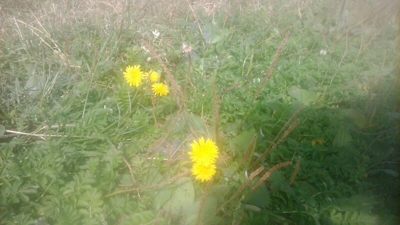
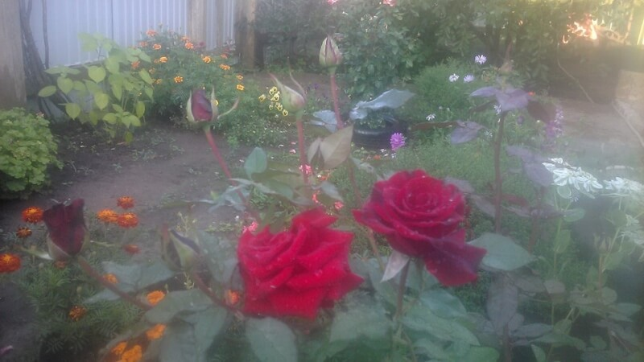
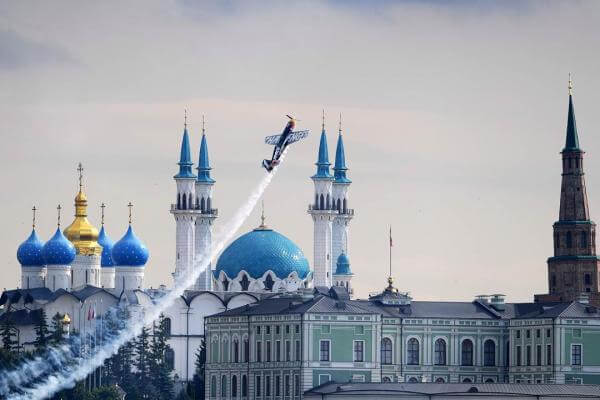

## Казань

### 24-28 августа 2018, дни 6-10

Светает на час раньше, темнеет, соответственно, позже на столько же, а время то московское!

В Казани все маршрутки убрали. Вместо них просторные, комфортабельные автобусы. Остановки объявляют на 3-х языках: русский, татарский, английский. Еще из транспорта есть троллейбус, трамвай, метро, а по Волге – паромы, катера, теплоходы.

Если собираешься топить печь дровами, то заготавливай 2 сорта: березовые и осиновые. Береза дает много жара, но, при этом от нее много жирной сажи. Поэтому, в конце топки жгут осиновые дрова – они сажи не дают и, попутно, дожигают березовую!

В конце августа еще есть вишни (а у нас еще в июне отошли!) и народ только начинает подкапывать молодой картофель.

Над Казанью часто летают боевые вертолеты и огромные стратегические бомбардировщики – здесь их строят.

Еду на Кораблестроительную, рядом с Петрушкиным разъездом. А название произошло так. Здесь были кораблестроительные верфи и канал, по которому спускали корабли. А рабочих вокруг канала возил конный трамвай, который тянула лошадь по имени Петрушка. "Ты как приехал?" "Да на Петрушке". Так и закрепилось название. Кстати, есть и памятник Петрушке.

В каждом квартале города обязательно есть одна-две пекарни с местной выпечкой, в т.ч. татарской: пироги, ватрушки, чак-чак, пачмак, бишбармак, треугольники, блинчики: сладкие, мясные, творожные, с яйцом. Все очень-мега вкусно!

Узнал, что дед Сеню в 2 года (году в 21, XX века) хотели в детдом отдать с сестрой Анной 4х лет. Детей то 6 было, прокормить тяжело. Посадили уже в повозку, повезли, а мать таки не выдержала, забрала их. И там еще мамин прадед, дед Сени дед Вакх был (имя, похоже, марийское). Решили, что уж помирать так всем вместе, чем разлучать. Как-то так.

Попал на гонки Redbull Air Race — ради них то и планировал сроки.

