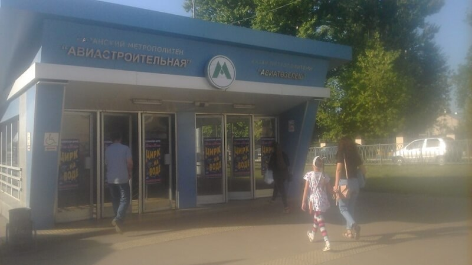
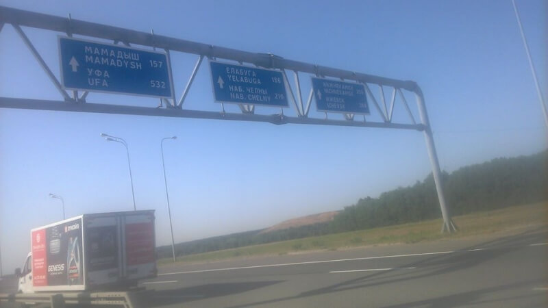

## Казань – Уфа

### 29 августа 2018, день 11.

Из Казани выезжал на метро – все-таки самый быстрый городской транспорт. Со станции "Проспект победы" на маршрутке 122 выехал до трассы М7. Дальше – обычная дорога, ничего особенного. С начинающим дальнобойщиком (ездит первый сезон и зимы еще не видел) доехал до въезда на Елабугу.

Потом, не помню уже кто, провез через город в сторону Набережных Челнов. Оттуда до Уфы с казахом-москвичем. Очень громко слушали шансон и классику. Много пробок из-за ремонта. Один раз гаи остановили – прятались под знаком "обгон запрещен". Откупились.

Запутался на развязке Уфы – пошел не в ту сторону. Указатели отсюда уже не очень внятные. Проехал до следующей развязки – всё по объездной Уфы.

Смеркалось. Трафик измельчал. На часах 7 часов, а местное время уже 9 вечера – часовой пояс +5 (+2 часа к Москве). Уж и стемнело... Лег спать без палатки – вроде бы не так и холодно, хотя пар при дыхании шел.