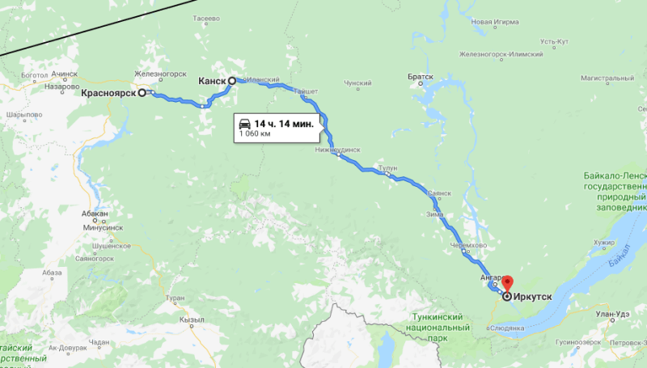

## Красноярск – Канск – Иркутск

### 4-5 сентября 2018, дни 17-18.

Проснулся в Красноярске, в гостинице в полдесятого местного времени (+5 часов к Москве и летнему Киеву). Упаковался, спускаюсь. Оказывается, отключили свет. Интересуюсь, будет ли без света готовится входящий в стоимость завтрак? Сказали, что яйцо поджарят. Позавтракал, выхожу: льет неслабо. Но я в дождевике и до Иркутска каких-то 950 км! Возле гостиницы надергал местных яблок, размером с наш абрикос — вкусненько.

Иду к развязке, километра 3-4 – там поворот на объездную. Пока шел, самостопом останавливается какая-то Лада: парень с девушкой и ребенком лет 1,5-2 довозят до развязки. Поднимаюсь на мост, прохожу разъезды, стоплю.

Еду до Канска с Максимом. Он бывший спортсмен, теперь менеджер в сфере макулатуры. Рассказал, что почти весь мусор можно перерабатывать, рассказал о ценах на жилье в Красноярске, кучу историй из своего опыта работы охранником в ресторане, показал шрамы от пулевых ранений, полученных в случайной драке, рассказал о стрелковой подготовке в российской армии, показал аэродром дальних перехватчиков под Канском... Короче, Макс рассказывал много, складно, интересно.

Кстати, здесь уже удивляются не тому, куда я направляюсь, а тому, откуда я приехал.

На въезде в Канск я вышел – здесь объездная, начинаю стопить. Мужичек на фургончике провез через город, показал объездную, куда она продолжается, так как сразу я ее не заметил. Короче, федеральная трасса Р-55 "Сибирь" в этом месте делает загогулину на 180 градусов и превращается в разбитую грунтовку, размытую дождями. Холодно. Решил, что пора доставать зимнюю куртку (и это в начале сентября!). Вроде стало тепло, но не жарко. Пришло время съесть поминальный пончик с помидором; сгрыз 3-4 яблочка из гостиницы. Стою на краю разъезженного болота, наблюдаю, как буксуют в грязи фуры на подъеме.

Остановил Камаз-самосвал. Обещал вывезти из этого болота в место, где объездная для грузовиков сливается с выездом из Канска легковых. Водитель самосвала из Хакасии. Говорит, что у них, как и на Южном Урале, тоже много озер. Причем, озеро с пресной водой через 5 метров соседствует с соленым и они не смешиваются. Еще здесь есть озера с теплой и горячей водой! Сказал, что они работают вахтовым методом, после чего он на 2 недели едет домой и там со своим дядей, хорошим знатоком леса, идет за шишкой (кедровой). Его дядя работает каким-то клерком, а летом, на 3 месяца, уходит в тайгу: ловит рыбу, охотится, заготавливает грибы, ягоды, шишку, хорошо знает урожайные места, так что без добычи они никогда не возвращаются. Говорит, что в тайгу сейчас можно идти ДАЖЕ без ружья — медведи сытые. Рассказал про китайские фирмы, которые заготавливают у них лес. А едем мы сейчас по трассе, которой нет на картах, а на въезде в Канск стоит знак, запрещающий грузовикам ехать через город, поэтому они все едут сюда, говорит мой водитель, лихо объезжая огромные колдобины, с черепашьей скоростью двигаясь в неспешной колонне огромных машин. Еще сказал, что, так как этой дороги не существует, то и денег на ее содержание не выделяют. Дальнобойщики даже как-то устроили акцию протеста: написали письмо властям, что, так как объездной нет, то их должны пропускать через город. Местные власти быстренько заровняли дорогу грейдерами и подсыпали камнем. Сказал, что отсутствующий кусок дороги они сейчас и строят: мы везем камень для насыпи. И всё это я узнал на протяжении всего лишь 5 километров, которые мы ехали со скоростью примерно 5 км/час!

Наконец проехали эту грунтовку, проехали место слияния грузового и легкового трафика, выехали на трассу и решили, что удобная позиция – возле дорожного кафе, которое мы уже проехали. Предложил съездить с ним на разгрузку. Так что я тоже приложил руку к строительству трассы! Разгрузились, вернулись, я попрощался с парнем и пошел через дорогу к кафе.

Стою, стоплю. Ребята, железнодорожники, на 9-ке провезли 22 км до городка Иланский. Предложили посадить на электричку. Начали считать – ехать на ней всего то 80 км, а кроме того, она уже ушла. Вышел на перекрестке.

Стою, стоплю. Вечереет, трасса пустая: трафик здесь совсем не такой плотный как в европейской части. Думаю о вариантах ночевки: вокруг поле с высокой травой, промоченной дождями – идти в нее желания совсем нет. В пределах видимости удобных мест не наблюдаю. С горя съел все поминальные конфеты и гостиничные яблоки. Стою, грею руки в карманах. Только начало смеркаться (часов в 6 вечера), останавливает фура с белорусскими номерами. Подхожу. Берёт меня до Иркутска.

Водителя звать Лёха. Едет он, оказывается, в Монголию. Эх, рвануть бы с ним до Улан-Батора, но Байкал... Говорит, что в фирме, где он работает, это его 4-й рейс и сразу в такую даль – в Монголию! За рейс должны заплатить 1300 евро. Живет он с женой и ребенком в общаге. Планирует подкопить и в следующем году съездить с семьей в Крым, а потом хочет купить квартиру.

Леха хочет скоре закончить рейс и собирается ехать всю ночь, чтобы завтра к утру быть в Иркутске, а к вечеру на монгольской таможне. Его напарник уже прошел границу и остановился на ночлег и Леха немерен его догнать. По моей карте (в свой навигатор он не успел скачать карту Забайкалья) прикидываем расстояние: до Иркутска 700+ километров, до Улан-Удэ еще 300, до таможни 200. Сложно, но можно!

Стемнело. Оказалось, что в его машине ближний свет почти не светит: когда он его переключает с дальнего, то дороги совсем не видно! У них на фирме нет машин, закрепленных за водителями, поэтому приходится узнавать о проблемах уже в поездке. Трафик хоть и небольшой, но, если идти в колонне или при встречном движении, то ближний свет нужен. Пока асфальт в хорошем состоянии и есть разметка, то еще можно ориентироваться, но, чаще всего, попадались участки без разметки и не самые ровные. Едем, мучаемся, глаза устают вглядываться во тьму. Поняли, что ехать ночью не самый лучший вариант. Решили найти кафешку со стоянкой: перекусить и заночевать. Но это Сибирь! Едем 20 км – тайга, 30 км – тайга, 50 км – тоже пусто. То есть совсем никакой инфраструктуры, только лента асфальта и лес кругом!

Наконец, в 10 вечера, нашли заправку, на которой даже магазина нет. Зарулили рядом с ней на какую-то грунтовку. Искать более удобное место можно было еще долго, а с таким светом мы уже прилично устали, поэтому, довольствуемся тем что есть. Решаем поспать, а в 4 утра подъем – машин на трассе в это время почти нет, можно ехать на дальнем, а там уже и рассвет.

Я намекнул, что в машине 2 спальных места, но Леха не очень то хотел, чтобы я спал в кабине. Решаем, как будем просыпаться. Леха совсем запутался с часовыми поясами: планшет с навигатором не хотел переключаться на местное время, а в телефоне у него было белорусское. Поэтому, единственное, что он знал наверняка, это время на родине! Договариваемся, что я завожу будильник и бужу его в 4 часа утра местного времени.

Фонарь на лоб, рюкзак за плечи и иду искать место для ночевки. Сразу за деревьями, возле дороги, обнаружилось кладбище. Похоже, грунтовка, на которой мы остановились, вела в какую-то деревню. Чуть дальше, за кладбищем, среди деревьев, я приметил площадку как раз под палатку. В лесу травы не было, но ноги глубоко тонули в мягком мху. Тут возникла проблема с поиском дерева, к которому можно привязать палатку. В Сибири нет деревьев с нависающими горизонтально ветками! Все деревья вытянуты строго вертикально и, по крайней мере, до высоты 10 метров веток, чтобы привязать растяжку, нет. Пришлось подыскивать подходящую стойку. Поиски заняли секунд 10. Был найден ствол сухой елочки, укороченный мною до нужной длинны ручным способом. Ставлю палатку и замечаю, что с дождем уже идет и снег – мох начал покрываться белым покрывалом. И это всего лишь 4 сентября, правда в Сибири. Завел будильник на 3:30 (мне нужно еще упаковать палатку со спальником) и лег спать.

Проснулся, чувствую, что выспался, но будильник еще не звонил. Смотрю время в телефоне, а он не включается – на холоде быстро села батарея, а в спальник я его не брал – там он отсыревает. Прикидываю, что пора вставать: как бы Леха без меня не уехал. Выползаю из палатки. Земля почти полностью покрыта тонким пушистым слоем снега. Упаковался. Машина стоит, как черный великан среди еще более величественных деревьев. По пути, приметил дорогу к трассе, чтобы задним ходом не маневрировать.

Подошел к фуре и с криком "Леха, вставай!" стучу в стенку кабины. Оный просыпается, раздвигает на окнах шторки, впускает меня в машину. Говорю, что уже время, но какое, я не знаю. Он смотрит у себя: в Белоруссии 11:02 вечера, значит здесь – 4:02 утра – всё четко! Леха замерз, машина остыла. Мне же тепло, что я даже снял зимнюю куртку.

Прогрели машину, погнали дальше. Как же хорошо по пустой трассе ехать с дальним светом! Часам к 6-ти встретилось кафе. Остановились, разыскали сонную официантку, выпили кофе, едем дальше. Я воткнул заряжаться замерзший за ночь телефон.

Как и вчера вечером, снова начали подсчет километража. Но сегодня еще подъехала тема с запасом топлива. В баках сейчас 150 литров, фирма выдала карту для расчетов на газпромовсих заправках. Но в Монголии по российской карте не заправишься, поэтому, перед таможней нужно залить полные баки, чтобы хватило вернуться. Едем. Прикинули, сколько солярки нужно до таможни, поняли, что сейчас внатяг хватает только до Иркутска. Начали высматривать заправку газпрома, чтобы долить хотя бы один бак. А их всё нет. Стрелка уровня топлива всё падает, а заправки нет. Уже начали переживать – дотянем ли до заправки. Спросили по рации у встречных, сказали, что до Иркутска газпрома не будет. Слегка офигевшие, начали снова подсчитывать остатки. Решили, что до Иркутска с небольшим запасом должно хватить. Но всё равно по пути высматриваем синюю заправку.

Часов в 8 утра, проезжая через деревни, видим, как детишки идут в школу. Нас же начала одолевать сонливость. Решили, что организм еще не перестроился на новый режим, ведь на родине сейчас 3 ночи! На одной из "не наших" заправок, выпили еще кофе. Подъезжаем к Иркутску. Тут уже нашли подходящую заправку, залили бак солярки и уже спокойные едем дальше.

По пути, с помощью телефона, я пытаюсь найти, где остановиться в городе. Но интернет на трассе почти не ловит. Да что интернет, здесь и связь в некоторых местах отсутствует. Пока я залипаю в телефоне, подъехали к объездной на Читу. Леха интересуется, где меня десантировать? Я переключаюсь на поиск на местности. Нахожу точку, кричу: "Здесь!". Леха прижал фуру к обочине, но место не очень удобное. Я быстро выпрыгиваю, выдергиваю из кабины рюкзак, куртку. Одеваясь, машу на прощанье Лехе в зеркало.

Всё, я в Иркутске: до города всего 4 км куда ведет единственная дорога. Взваливаю рюкзак, хлопаю по привычке по карманам... А телефона то нет! Он уехал в машине, в подстаканнике, с подключенным шнуром зарядки. А вместе с ним уехали все мои контакты, две симки, одна из которых привязана к банковской карте. А также я лишился карты с отметками запланированных мест, фоток, интернета. Немного непривычно: я в незнакомом городе без связи, без интернета, без привычных средств коммуникации с современным миром! Но понимаю, что сейчас я ничего не верну. Поэтому я просто иду через развязку в город с надеждой, что на месте разберусь.

На дороге ремонт. Одна полоса отгорожена, все машины теснятся на оставшейся. Но вдруг, несмотря на то, что он загораживает движение, притормаживает японский грузовичек. Водитель, сидящий на правом сиденье, интересуется, подвезти ли меня? Отвечаю утвердительно и вот я еду в город. Рассказываю водителю о своих переживаниях по поводу утраты телефона. Он тут же предлагает мне свой старый кнопочный телефон. Я благодарю, но отказываюсь – мне нужен хоть плохонький, но смарт с интернетом. Водитель, Виктор, говорит, что ему нужно загрузиться в промзоне, а потом он может довезти меня почти до центра (в сам центр грузовикам нельзя). Отвечаю, что теперь я уже никуда не спешу, и мы едем на базу. Показывает мне на хлеб, который он купил домой и предлагает мне отломить: мол, встречают путников хлебом, солью. Хлеб оказался очень вкусным!

Грузовичек оборудован кран-балкой, с помощью которой Виктор сам грузит пару контейнеров битого стекла на заводе по производству окон. Говорит, что ему нужно заехать еще в одно место. Там он заводит меня в рабочую столовую, перекусить, а сам уходит по делам. В столовой кормят прямо на кухне. Хозяйка говорит, что зал у них есть, но нет смысла его отапливать и убирать, так как клиентов у них – человек 10. И вот я сижу на кухне, за столом у огромной общепитовской плиты и поедаю пюре с котлетой и салат. Вкусно, как дома.

Когда вернулся Виктор, я попросил воспользоваться его телефоном для поиска хостела. По дороге записываю обычной ручкой в обычный бумажный блокнот пару адресов. Виктор, на всякий случай, диктует и свой номер. Говорит, что мои адреса находятся в центре, в районе центрального рынка, и высаживает на остановке.

Сел на автобус и немного поплутал по городу. Мне сказали, что рынок – это конечная остановка, поэтому я не особо переживал ее пропустить. Но оказалось, что конечная не совсем конечная: похоже автобус идет по кольцевому маршруту, так как мы дважды проезжали мост через Ангару. Где-то в промзоне, на очередной конечной остановке, водитель всех высадил и уехал в парк.

Короче, добрался я до центра и нашел первый в моем списке хостел. Времени уже 5 вечера, сил на поиски другого жилья уже нет. В этом же места есть, цена приемлемая. Остаюсь. Принял душ, загрузил стирку. Пока ожидаю, пью чай с остатками козинака, который приехал со мной аж из Брянска! Дежурная девушка очень не общительная, посетители тоже слегка странные, поэтому, пью в одиночестве.

Попил чай, решил писать дневник в тетради – так надежней! Написал кусок от Новосибирска. Сижу в общей комнате, а заодно наблюдаю жизнь хостела. Заселилась гиперактивная девочка с мамой. Девочка интересовалась у меня, буду ли я здесь спать, где моя кровать и где будет спать она. Затем, у немцев, стала настойчиво требовать чтобы они угостили ее обедом, а те ее не понимали. Администратор так же активно перед всеми извинялась. Активную девочку мама увела в комнату, чтобы успокоить, что было очень громко. Развесил сушиться свои постиранные вещи. После этого, еще немного пописал заметки и отправился спать.