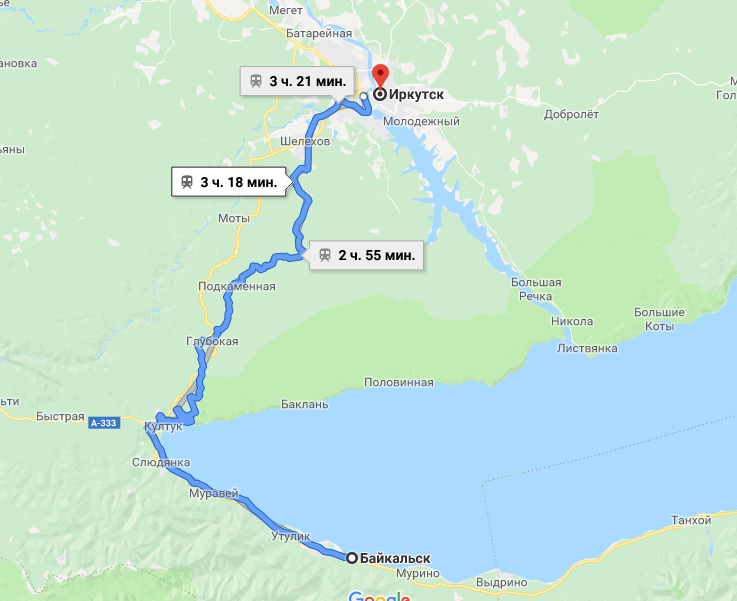

## Иркутск – Байкальск

### 6 сентября 2018, день 19.

Проснулся в 10 утра. Понял, что оставаться в хостеле желания нет: здесь очень тесно, а казахские парни, которые жили со мной в комнате, еще спали. Поэтому упаковываю шмотки на кухне.

Сегодня – первый солнечный день с момента перехода Урала! Моя цель – Байкал!

Решил ехать в Слюдянку, т.к. Листвянка, как я понял, чисто туристическая стала и там, кроме Шаман-камня и смотреть нечего. А Слюдянка, к тому же, еще и по пути. Выяснил, что туда можно доехать на электричке.

Иду на рынок. Осматриваю все ломбарды и комиссионки в поисках телефона. Присмотрел один за 30$. Но у него не работает вайфай (но, как выяснилось уже в Монголии, вполне себе работает). Беру, т.к. нужна связь и карта. Симку российскую не восстановить, т.к. она из другого региона. Поэтому, беру новую.

Еду на вокзал. Здесь узнал, что электричка до Слюдянки будет в 5 вечера. Беру билет. Иду в зал ожидания. Здесь восстанавливаю контакты из облака, устанавливаю приложения. Нахожу розетку и пытаюсь зарядить свой новый телефон – к 5 вечера заряжен на 40%.

Перед отъездом беру в дорогу пару беляшей и еду в Слюдянку. Дорога, как я и ожидал, очень живописная. Поезд идет среди гор и лесов. Иногда встречаются маленькие деревни: здесь наблюдаю сюжеты сельской жизни. Наконец, с перевала, открылся вид на Байкал! Озеро окружено горами. Кое-где, на вершинах видны снежные шапки.

Электричка идет до Байкальска. Смотрю по карте – оттуда мне удобнее выезжать. Решаю зайцем проехать до конечной. Хотя, пока ехали, у нас уже трижды проверили билеты, но все-таки думаю рискнуть. После Слюдянки контроллер еще раз пошла проверять билеты. Сделал вид, что очень интересуюсь видами за окном (а было уже 9 вечера – темно). И, т.к. я уже примелькался, она просто спросила, до Байкальска ли мне? Мое "угу" ее устроило. Еду до конечной!

Полдесятого. Вместе с полудюжиной пассажиров выгружаюсь на конечной. Темно, людей на улице деревни – никого. Иду, ищу лес, чтобы заночевать. Среди дворов замечаю, типа, парк, а в нем часовенка. Решаю, что с ней вдвоем нам в парке будет не тесно.

Опять проблема с местными деревьями (см. дни 17-18) – долго ищу стойку под палатку. Нашел. Разыскал ровную площадку, поставил палатку, съел беляши и спать.