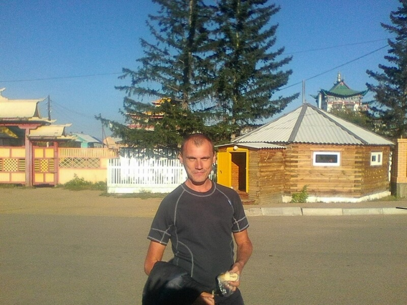
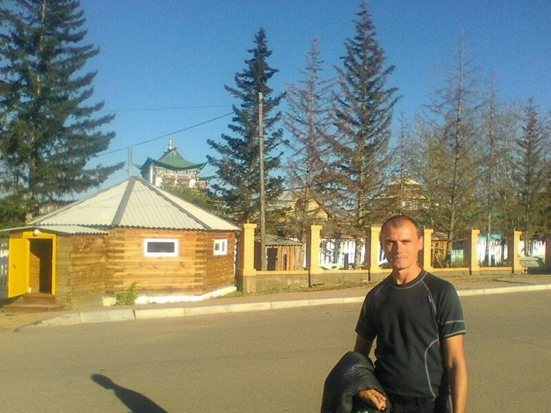
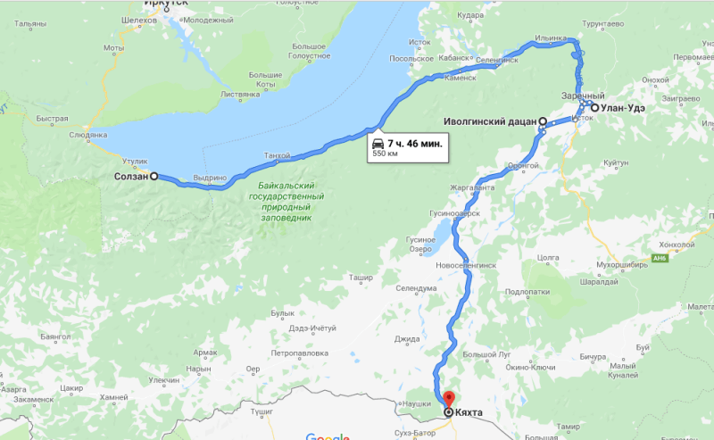

## Солзан – Улан-Удэ – Кяхта

### 8 сентября 2018, день 21.

Программа-минимум похода выполнена – я попал на Байкал! Дальнейшее путешествие я планировал уже как факультативное. Здесь я решил, что есть силы и желание продолжить путь, даже с учетом понесенных потерь (см. дни 17-18).

Всю ночь Байкал штормило. Утро выдалось пасмурное. Погода закончилась, пора ехать дальше. Развесил спальник сушить от конденсата. Доел остатки каши, умылся, собрался, пошел.

Вышел на трассу. Стоплю в сторону Улан-Удэ. Трафик совсем слабый – одна машина в 2-3 минуты. Что интересно, через железнодорожную станцию, поезда проходят почти с такими же интервалами (движение по станции я слышал всё время, что я провел на Байкале). Через час уезжаю.

Водитель – Дима, едем до Бабушкина. Он занимается поставкой звукового и светового оборудования в дома культуры. Рассказал о своих способах заработка в 90-х: типа, время прошло, уже можно поделиться; рассказал об особенностях его сегодняшнего бизнеса; рассказал о преимуществах японской машины для Японии (с правым рулем) от японской машины для Европы и Америки. Посоветовал съездить в долину Селенге в Бурятии. Тут же вспомнил, что там есть действующий буддийский дацан с мумифицированным монахом, который, говорят, еще живой, просто в глубоком трансе. Так как Иволгинский монастырь и монах, в нем хранящийся, довольно знаменит, там, говорит, в отличие от остальных местных буддистских храмов и монастырей, служат монахи-тибетцы. Предложил съездить туда вместе. Почему бы и нет?

Заехали по делам в Бабушкин к директору ДК. Она, узнав, что мы едем в Иволгинский дацан, попросила "побрызгать" за ее брата – кандидата в мэры (скоро должны были состояться выборы). Дима тоже решил "побрызгать" по своим проблемам в бизнесе.

Едем, болтаем. Решили захватить с собой Диминого партнера, бурята, который занимается доставкой ему звукового и другого оборудования из Китая. Он, типа, знает традиции.

Трасса шла сначала вдоль берега Байкала, затем, через горы, начала перебираться в Забайкалье, в республику Бурятия. За перевалом пейзаж резко изменился: вместо тайги, гор, озер и болот началась чистая степь. Здесь деревья встречались только высоко на склонах гор, окружающих долину Селенге или во дворах деревенских домов. Долина же покрыта густой, выгоревшей на солнце травой. Кстати, за перевалом и погода резко изменилась: из моросящего дождя и холода тайги мы попали в солнечную жаркую степь.

На въезде в Улан-Удэ нас встретил сын Диминого партнера, проводить до дома, чтобы не блудили. Заехали к ним на дачу, быстро собрались, пересели в другую машину, поехали

На подъезде к Иволгинскому дацану зашли в супермаркет. Для монаха, который будет "брызгать", нужно купить белые дары: молоко (почему-то непременно Шадринское) и водку (любую). Приехали на место. Идем по территории монастыря, крутим молитвенные барабаны, я рассматриваю непривычную буддийскую архитектуру храмов. Встретили прогуливающегося монаха, спросили, где можно "побрызгать". Говорит, пошли.

Зашли к монаху в домик – обычный деревянный деревенский дом с печкой. Т.к. вопросы у нас несвязанные, заходим в комнату на ритуал по одному. Дима пошел первый. Жду своей очереди за шторкой на кухне.

Пришла моя очередь. Я подал монаху белые дары. Обсудили, какие у меня есть вопросы, проблемы. Он коротко на листке записал тезисы. Начал читать мантры (?), открыл водку, открыл молоко, продолжает читать. Читал минут 15. В конце, взял щепотку риса и бросил на листик с тезисами. Потом, глядя, похоже, на расположение зерен на бумаге, рассказал мне, как нужно действовать, чтобы вопросы решились и избежать проблем.

А мумифицированного монаха мы так и не увидели. Его выносят для всеобщего обозрения только один раз в году – 13-го сентября.

Поехали назад. Меня высадили на трассе, в 15-ти километрах от Улан-Удэ в сторону монгольской таможни. Почти сразу застопил междугороднюю маршрутку. Говорю, что еду до Кяхты. Водитель сказал, что туда не доезжает, но меня взял, причем бесплатно! До Кяхты не доехали километров 30. Солнце уже касалось горизонта. Стало холодно. Одел куртку. На газели доехал до въезда в Кяхты – до погранперехода – 11 км.

Здесь же стоял пограничный пост. Ребята поинтересовались моим паспортом, сказав, что в Кяхты мне нельзя – город пограничный и туда нужен пропуск. Я же ответил, что в город и не собираюсь и в ответ поинтересовался наличием у них воды (мои запасы закончились). С водой оказалась напряженка. Параллельно, коротко обсудили мои планы.

Я прохожу за перекресток стопить до таможни. Уже совсем стемнело. Думаю, что неплохо бы одеть светоотражающую жилетку. Я так и не успел реализовать этот план – возле меня остановился УАЗ-буханка. В кабине – уже знакомые погранцы: сменились, едут в казармы. Едем, по дороге обсуждаем прелести и опасности автостопа.

Вышел перед таможней. Прохожу очередь машин, интересуюсь на посту, где здесь пешеходов пускают. Говорит, не пускают – переход только автомобильный. Пошел вписываться в машину. Стоят одни монголы. Почти все машины под завязку заполнены людьми и товарами.

Наконец вписываюсь в фургончик, также забитый, но ребята потеснились. Попытались поговорить. Я не знаю монгольского, они русского. Сидим, ржем: я – с них, они – с меня.

В общем, заехали на таможню. Ух, как же русские шманают монголов! Разгрузили полностью фургон, в том числе запаску и содержимое бардачков. Пограничники, на досмотре, пересматривали все личные вещи пассажиров поштучно, что-то искали под днищем, под капотом, в бардачке. Мы всё время стояли на улице: ждали нашей очереди, потом осмотр. Замерзли – жуть!

Монгольская таможня. Монголы в фургоне уже в эйфории, что вернулись домой. Досмотра – никакого, только выходим и в здании таможни проходим паспортный контроль. Однако, здесь уже со мной произошла заминка: у монгольских пограничников нештатная ситуация – по справочникам ищут, как оформлять украинцев. Оформили, прошли!

Времени – час ночи. Мои попутчики пошли в отель. Я побродил по округе, нашел обменник и пошел тоже в отель – за 10тыс. тугров ночь.

PS: Спасибо Дмитрию за фото!