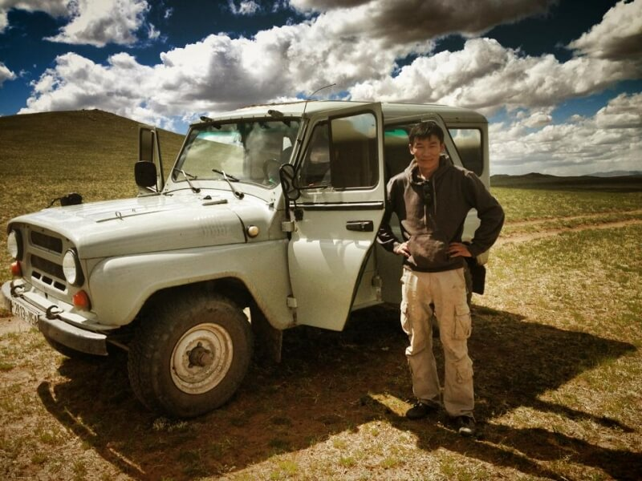
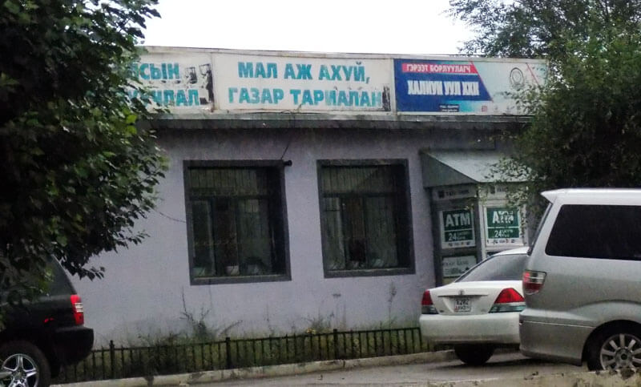
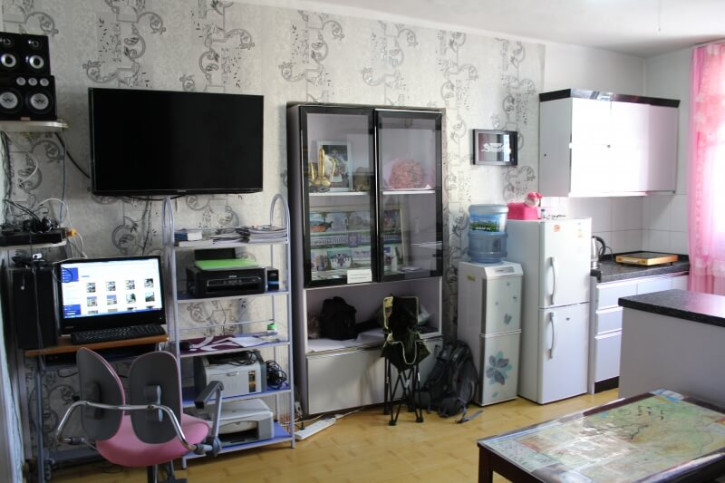
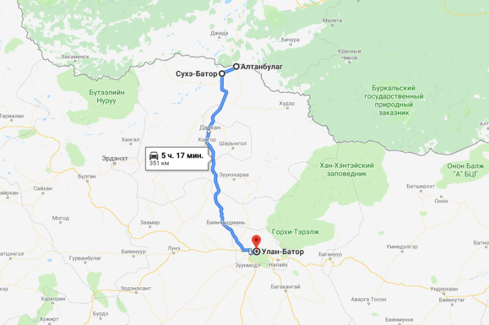

## Алтанбунлаг – Улан-Батор

### 9 сентября 2018, день 22.

Проснулся в 8 в приграничном отеле уже в Монголии. Пошел на вахту попросить кипятка, чтобы заварить лапшу, купленную еще на Байкале. Вода в бойлере была не очень горячей. Подождал, пока закипит. Пообщался с дежурной. Она неплохо говорит по-русски, но сложные предложения не понимает. Поел, включил заряженный за ночь телефон, увидел, что российская сеть здесь еще неплохо ловит. Написал сообщения домой – звонить не позволяет разница во времени – у меня 9, на родине еще 4 утра. Решил выпить чаю. Вода опять холодная – дежурная налила полный бойлер, так что ждать долго. Подарил ей украинскую монету в качестве сувенира. Поинтересовалась, сколько это будет в туграх. В ответ угостила пригоршней конфет. Попил чаю, собрал вещи – в путь!

Иду за пределы поселка. Вот она – Монголия, страна, в которой я страстно мечтал побывать! Впереди бесконечная степь с шелковистым ковром зеленой травы; справа и слева невысокие зеленые горы, виднеются отдельные маленькие озерца; лошади, овцы, козы, коровы свободно пасутся в степи, причем выглядят они привлекательнее, чем у нас – чистенькие, шерсть шелковистая и блестящая. Красота! Иду, наслаждаюсь пейзажами. Юрт пока не видно.

Самостопом останавливается машина. Сказали, что подвезут меня на "ицкадь пять" километров, думаю, что не меньше пятнадцати. Сажусь. Пожилая пара довезла до Сухбатора (на наших картах почему-то пишется Сухэ-Батор), показали направление дальше на Улан-Батор.

Иду по трассе, наслаждаюсь пейзажами: горы, степи, лошади. Здесь уже юрты стоят, правда за заборами. Ранее узнал, что забор нужен, чтобы иметь почтовый адрес. Опять же самостопом останавливает мужичек, говорит, поехали. Доехали до стеллы Сухбатора за пределами города. Он подошел к каким-то ребятам, поговорил с ними. Потом сообщил мне, что он до Улан-Батора не едет, а "вон те ребята" на "вот этой машине" едут и тебя довезут. Прощаюсь, беру рюкзак, иду к ребятам. Те стоят на краю степи и кормят каких-то мышеподобных зверьков. Я спросил, как эти звери называются? Мне ответили, но название почти сразу забылось (((

Едем. Никто не говорит ни на русском ни на английском. Немного поговорили через транслейт в телефоне парня – у меня уже включился роуминг, а без интернета перевод с Монгольского не работает. Женщина, сидящая впереди, уже без переводчика, какими-то словами, жестами, объяснила, что это ее сыновья, один из которых, тот что за рулем, служит военным.

По дороге угощали сухофруктами, конфетами, водой.

Здесь познакомился со способом справлять нужду, когда вокруг голая степь без единого дерева или куста. Просто отходишь от машины на несколько метров и делаешь свои дела. Девочки так же поступают. Тут все продумано: они носят поверх брюк блузки или туники ниже попы, так что все пристойно ))) В общем, девочки – направо, мальчики – налево.

Движение по трассе в Монголии отличается неспешностью. По хорошей, пустой трассе едем, обычно, со скоростью 70-90, на обгонах разгоняемся до 100. При обгоне сигналим обгоняемой машине (ночью еще мигают дальним светом) – монголы не очень то смотрят в зеркала, а у многих вместо зеркала в салоне установлен экран видеоплеера.

Пейзажи замечательные: горы, степи, реки, стада лошадей, овец, коров, юрты, стоящие просто в степи.

Проехали несколько указателей населенных пунктов, но, кроме отдельных юрт на горизонте, никаких населенных пунктов я не заметил.

Наконец, приехали в Улан-Батор, где меня высадили на автобусной остановке. С трудом выяснил, как доехать до центра. Уже 6-й час вечера – нужно уже думать о ночлеге, но для его поиска нужен интернет.

Пытаюсь сначала разглядеть какой-нибудь салон связи. Названия на вывесках, хоть и на кириллице, но совсем непонятные. Зашел в пару, показавшихся обнадеживающими, дверей: в одной – продукты, в другой – бытовая химия. Пытаюсь выяснить у населения, где можно приобрести сим-карту. Никто не может понять, о чем идет речь.

Нашел дедушку, сидящего на лавочке, раскуривающего сигарету и, судя по всему, особо не спешащего. К дедушке я подошел, потому что считал, что старшее поколение может знать русский язык. Спрашиваю, где купить симку с интернетом. Мои надежды с языком не оправдались. Перехожу на язык жестов. Показываю свой телефон, тычу в него. Он достает и показывает свой телефон. Пока нет понимания. Начинаю объяснения сначала. Примерно достиг цели – он тычет в разъем для симки, я киваю. Тут он ловит какого-то школьника и, предположительно, говорит тому, чтоб тот объяснил, где такое продают.

Школьник спросил: "Русский?". "Украинец, но по-русски говорю", – отвечаю. Парень русский язык учил в детском саду и в школе, но, кроме выполнения заданий, практики никакой – говорит медленно, но вполне неплохо. Рассказал, что у них есть 3 оператора связи. Определились, что нужен дешевый и качественный интернет. Пошли к офису оператора. Тут начинаем выяснять, как купить симку. Оказывается, процедура не особо интуитивно понятная, причем работники офиса иностранными языками не владеют, а парень не очень внятно им объяснял. В общем, в терминале (который весь на монгольском) выбираем телефонный номер из свободных и нужный тариф. Потом подходим к девочке – та заключает договор, записывает ручкой (!) мой номер телефона на карточку и выдает сим-катру за 2тыс. тугров ~ 0.7$, по которой я имею 5Гб интернета на месяц. После этого, подходим к парню, который активирует услугу интернета. Сам бы я в этом вряд ли так быстро разобрался. Выходим последними – офис уже закрывается. Как четко мы все успели!

Мой товарищ представляется, дает, на всякий случай, свой номер телефона, прощаемся. Его имя сейчас не напишу, т.к. монгольские имена я с трудом воспринимаю на слух, иногда даже трудно сразу правильно повторить. Вообще то, по моему субъективному мнению, монгольский язык похож на очень шепелявый немецкий.

В общем, сижу в парке, ищу жилье. Нашел один интересный хостел, но как найти его на местности? Да и телефон на сайте не указан. Немного помучившись, и эту задачу удалось успешно решить.

Хостел – на третьем этаже обычного жилого дома. Какой-то дедушка открыл мне дверь подъезда. Поднимаюсь, стучу в дверь, впускают. Спрашиваю администратора, парень, француз, говорит, что нет его и придет ли сегодня – неизвестно. Странно. Оказывается, этот хостел на самоорганизации. У каждого есть ключ, а администратор появляется лишь изредка. Звоню по написанному на доске номеру. Эрик, администратор, говорит, что да, заселяйся, место есть, а он подойдет в 9 вечера.

Моюсь, стираюсь, съедаю пачку лапши. Подошел Эрик, предложил выпить чаю. Сидим, разговариваем. Он говорит, что когда учился в институте, на философском факультете, для написания диплома перечитал много русских книг и когда-то хорошо знал язык. Пытается со мной практиковаться, но постоянно переходит на английский. Где-то через минут 40 думаю, что пора обсудить и дела. Спрашиваю про оплату. Он машет рукой, говорит, мол, все завтра и продолжаем беседовать о Монголии, моих планах, погоде и т.д. Единственное, что относилось к решению вопроса заселения – мне был выдан ключ от двери.

Вечером зашла пара русскоговорящих. Оказалось, оба немцы – Илья и Аня. Проболтали до часу ночи. На сегодня хватит – спать!

