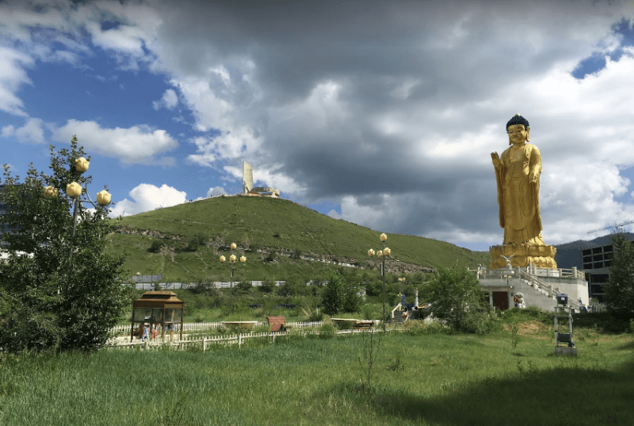

## Улан-Батор

### 10 сентября 2018, день 23.

Оказывается, Эрик, хозяин хостела "Lehend Hills Mongolia" (вообще-то его имя произносится как Эрк, но он его адаптировал под европейское для удобства общения), приходит по утрам кормить гостей завтраком. Приготовил яичницу, салат, гренки. Приятно!

Откровенно говоря, столица живет абсолютно не так, как вся остальная страна. И разница здесь совсем не в уровне дохода или в наличии столичной инфраструктуры. Дело в том, что Монголия – единственная страна, в которой на государственном уровне поддерживается кочевой образ жизни населения! Поэтому, Улан-Батор – это совсем не то, что я мечтал увидеть в Монголии. Но мне нужно было устроить небольшой привал и я решил на один день остановиться здесь.

Поспрашивал у Эрика о том, что посмотреть в Улан-Баторе за один день. Он посоветовал сходить к золотому Будде. Показал на карте, куда ехать, я отметил точку в навигаторе.

 

Телефон снова разряжен – вчера устанавливал недостающий софт. Пока он заряжается, пишу в тетрадь путевые заметки и пью чаи.

Около часа дня перекусил в заведении "Хаан Бууз", где, как сказал Эрик, питаются местные жители. Кухня европейская (тефтельки и рис), чай же монгольский – соленый с молоком. Пока разбирался, как здесь оформить заказ, подошла женщина и поинтересовалась, русский ли я? Короче, сели за один столик, поболтали о жизни. Она училась в Иркутске, поэтому знает язык, но уже начала его забывать, хочет со мной попрактиковаться.

Поел, пошел на автобус номер 7, как советовал Эрик. Доехал, примерно, до нужного места, стал искать золотого Будду. Тут с одной стороны гора, а с другой – новострой. С детишками поприкалывались на английском. Про Будду они не знают. Пошел искать.

Под горой нашелся буддийский храм. Думаю: "Если Будда, то должен быть там!". Забираюсь к нему. Оказывается закрыт – в процессе строительства. Пообщались с рабочими – больше жестами. Залез на ближайшую горку. С нее открывается панорама почти всего города. Пофоткал. Начал капать дождь. Трава на крутом склоне становится скользкой, поэтому я пошел вниз.

На остановке сел на автобус с тем же номером, но на лобовом стекле зачем-то выставили номер 3. Подсел дедушка, представился Суреном, бывший министр чего-то там Монголии. Дал ему свой скайп, тот собирался приехать в Одессу.

Я старался наблюдать за дорогой, чтобы не пропустить свою остановку. Но, в процессе разговора, я немного отвлекся, а когда снова глянул в окно, то заметил, что автобус шел по незнакомому маршруту. Короче, вернулся я на нем же к той же горке.

Здесь сел на 9-й автобус с номером 7 на лобовом. Стал уже следить по карте. Уже вечер, начались дикие пробки, причем, некоторые машины и автобусы, пытаясь повернуть, стоят поперек дороги в несколько рядов. Жуть. Тут еще начался ливень. Пока мы ехали, он то прекращался, то снова лил. На полпути автобус стал разворачиваться в другую сторону. Я вышел, решив, что, с учетом пробок и непонятной нумерации транспорта, проще дойти пешком. К тому же, ливень, похоже прекратился.

Только зашел в хостел, как дождь пошел снова – вовремя я успел! Поболтали с Ильей и Аней. Пора спать.