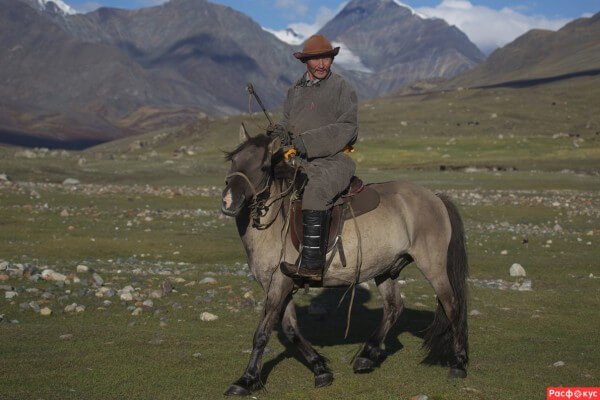
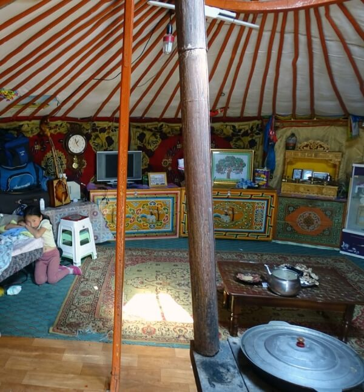

## Окрестности Арвайхира. В гостях у Эрика (вечер)

### 12 сентября 2018, день 25 (вечер).

Вечером в Арвайхире на выезде в сторону Баянгола сажусь в грузовичек, чтобы выехать из города. Метров через 300 асфальт закончился, началась монгольская дорога – грунтовка. Водитель – Эрик – хохотун! Все время ржал и повторял русские слова, что я говорил: чем-то они его веселили. К этому времени я научился быстро сообщать, что я из Украины. Методика проста: тычу пальцем в собеседника, говорю – "Монгол!", тот кивает, потом тычу в себя и говорю – "УкрАина" с ударением на второй слог, так они чётче воспринимают.

В общем, едем, поем песни: Эрик на монгольском, я на русском, украинском. Говорит, что сегодня я ночую у него. Я не возражаю. Потом он вдруг поинтересовался, не маньяк ли я и не собираюсь ли его ночью зарезать? Я утвердительно киваю. Ржем. Тут же его заинтересовало содержимое моего рюкзака. И так как это было похоже на наивное детское любопытство, я сам с удовольствием показываю свои шмотки и смотрю на его реакцию. Удивляется и хвалит мои походные штучки, т.к. сам кочевник и знает в этом толк. Спрашивает, есть ли у меня еда? Показываю свои запасы гречки. Ржет: это, говорит, что, еда?

Переезжаем вброд быструю реку – глубина приличная. Волна захлестывает на лобовое стекло хоть и небольшого, но грузовика. Подъезжаем к следующей реке. На другой стороне, у съезда к броду, стоит микро-джип. Пассажиры из него все вышли, ходят по берегу фоткаются. Останавливаемся чуть в стороне от дороги, выходим из машины. Я так предполагаю, чтобы пропустить джип, т.к. они первыми подъехали к броду. Эрик внимательно за ними наблюдает. Думаю, ждет, когда те будут проезжать, чтобы оценить глубину брода. Мы вышли из кабины, ходим по берегу. Я смотрю на быстрое течение реки. Эрик смеется – предлагает мне подворачивать брюки и переходить. Тоже смеюсь, оценив шутку. Джип, наконец, переправляется. В центре потока он нырнул на полкапота под воду, но дал газу и выскочил на более мелкое место.

Эрик отвязывает в кузове свой груз – бензокосу. На другом берегу тоже начинается движение. Подъезжает маленькая легковая тойота. Ну, думаю, она точно здесь утонет! Но та и не думает переправляться: останавливается в стороне от брода, на берегу. Из машины выходит девушка, достает канистры и начинает наполнять их водой из реки.

Подъехал мужичек, верхом на лошади. Присмотрелся, взял левее того места, где проходил джип и переправился к нам. Взял у Эрика косу и повез на другой берег. Начинаю понимать, что шутка про переправу вброд, возможно, была не шутка. Но еще надеюсь, что переправимся на грузовике – не бросать же его здесь! Мои надежды рухнули, когда Эрик достал мой рюкзак, поднял дверные стекла, закрыл двери машины, а сам начал натягивать поверх штанов сапоги-заброды. Прикидываю глубину – сильно выше колен. Разуваюсь, сую кеды в рюкзак. Снова мужичек на лошади переправляется к нам, забирает мой рюкзак и переправляет его на другой берег. Снимаю брюки и по скользкой гальке при сильном течении иду на другой берег. Все внимательно наблюдают и ржут с меня. Перешел, одеваюсь.

Эрик предлагает показать мою снарягу его товарищу, Шурику. Тот уже спрыгнул с коня, уселся на траву и смотрит с вожделением на рюкзак. Показываю, на мой взгляд, самое интересное. Параллельно Шурик поднимает вопрос о плате за переправу рюкзака. При этом вопрос о том, чтобы выпить вечером чего-нибудь крепкого, уже поднимался Эриком. Предлагаю медицинский спирт, который брал в качестве топлива для горелки. Тут же заветная бутылка была извлечена, часть перелита в невесть откуда появившуюся пустую бутылку и тут же из реки разбавлена водой до нужной крепости. Остатки бережно вернули.

Эрик показывает на юрту где-то в километре от берега. Грузимся в тойоту, а Шурик с бензокосой поскакал верхом вперед. Выгружаемся, заходим в юрту. Кроме нас троих здесь еще была девочка, дочь Эрика, лет 4х. Садимся, выпиваем по паре плошек кумыса.

Все быстро собираются, хозяйка показывает, что идет доить лошадей. Процедура простая. Жеребят заранее привязывают недалеко от юрты. Кобылы, при этом, далеко не уходят. Потом Шурик и Эрик по очереди подводят жеребят каждого к своей маме. Та думает, что ее ребенок сосет молоко, а это девченка быстро доит спокойно стоящую кобылу.

После дойки Эрик с товарищем начали отлавливать скаковых лошадей, еще не особенно прирученных. Шурик, верхом, догоняет замеченную в табуне особь, набрасывает на нее петлю на длинном шесте, останавливает. Эрик подбегает, надевает на нее уздечку и привязывает к веревке, натянутой высоко на шестах. Пока этим занимались, на мотоцикле подъехал еще мужичек, посмотрел на меня и пошел помогать с лошадьми.

Пока осматриваю юрту. Круглая, покрыта белым войлоком, оранжевая деревянная дверь с узорным рисунком. Вход, обычно, с южной стороны, а над ним, на скате крыши, лежит панель солнечной батареи. Возле юрты стоит Тойота, на которой мы приехали, мотоцикл, лежат какие-то жерди, стоят мешки с топливом для печки – сухими кизяками. Внутри пол застелен линолеумом, в дальнем от двери краю на полу лежит ковер, там же стоит комод, на нем LED-телевизор, алтарик с буддой и маленькой масляной лампой. Слева от входа: пластиковая бочка с водой, кухонный стол, кровать. Справа – бидон с молоком, большая бочка (литров 250-300) с кумысом, морозильная камера и какие-то вещи. На деревянной стенной решетке закреплены разные полезные мелочи: настенные кварцевые часы, корзинка с ложками, вилками, стакан с зубными щетками, моточки веревки, проволоки, пила и т.д. Под потолок, между потолочными балками и войлоком, хозяева пихают всякие штуки, что должны быть под рукой: телефоны, деньги. Посередине стоит железная печь, труба выходит в один из секторов центрального круга крыши через металлическую пластину, остальные 3 сектора затянуты тонкой сеткой от насекомых. Юрта из маленьких – диаметром метров 5, а по центру только один подпорный столб. Кстати, вся дальняя стена в несколько рядов завешена медалями и дипломами: Эрик – какой-то крутой чемпион по скачкам.

Пока взрослое население занимается хозяйством, я, как не смыслящий в их делах, переключился на ребенка. Помог девочке надеть слетевшую цепь на велосипеде и мы прокатились (вернее ехала она, я шел следом) в ближайших окрестностях. Удивительно наблюдать за такой кнопкой, когда она уверенно топает сапожками по степи, как в своем дворе – знает где лежит каждая мелочь, иногда на приличном расстоянии от юрты. Вот такая малявка хозяйничает на степных просторах Монголии!

Пока смотрел на работу с лошадьми, услышал сзади равномерный шум. Оборачиваюсь. Непонятно откуда взялось приличное стадо овец и коз. Хозяйка с дочкой за пару минут согнали их в плотную группу. Те совершенно не возражали и уже ложились отдыхать.

Тут уже Эрик вскочил на коня и стал методично объезжать стадо: ходил вокруг – стадо шарахалось, проезжал через центр, рассекая стадо на части, снова собирал в круг. Так продолжалось минут 15. Наконец, что-то высмотрел. Накинул на овцу петлю, а мужичек, его напарник, схватил ее, обхватив за переднюю часть, приподнял и на задних ногах потащил к юрте. Шурик, кстати, уже куда-то исчез. Мужичек (он позже называл свое имя, но я не запомнил) что-то спросил жену Эрика: та перехватила овцу, а сам он пошел в юрту. Вышел с ножом и какой-то тряпкой. Расстелил тряпку и уложил не нее овцу. Меня же Эрик позвал в юрту пить кумыс. Стало темнеть и холодать. Я вышел за курткой к рюкзаку, что оставил снаружи. Овца лежала бездыханной, хотя я не слышал ни звука. А мужичек в юрте уже пробовал набодяженную на реке водку.

Девочку, по случаю холода, тоже одели в красивый национальный кафтан. Я так понимаю, монголы носят национальную одежду не по праздникам, а повседневно: типа удобно и практично. У мужчин без всяких украшений – одноцветный плотный халат, обычно синий, бордовый, обязательно с длинными рукавами до колен (ладонь полностью внутри и когда они что-то берут, то подкатывают рукав) и яркий пояс из длинной тканевой ленты. Зато женщины и, особенно, дети как на картинке: на темной ткани халата золотистая или серебристая вышивка, резные пуговицы. Все носят кожаные сапоги, часто ручной работы с тиснёным узором.

Пьем кумыс, разговариваем. Мужичек, напарник Эрика, знал несколько слов по-русски. Пошла более живая и осмысленная беседа.

Через полчаса затащили овцу в юрту – на улице уже темно. Мужик ловко сделал надрезы и руками быстро отделил шкуру, оставив тушу лежать на ней. Расправил вокруг туши шкуру, чтобы пол не пачкать и минут за 10 распотрошил ее, сложив потроха на большое металлическое блюдо. Вычерпал в миску кровь, отделил голову, лодыжки с копытами; разделил тушу на две части – верхнюю и нижнюю, окончательно отделив шкуру и вдвоем с Эриком подвесили половинки туши на стенной решетке справа от входа: как они сказали – созревать. Шкуру аккуратно свернули и вместе с головой положили на полу под развешенными мясом.

Хозяйка уже растопила печь. Кстати, сухие кизяки совсем не воняют, как многие думают, а когда горят, слегка пахнут сеном. После этого поставила на печь казан, наполнив его водой и стала сортировать, чистить и мыть потроха. Какой-то особый кусочек отрезала и отдала дочке. Та со знанием дела положила его на алтаре возле масляной лампы, которую, кстати, еще перед началом разделки уже зажгли и крутанули молитвенный барабан.

Теперь уже хозяйка стала порциями закидывать в казан подготовленные потроха – типа, у каждого свое время готовки. Тонкие кишки тщательно промыла, накрошила лук, высыпала его в кровь, добавила молока и через воронку быстро наделала кровяной колбасы, которую бросила в тот же казан вариться. Остатки крови перелила в так же тщательно вычищенный и вымытый желудок, край которого завязала сложным, но красивым узлом вокруг выструганной палочки. Отходов почти нет – только содержимое кишок и желчный пузырь. Толстые кишки упрятали внутрь тонких – тоже какие-то колбаски – их едят, нарезая тонкими кружочками. В общем, вся процедура, с момента, когда внесли овцу, заняла минут 40.

Параллельно с этим пьем кумыс. Девочка ходит за взрослыми и кладет всё на свои места, точно зная, например, как сложить газовую плитку, упрятать ее в чемоданчик и положить на место. Иногда ей перепадают вкусняшки, которыми мама угощает дочку в сыром виде, отрезая от разделываемых потрохов.

Всё готово! Нарезают тонкими пластинками ассорти из потрохов – по-немногу всего: сердце, почки, печень и др., докладывают нарезанные кусочками колбаски. Вкусненько! Запиваем кумысом, а напарник Эрика с непонятно когда материализовавшимся Шуриком еще и водкой.

Поели. Шурик укатил на мотоцикле к себе. Пришло время детально рассмотреть мои вещи. Каждая вещь, каждая бумажка передавалась по кругу и тщательно рассматривалась. Хозяйку заинтересовали старые фотографии моих родственников, которые я везу из Казани, ребят – снаряжение. Особо понравилась спиртовая горелка: ее поджигали много раз, грели в миске и кружке воду, просто смотрели на огонь. Мужичек переживал о бесцельно сжигаемом продукте. Из еще не сожженного спирта набодяжили еще водки – та уже закончилась. В итоге, подарил Эрику горелку и остатки спирта – на кой он мне без горелки?

Еще понравились украинские монеты, которых я набрал на сувениры. В Монголии деньги только бумажные, а монеты, оказывается, приятно держать в руках. Отсыпал им горсть. Эрик с женой долго пересыпали их в ладонях, наслаждаясь ощущениями. Потом сложили на комоде, возле алтаря и наград Эрика. Кстати, к сведению тех, кто на Родине критиковал мои брюки – монголы оценили их весьма положительно, показывая большой палец ))) Еще демонстрировал, как упаковаться в спальный мешок. Опять с меня ржали, но оценили то, что он застегивается и внутрь не задувает.

Кстати, с электричеством у монголов проблем нет. Солнечная панель заряжает приличного размера аккумулятор. В юрте горит свет, работает морозильная камера, телевизор (его, правда, не включали), телефоны заряжаются, заткнутые под потолочные балки.

В общем, сидели долго. Наконец прибрались и стали ложиться спать: мы с мужичком на полу – справа от входа, хозяева – на кровати. Я расстелил и забрался в спальник, мужичку расстелили матрац, выдали одеяло. Погасили свет, уснули.