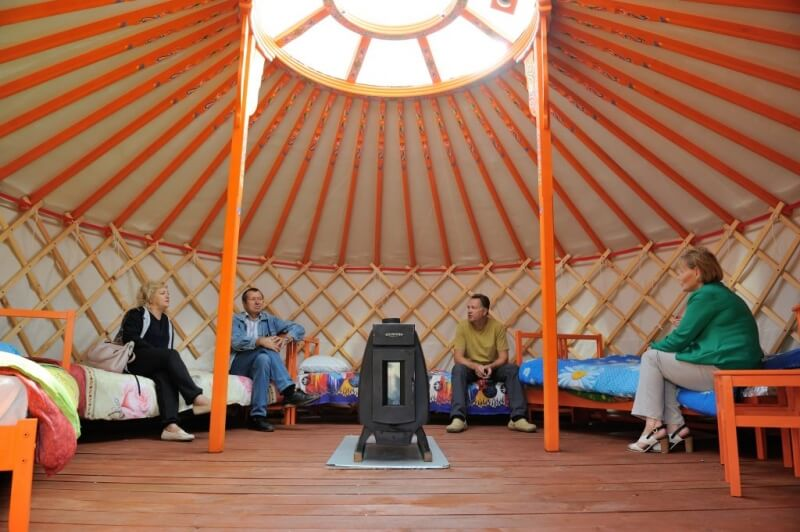
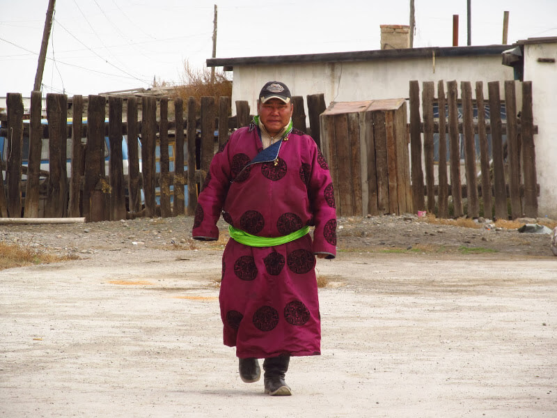

## Арвайхир – Баянгол

### 13 сентября 2018, день 26 (день и вечер).

В Арвайхире занял ту же позицию, что и днем раньше, но теперь уже не вечер, как тогда, а день. Останавливаю Тойоту круизер (Тойота, кстати, наиболее популярная здесь марка машин). Один из пассажиров вполне сносно говорит по-русски. Говорит, что провезут по нужной дороге километров 30, останется – 60.

По дороге решаем, что я еду к ним, а когда на дороге заметим машину, то меня к ней доставят. Нормально!

Подъезжаем. Здесь живет уже большая семья – стоят 3 юрты побольше, чем у Эрика. Хозяева доили коз, нас посадили в гостевой юрте. Тут уже кумыс пили по всем правилам монгольского этикета: отпил из общей пиалы, долей до полной, передай другому. Причем, передача по старшинству, здесь я был последним: молодежь продолжала заниматься домашними делами. На закуску подавали сыр. Пришел парень, затопил печь в гостевой юрте, поставили казан, наполнили водой.

Тут на горизонте заметили столб пыли от идущей по дороге машины. И мы погнали ей на перехват напрямую по степи. Еле успели – сигнал в машине не работал, сигналили фарами. Остановился. Да, едет в Баянгол, но сперва заедет к себе в юрту, а потом вернется за мной. Пока общаемся с русскоговорящим мужичком, который завез меня сюда. Родился он здесь, но теперь живет в Улан-Баторе. За рулем был его брат, а он с мамой приехал к нему погостить и отдохнуть от города.

Вернулась машина, еду в Баянгол. Это поселок – метров 300 длинной. Вышел на другую сторону стопить до Сайхан-Ова. Здесь уже больше колючек, чем травы.

Вечереет. На горизонте начали подозрительно быстро расти тучи. Задул ветер. Похолодало. Думаю, где ночевать.Теоретически, можно напроситься к кому-нибудь в поселке, но злоупотреблять гостеприимством считаю неправильным. Есть такое мнение, что количество доброты на человека лимитировано, а, злоупотребляя, мы уменьшаем свой лимит.

Решаю ставить палатку: сильный ветер и, похоже, будет дождь. Здесь уже проблема со стойкой для палатки посерьезней, чем в России: деревьев здесь нет! То есть совсем – даже кустов нет! Каждая деревянная деталь в доме привезена издалека, выполняет полезную функцию и старательно бережется. Так что дерево, к ветке которого можно привязать палатку, или палку для стойки найти просто невозможно – их здесь нет! Зато вижу А-образную опору ЛЭП, к поперечине которой и думаю привязаться.

Задувает всё сильнее, палатку рвет из рук. Зарядами начинается дождь. Ветер крепчает на глазах. Чувствую, что палатку может сорвать. Обхожу все колышки, перекрепляю, забиваю камнем до упора.

В это время ко мне подошла женщина из крайнего дома поселка (я отошел в степь метров на 150). Убеждаю ее, что у меня пока все нормально. Постояла. Показал ей, что у меня есть вода. Вроде успокоилась, ушла.

Расстилаю каримат. Чувствую – холодает. Залез в спальник. Ветер еще более крепчает. Изнутри придерживаю рукой и ногой подветренные точки крепления растяжек, чтобы не вырвало колья. Наконец, хоть на холод совсем не хочется вылезать, решаюсь еще раз обойти и проверить растяжки. Добиваю глубже не до конца забитые колья, на подветренные ложу булыжники.

Похоже, за мной наблюдают. Только я вылез на свет, из того же крайнего дома подъехал мужичек на мотоцикле. Сказал, что будет сильный ветер и очень холодно. Показал ему, что у меня есть спальник, куртка, а сам полез уже внутрь – на улице реально холодно.

Застегиваюсь в спальнике до конца. Колышки – почти уверен, что выдержат. Но начались сомнения, выдержит ли ткань такой напор? Лежу в самом высоком месте палатки, а крышу выгибает так, что она бьет мне по носу. Думаю, что же будет ночью?

Начинаю дремать. Слышу снаружи сигналит мотоцикл. Выползаю. Подъехал мужик, уже с дочкой, привезли мне чай в бутылке и позы в контейнере. Интересуются, может я пойду спать к ним? Тут уже соглашаюсь. Объясняю, что сейчас сверну вещи и подойду. Отдал им привезенное съестное назад, начинаю паковаться. Вещи сложил, укрывшись от ветра в палатке, но как сложить саму палатку? Малейшая неловкость и ее унесет в поле, что и мотоциклом не догонишь! Решил одну оттяжку с булыжником не отстегивать, а, сначала, затрамбовать палатку в рюкзак. Стал так, что ветер сам помогал трамбовать палатку в рюкзак, я только направлял. А после этого уже спокойно выдергиваю последний колышек и прячу веревку. К концу манипуляций снова подъезжает мужик. Отдаю ему рюкзак, а сам иду следом.

Юрта у них стоит за забором. Там же пара маленьких домиков. В один из них и заходим. Внутри горит печь, сидит недавняя женщина и их четверо детей. Напоили чаем, накормили позами (типа, пельменей, но огромные, причем, тесто тоненькое, а мяса очень много), угостили конфетами. Кстати, чай здесь – похоже, бульон после варки поз: горячий и сытный.

Пытаемся поговорить. Трудно. Они знают только монгольский. Старшая дочь, лет 14-ти, английский, вроде, учит, но на слух не воспринимает даже отдельные слова. Прошу у нее телефон, открываю переводчик. Пытаемся через него с основными вопросами разобраться. Появилась хоть некоторая ясность. Тут уже без перевода, на основе контекста, немного пообщались. Спросили, куда я дальше думаю идти. Рассказал о своих намерениях добраться до Южной Гоби. Уважительно покивали (а Эрик крутил пальцем у виска), мол, решил – делай!

Пошли спать – детей в школу завтра собирать. Отвели в отдельную комнату во втором домике. Я расстелил на полу спальник и в безветрии и тепле уснул.