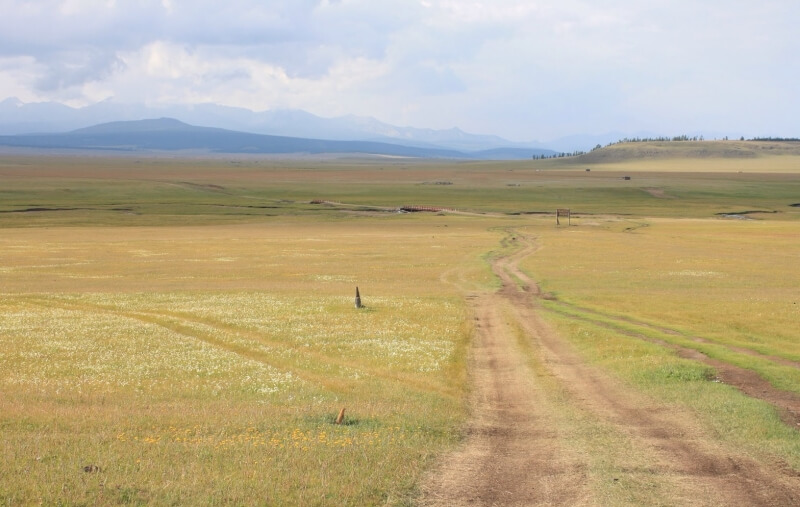

## Баянгол – путь к Сайхан-Ова

### 14 сентября 2018, день 27.

Утром проснулся в комнате домика, приютившей меня от шторма монгольской семьи. Смотрю в окно – ветер сильный, но уже не такой как вчера – светит солнце. Собрал вещи и пошел во второй домик – там висела моя куртка.

Хозяин тут же предложил чаю, подвинул плошку со вчерашними позами. Дети тут же: кто доделывает уроки, кто таскает ведрами воду, кто делает прическу.

Перед хозяином на столе швейная машинка, лекало, по которому он из кусочков кожи странной формы, похожих на мошонку, вырезает заготовки. Интересуюсь, что получится в итоге? Он показывает мне готовые изделия – мешочки для нюхательного табака, украшенные серебристыми шнурами. Красиво, да и кожа необычная – кремового цвета с рисунком из серо-рыжих линий.

Допил чай, попрощался. Хозяин проводил меня до ворот. Я вышел на вчерашнюю позицию, снял и поставил на траву (в колючки) рюкзак. Стою, жду. Подъезжает на мотоцикле тот же мужичек, хозяин дома, где я ночевал. Говорит, что машины отсюда до Сайхан-Ова не ходят. То есть не ходят совсем! Туда нужно идти пешком и, при возможности, стопить все, что движется: мотоциклы, лошадей. Спрашиваю, сколько туда километров? Он показывает два раза по пять пальцев. Думаю, ОК, 10 км – не проблема. Вскидываю рюкзак на плечи, еще раз прощаюсь и бодро шагаю по дороге.

Начал вспоминать карту. Закрались сомнения: 10 км – слишком мало. Подозреваю, что мужик показывал не 10, а 55 км. Примерно через километр мои подозрения подтвердились: посреди степи стоит указатель – до Сайхан-Ова – 56 км и стрелка – прямо! Назад идти намерения нет. Прикидываю, за какое время доберусь до поселка – примерно завтра. В рюкзаке – пол литра воды, 2 пакета гречки, но нет горелки. Однако варить кашу я и не собираюсь – моей воды все равно не хватит. Вообще-то по поводу еды особо не переживаю. За последние дни меня кормили одним мясом, так что чувства голода не появлялось совсем. Сегодня тоже позавтракал. Так что, думаю, часов на 8 должно хватить. К тому же, в степи стоят юрты и, если что, то, максимум в пределах пяти километров будет какая-нибудь.

Иду по гравию. Дороги расходятся, сходятся, пересекаются, ответвляются. Прикидываю генеральное направление: линия ЛЭП должна идти точно к поселку (а куда ей еще в степи идти?), а дорога по пути огибает преграды. Ответвления ведут к юртам кочевников и они менее укатаны, чем основная дорога. В общем, думаю, не заблужусь, да и уточнить всегда можно у пастухов: они сами подъезжают – интересуются, кто это тут идет – места то не туристические, тут не привыкли к посторонним, тем более к иностранцам. Правда, побаливает правая нога – еще на Байкале где-то что-то, похоже, ущемил. Но пока нормально.

Дорога идет, в основном, параллельно ЛЭП. От безделья (голова то свободна – только ноги топают) и из любопытства измеряю шагами расстояние между столбами – получилось 200 метров. Для того, чтобы была какая-то текущая цель, нахожу на горизонте какое-нибудь приметное место: перевал, холм, озеро, считаю до него количество столбов, вычисляю расстояние и иду до цели. При достижении какой-нибудь из целей, если чувствую усталость, делаю привал. Периодически, пересекающимися курсами, проезжают монголы на мотоциклах. Некоторые подъезжают, чтобы познакомиться и побеседовать. Тут понятно, что чуваки просто едут в степь к своему стаду, чтобы скорректировать их направление. Так что просто общаемся и расходимся.

Прошла встречная машина. Я помахал им, они мне. Иду дальше. С перевала замечаю: впереди по дороге мне навстречу едет группа из трех мотоциклов. Монголы организованными группами не ездят, чаще ездят по одному. Интересно, кто это? Иду, приглядываюсь – мототуристы: в мотодоспехах, машины навьючены снаряжением. Не останавливаясь, они машут мне, я в ответ машу им.

Иду дальше. Слышу – сзади догоняет машина. Идет по параллельной колее, метрах в 200 от моей. Машу, пытаюсь остановить. Из открытого окна что-то бодро прокричал парень и уехал. Сильно не расстраиваюсь – раз что-то мне говорил, значит не игнорировал, а если не остановил, значит была причина.

Иду. Уже пра искать место для привала: приметил точку – на перевале через 2 км (10 столбов). Вижу, с горы спускается та же машина и, пересекая колеи, едет прямо ко мне. За рулем – парень, лет 14-15, рядом сидит другой, лет 11-12. Поговорили, выяснили, кто куда едет, согласились подвезти. Сажусь, едем, пытаемся болтать. У старшего зазвонил телефон. Поговорил, остановился, говорит, что им назад уже надо. Благодарю и высаживаюсь – как раз на перевале, где планировал отдых. Но, так как я это расстояние не прошел и в машине слегка отдохнул, то иду дальше.

Иду, примечаю локальные цели, считаю расстояние, пытаюсь их достичь, снова примечаю цели и снова иду к ним...

По дороге встречаются странные озера – никаких речек или ручьев в них не впадает, но растения по берегам говорят, что здесь такой уровень воды уже давно. Вода не затхлая, как была бы в стоячей воде, а вполне себе прозрачная. Кроме того, если озеро находится на пути ЛЭП, то опоры там установлены по правилам монтажа в воде – с высоким бетонным основанием. А ставили то эти опоры не меньше 20 лет назад! То есть и озеру тоже не меньше этого времени. Предполагаю, что озера питают подземные воды.

Кстати, про воду. С вечера и утром нормально напился чаю, к тому же не жарко, так что полдня пить совсем не хочется. Во второй половине дня, на привалах, выпиваю по четверти из моей поллитровой бутылки. Иду во флиске – хоть солнце и припекает, но на ветру совсем не жарко.

Телефона нет, так что за временем слежу по солнцу. Ну как слежу? Нужно не прозевать момент наступления вечера – темнеет быстро и сразу становится холодно. По солнцу же, вернее по моей тени, определяю направление, когда захожу далеко от дороги – солнце где-то сзади. К вечеру я уже приловчился определять направление, поэтому иду, срезая изгибы дороги, по степи. Здесь, в поле, замечаю дикий чеснок. После обилия мяса очень хотелось овощей. Так что с удовольствием подъедаю по дороге чесночок.

Тень моя – впереди слева. По пути наблюдаю, как она удлиняется – оцениваю высоту солнца. Решаю, что пора искать ночлег, да и вода моя уже закончилась. Присмотрел на горизонте юрту, которая стоит недалеко от дороги. Иду к ней.

Подхожу не спеша – высматриваю собак – они здесь большие и довольно агрессивные. Заодно оцениваю, что юрта жилая: рядом стоят машина, мотоцикл и грузовичок, отверстие в крыше приоткрыто и оттуда торчит труба, на стойке рядом – панель солнечной батареи, на земле – спутниковая антенна, мешки с топливом.

Выбежала собака, подбежала ко мне, без энтузиазма облаяла, но явно показала пределы охраняемой территории. Нарываться на клыки не хочется, поэтому остановился метров за 100 и окликнул хозяев. Из юрты вышла старушка: меленького роста, сухонькая. Обхватив собаку, которая ей выше пояса, показывает мне, чтобы я шел в юрту. Не успел я переступить порог, как собака вырвалась и, таки, укусила меня за ногу. Ну что ж, не смертельно.

Зашел в юрту. В дальнем конце от двери лежит дед. Поздоровался. Зашла старушка, предложила табуретку. Сел. Прошу чаю ("цай" по-монгольски) – пить уже хотелось сильно. Бабушка налила пиалу и, по традиции, поставила рядом термос. Выпил одну пиалу, долил из термоса, выпил вторую, доливаю третью. Переползаю на пол, уже сообразив, что уселся на место хозяйки, возвращаю табуретку. Старушка предлагает поесть, отказываюсь. Тогда она насыпала в блюдо печенье, которое, говорит, испекла сама (на железной печке – как?) и домашний сыр (он здесь, обычно, сильно высушенный и очень кислый). Жажду уже немного сбил, поэтому по-немногу подъедаю угощенье, неспеша запивая чаем.

У деда больные ноги. Он лежит на ковре, курит. Особо не разговариваем – они не знают русский язык, я – монгольский. Бабушка с кем-то говорит по телефону. Я допиваю из термоса остатки чая – вроде, жажда немного утолена. В юрте горит печь: тепло, уютно.

Темнеет. Приехали на мотоцикле мужчина с женщиной. Садятся, начинаем говорить. Понял, что мужчина – сын стариков, в юрту которых я зашел. Через несколько минут подъезжает второй мотоцикл, заходят два парня – внуки. Тут старушка полезла в шкафчик, извлекла оттуда 2-литровую пластиковую бутылку, поставила на печь ковш и доверху наполнила его из бутылки. Содержимое немного подогрелось. Мужик, сын хозяев, наполнил пиалу и объяснил, что это – монгольская водка. Отпил сам, долил, передал деду. Тот, символически, отхлебнул. Мужик снова долил, передал своей жене. Тут и моя очередь подошла. Водка не очень крепкая, со сладковатым привкусом, фруктовым ароматом и теплая! Отхлебнул. Мужик сказал, чтобы я не филонил, а пил нормально. Водка приятная, почему бы и нет. Потом предложили бабушке, а молодежь обошли вниманием.

Начались разговоры. Спросили, откуда я тут такой взялся? Говорю, что сегодня вышел из Баянгола. Удивляются – оказывается, я 30 км отмахал. Начал рассказывать о своих планах дойти до Южной Гоби, показываю карту (пацаны притащили скотч – подклеить разрывы на сгибах). Покивали: мужик, мол, уважуха. Интересуются: что, шел в разбитых кедах? А они и правду, к 27 дню уже слегка истоптались. Сами монголы ходят в сапогах и другую обувь презирают. Еще Эрик (см. день 25) ржал с моих кед: говорит, выбрось их и возьми нормальную обувь, в смысле, сапоги. Здесь же у мужика сапоги – вообще бомба: с выдавленным на голенищах узором, толстой кожаной подошвой и загнутыми вверх носками – видно, ручная работа! Даже дед, который почти не встает, лежит в сапогах. Спросили, какой у меня размер обуви. Пытаюсь убедить, что кеды меня вполне устраивают. Тут же утвердительно сказали, что ночую я здесь.

В юрте со стариками, кстати, первый раз посмотрел передачи монгольского телевидения: танцевальное шоу, новости.

В общем, сидели долго, разговаривали. Наконец, стали разъезжаться. Мужик поинтересовался когда я ухожу и сказал, что завтра утром еще заедет. С нами остался младший внук – парень, лет 15-ти: видимо, для спокойствия стариков.

Начали стелиться. Мне выдали матрац, я достал свой спальник. Внук лег рядом. Всё, спать – ноги устали, а на больную уже хромать начал.