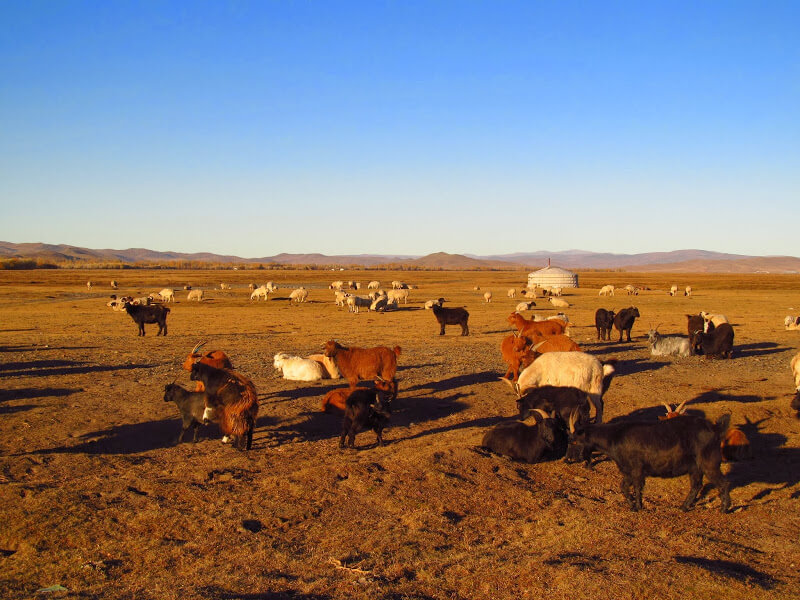
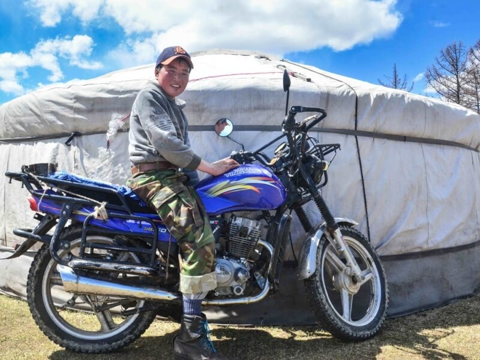
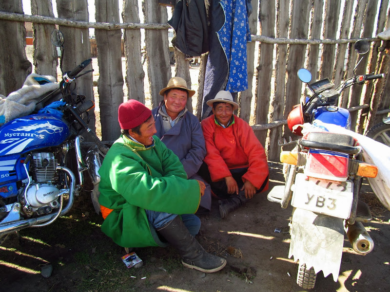
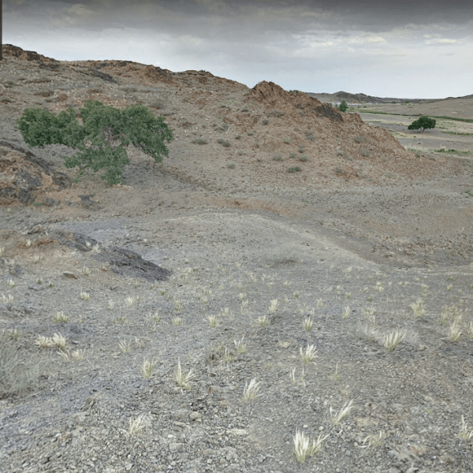
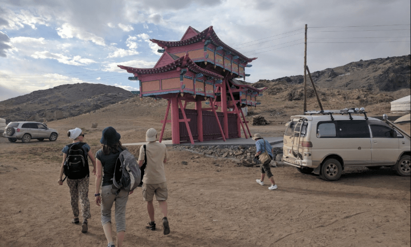
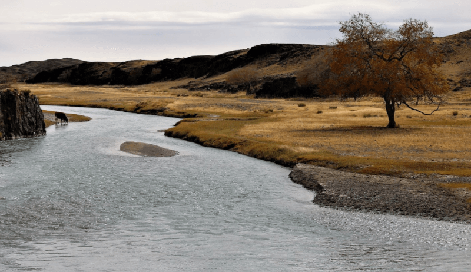

## Сайхан-Ова – Дэлгэрхангай

### 15 сентября 2018, день 28.

Утром проснулись около восьми (на стене юрты висели кварцевые часы). Бабушка встала и стала топить печь и варить чай. Когда внутри юрты немного согрелось, начали вставать и мы. Я пакую спальник и трамбую рюкзак.

Младший внук, лет 15-ти, сразу вышел, а через время вернулся и, через открытую дверь, указал на стадо овец и коз, которое он пригнал: видно, что хочет показать мне свою самостоятельность. Показываю большой палец, киваю, он скромно улыбается.

Выпили чаю. Внук с бабушкой пошли доить коз. Парень быстро отделил от стада дойных коз (как он узнает их в такой массе?), взял веревку и начал привязывать их мордами внутрь, хвостами наружу, в шахматном порядке. Часть коз, несмотря на наши с бабушкой попытки удержать их, сбежали в основное стадо. Парень привязал оставшихся, а потом пошел за стадом, которое отошло уже далековато, отлавливать беглецов.

Пока бабушка доила коз, мы с внуком пошли в юрту греться и пить чай. Подошла бабушка, процедила молоко и начала готовить завтрак. В казане, в остатках чая (который не поместился в чайник и термос), сварила рис и насыпала каждому в пиалу, досыпала в блюдо печенек и сыра. На десерт была простокваша из козьего молока с сахаром.

Поели, еще выпили чаю. Времени – уже 10 утра. Думаю, что пора уже идти. Попросил налить воды в бутылку. Бабушка неоднократно пыталась позвонить сыну, но он, видимо, был недоступен – слышно было, как робот в телефоне говорил что-то по-монгольски. Внук сказал, что немного подвезет меня на мотоцикле.

Выходим, я прощаюсь со стариками, садимся с внуком на мотоцикл и едем по дороге в сторону Сайхан-Ова. Минут через 10, на вершине одного из холмов, прощаемся и с парнем. Я пошел дальше, он еще постоял немного на вершине и уехал назад.

Снова дорога. Планирую сегодня прибыть в Сайхан-Ова. Пить не хочу, есть – тоже. С холма спускаюсь в широкую котловину, перехожу ее и, когда выбрался оттуда наверх, делаю привал.

Наверху задувает ветер. Усаживаюсь, осматриваюсь. Начинается пустыня: здесь уже больше песка, чем камней, жиденькая травка отдельными пучками высотой, сантиметров 5, и верблюжьи колючки – темно-зелеными пятнами. Орлов и ястребов, которых до этого было много, уже не видно.

Отдохнул и в путь! Солнце припекает, но ветер холодный – свитер не снимаю. Снова, как и вчера, чтобы не скучать, примечаю локальные цели: озеро, холм, считаю по столбам расстояние, иду. Юрты здесь стоят уже реже – травы для животных меньше, поэтому каждой семье нужна бОльшая территория.

По дороге разгоняю табун лошадей, которые пасутся возле самой дороги. Дальше встречаю большое стадо овец с козами (они всегда здесь пасутся вместе), которые переходят дорогу. Но к моему приходу перейти не успевают, так что я делю их на две части. Тут я наблюдал организацию стада: когда я проходил по дороге между двумя его частями, то ближайшими ко мне животными оказались крупные козлы, которые стояли и направляли на меня рога, пока остальное стадо уходило дальше. При этом овцы совсем никак не организовывались. Такую же систему я наблюдал и потом еще несколько раз: при моем приближении стадо уплотняется, козлята и самки идут в самый центр, а снаружи, в мою сторону, смотрят только рога крупных козлов. А овцы только пользуются их защитой.

Еще пара привалов и начинаю чувствовать жажду – пью воду. Иду. Сзади слышу шум. Оборачиваюсь. По параллельной колее едет машина в нужном направлении. Машу, она поворачивает и, пересекая колеи, подъезжает. За рулем – дедушка, говорит, что довезет до Сайхан-Ова. Круто!

Приезжаем. Поселок – за рекой, через которую узкий пешеходный мост – машина не пройдет. Даже если через реку и есть брод, то малолитражка деда там утонет. Благодарю и первым иду в поселок – у деда в машине лежала палочка и он не спешил выходить.

Всё, я в Сайхан-Ова! Первый пеший этап по монгольской степи завершен! В моем движении на юг, я прошел степную часть Монголии. Здесь же уже были все признаки пустыни: травы почти нет, почва – песок и камни, из растений, в основном, жидкие пучки колючек. Но моя цель – забраться еще южнее – в Южную Гоби!

В поселке начинаю поиски дороги дальше. По карте, ехать теперь надо до Мандал-Ова. На улице пусто. Заглядываю в один из дворов. Там мужики разбирают переднюю ступицу полноприводного микроавтобуса. Интересуюсь, где дорога до Мандал-Ова и ходят ли туда машины? Подошла девушка, немного говорящая на англо-русском. Переводит, мол, сейчас этот автобус для меня пойдет в Мандал-Ова. Говорю, что денег на аренду машины у меня нет. Мужики сразу теряют ко мне интерес. Девушка же мне рассказала, что отсюда в Мандал-Ова транспорт почти не ходит, но через их поселок проходит трасса туристических маршрутов. На заправке "Петрович" туристические караваны, обычно, пополняют запасы топлива перед поездкой по пустыне и там их можно перехватить. Показала мне направление.

Иду на заправку. Два парня на пороге курят. Прошу у них воды. Приглашают внутрь – там магазин. Но кроме фанты, колы и других напитков, воды нет. Интересуюсь, есть ли простая вода? Заправщик принес из другой комнаты чайник и налил в кружку воды. С удовольствием напился! Интересуюсь у ребят, как часто здесь бывают туристические машины? Говорят, что движение начинается обычно после 5 вечера. Сейчас только 2 дня – времени еще много. Я выхожу на улицу и устраиваюсь на камне около заправки.

Ребята вышли на порог, заметили меня, зовут внутрь. В комнате заправщика усаживают на диван, типа, давай, сиди с нами здесь. Спросил у них есть ли интернет и попросил телефон (мой, уже второй за поход, утерян см. день 25). Отправил сообщение домой.

Заправщик скучает и играет в телефоне. Второй парень, который немного знал английский, болтает со мной. Бат Эрдэнэ, так его звали, оказался веселун. Болтаем, хохочем. К заправке периодически подъезжают машины, мотоциклы, но пока все не мои. Бат Эрдэнэ уже зовет меня к себе ночевать, говорит, напьемся кумыса, пива!

И вот заправщик говорит, что подъехала машина туристов. Выхожу. На заправке стоит полноприводный микроавтобус. Я иду к водителю, как оказалось, отлично говорящему по-русски. Звать его Женя, бабушка его из Сум. Он везет туристов по маршруту в древний монастырь в Дэлгэрхангай, а потом дальше в Гоби. Но мест в его машине нет. В это время подъезжают еще 2 машины. В первой – тоже полно туристов. Во второй, забитой вещами под крышу, по-монгольски мне говорят, что тоже места нет, разве только на коленях. Я жестами активно соглашаюсь с этим вариантом. Ребята, неожиданно, тоже соглашаются и говорят, чтобы я нес свои вещи. Вытаскиваю из комнаты заправщика свой рюкзак, подходит Женя. Прошу его, как понимающего монгольский язык, уточнить, куда едут ребята, к которым я вписался? Говорит, что все три машины – его и идут вместе, а это – типа, грузовая с вещами туристов и всякими припасами.

Кабина японской машинки узкая, рассчитана только на двоих японцев, а совсем не на троих европейцев. Салон под потолок забит рюкзаками туристов. Трамбуем мой рюкзак в какую-то щель, кое-как умещаемся вдвоем на пассажирском месте и едем. Машу, на прощанье, парням на заправке.

Туристы поехали вперед на 2-х машинах, а мы, на гружёном внедорожном микроавтобусе, кружим по поселку и что-то выспрашиваем у населения. Наконец, подъезжаем к маленькому домику без окон, недалеко от реки. Оказывается, там внутри – колодец, в котором местные жители берут воду. Здесь мы наполняем канистры водой и едем догонять ушедший караван машин.

Проехали пустынный участок и по каньонам начали углубляться в невысокие старые горы. На дне каньонов росли большие "нормальные" деревья, от которых я уже слегка отвык.

Приехали в монастырь часов в 6 вечера. По руинам бродят группки туристов. Выясняю, что группа с которой я приехал, да и почти все остальные, сегодня ночуют в юрточном кемпинге, а завтра едут дальше: кто в Гоби, кто наоборот – из Гоби.

Хожу, знакомлюсь с новой позицией. Монастырь Дэлгэрхангай расположился очень живописно: в небольшой долине среди невысоких скал и холмов, окружен настоящими деревьями. Чуть дальше, в каньоне, течет река, на берегу которой расположен кемпинг.

Подхожу к водителю одного из микроавтобусов, пассажиры которого пока осматривают руины, чтобы уточнить маршрут. Изучаем мою карту, я рассказываю о себе. Он в навигаторе посмотрел, где находится Украина, офигел. Зовет в кабину. Сидим, болтаем. Он показал фотки своих детей, угостил меня домашней колбасой, хлебом, печеньем. Рассказал мне о туристических маршрутах, которые здесь проходят и подтвердил, что, обычно, здесь все ночуют, а утром, часов в 7-8, разъезжаются: кто в Баянгол и дальше в Гоби, кто в противоположную сторону – в Хархорум. Вернулись туристы. Я выхожу и прощаюсь с водилой.

Вечер, пора думать о ночлеге. Кемпинг – для богатых туристов – мне не по карману. Осматриваюсь. Между скал нахожу подходящее место под деревом, где и ставлю палатку.

На закате, через мой лагерь прошло стадо коров, но меня это уже особо не беспокоило – я уже дремал в спальнике. Думаю, что нужно встать на рассвете, чтобы успеть собраться и перехватить машины туристов. С этими мыслями и засыпаю.