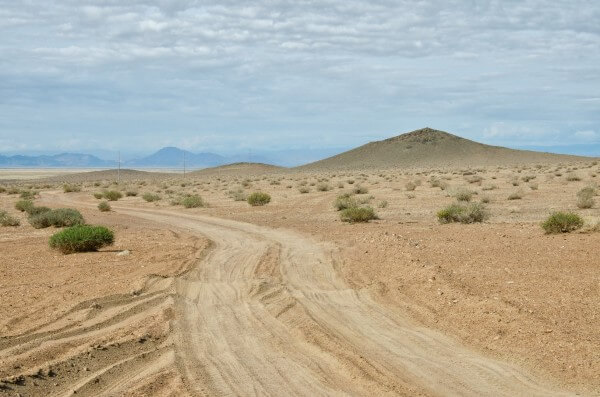
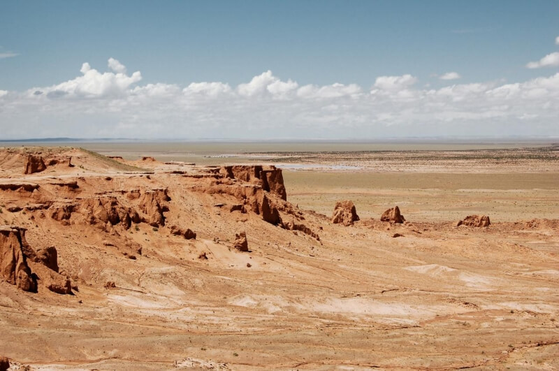
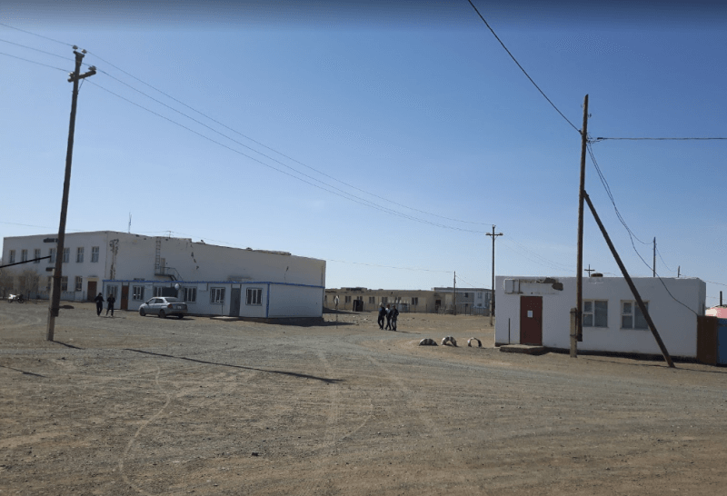
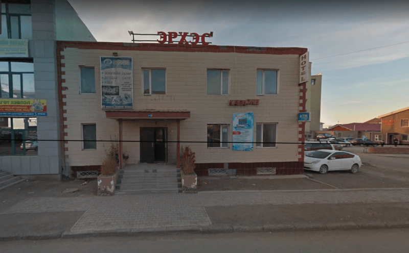
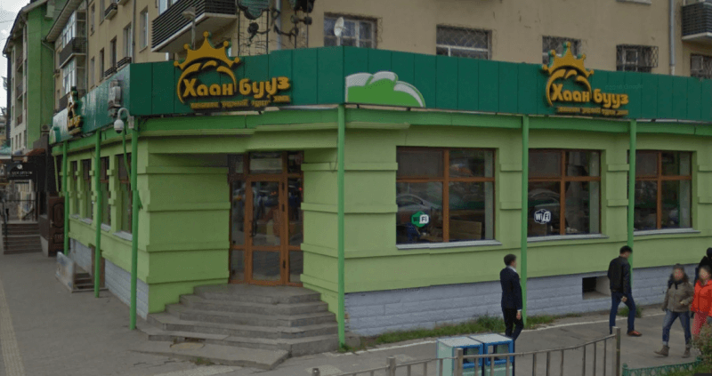

## Дэлгэрхангай – Мандал-Ова – Баянзаг – Булган – Даланзадгад – Улан-Батор

### 16-17 сентября 2018, дни 29-30.

На рассвете, как и планировал, подъем. Хотя ночью и было холодно, но конденсата в палатке нет совсем – видимо, сухой воздух пустыни не позволяет влаге переходить в жидкое состояние. Пакую рюкзак и иду к стоянкам. Из вагончика буровиков рабочие приглашали на утренний чай, но я отказался, т.к. машины уже начинали грузиться туристами.

Походил по стоянке – все машины полные. Видимо невыгодно для групповых туров гонять полупустую машину. Многие туристы меня узнают, улыбаются, машут – я вчера подходил ко многим машинам, да и палатку ставил на видном месте – около дороги к кемпингу.

Подошел к водителю УАЗика-буханки. Пока обсуждали мои намерения и разглядывали карту, подошел водитель Круизера. К нему я вчера, кстати, подходил, но женщина, представитель турфирмы быстро меня отшила. Короче, он подошел спросить дорогу на Баянгол, а водитель УАЗа начал ему объяснять. Пока я стою, жду окончания диалога, чтобы вписаться в грузовой УАЗик, ко мне подошли пассажиры Круизера с теткой из турфирмы, которую взяли в качестве переводчика. Поинтересовались, куда я еду? Я, уже зная маршруты туристов, говорю, что мне до Булгана, т.к. они едут дальше на юго-запад с ночевкой в Гоби, а мне нужно в Даланзадгад, на юго-восток. Те предлагают мне ехать с ними. Тетке из турфирмы, похоже, не очень нравится эта идея, но клиент, типа, прав и я гружу свой рюкзак в багажник Круизера.

Едем. Это пара немцев, парень с девушкой, заказали индивидуальный тур по Монголии. Девушка говорит только по-немецки, парень знает английский. Неспешно беседуем, обсуждаем, чем нас привлекла Монголия. Я параллельно отслеживаю дорогу, чтобы знать, где мы находимся. Быстро выехали из каньона, где находился монастырь на равнину. Очень красиво: песчаная равнина, а на горизонте высокие скалистые горы со снежными шапками. Здесь уже пастухи вместо лошадей разводят верблюдов, а овцы и козы – как и везде. Показался поселок, отмечаю, что доехали до Мандал-Ова. Заехали на заправку, едем дальше.

За Мандал-Ова началась реальная пустыня: редкие пучки выгоревших колючек, песчаные дюны, через которые ведет колея дороги, на горизонте всё те же заснеженные вершины. За всю дорогу к Баянзагу, я не заметил ни одной юрты. Очень не пожалел, что не шел здесь пешком – даже водички попросить не у кого.

Доехали до плато Баянзаг. Здесь немцев ведут в кемпинг обедать, а потом – смотреть кости динозавров. Тетка провела беседу с туристами и меня высаживают. Водитель показал направление на Булган. На горизонте, сквозь дрожащий миражами воздух, замечаю что-то, похожее на поселение. Прикидываю – километров 20, похоже. Вода есть, иду.

Спустился с плато, иду дальше. Иду не по дороге, которая идет дугой, огибая русло высохшей реки на дне котловины, а напрямую, примерно держась направления на поселок. Примерно, это потому, что спустившись с плато, я потерял признаки поселка за горизонтом, но заблаговременно приметил цепь ориентиров на него. Снова, как и перед Сайхан-Ова (см. день 27) нахожу в поле дикий чеснок, а здесь еще обнаружил и дикий лук. Иду, подъедаю траву.

Перебрался через сухую реку, выбрался наверх из котловины. Поселок виден уже более внятно, но отдельные дома все равно еще не различаются. Иду дальше. На подходе, замечаю редкие юрты, но все далеко от дороги.

Иду. От одной из далеких юрт отъезжает машина в сторону поселка, но потом поворачивает и подъезжает через поле ко мне. Мужичек с дочкой, лет пяти, едут в магазин и довозят меня до поселка.

Всё, я в Булгане! Следующая моя станция – Даланзадгад – крупный город, от которого уже идет асфальтовая трасса до Улан-Батора (оранжевая линия на карте, подаренной подвозившим меня пареньком см. день 24). Предполагаю, что из Булгана уже должны ходить машины в город, хотя до него – больше 100 км.

Зашел в магазин, купил там сок в бутылке странного объема – 1,2 литра и украинское печенье "Супер Контик", изготовленное в России. Здесь же, на улице, всё это съел и выпил, угостив одной печенькой мальчугана, который крутился возле меня и всё время говорил "хелло". Из поселка дороги расходятся веером во все стороны, поэтому я уточнил направление на Даланзадгад у водителя грузовика.

На выезде стоит бензоколонка. Рядом стоит юрта, на пороге которой заправщица загружает белье в стиральную машину (привет всем, кто считает что кочевники и прогресс несовместимы). Заправки в монгольской глубинке работают как и везде – круглосуточно. Просто заправщик, юрта которого стоит, обычно, неподалеку, занимается дома своими делами, а когда подъезжают машины, то подходит и выполняет свои рабочие функции.

В общем, я уточнил у заправщицы, та ли эта дорога? Положил рюкзак в колючки, сел сверху и жду машину в Даланзадгад возле пыльной грунтовки. Прошло несколько машин (все не мои) и несколько времени. Тут заправщица машет мне, мол, твоя машина. Подхожу. Здесь уже начинается цивилизация – за проезд просят денег. Торгуемся, скидываю цену до 7 тыс. тугров. Едем.

За рулем японской микролитражки – девушка. Там, где туристов для ощущения экстрима возят на джипах, мы, на микромашинке с барышней за рулем, летим на скорости 90, иногда проскакивая между колеями через поле. На особо крутых подъемах думаю, что коробка-автомат рехнётся. Но нет: аккуратно взбираемся, переваливаем песчаные горбы и мчимся дальше. На подъезде к городу девушка стала высматривать параллельные дороги по машинам, едущим по ним – в полкилометра от нас с обеих сторон – и как-то отбирала нужные. Мы переезжаем на них когда по колеям, ведущим к юртам, а потом по полю, но чаще просто по направлению на столб пыли от проехавшей машины. Наконец, километров за 5 от города, выехали на приличный асфальт и по нему въехали в город.

Уже вечер. Иду по Даланзадгаду, думаю о ночлеге. Спрашиваю население об отелях, но в дешевом нет мест, в другом – слишком дорого (просили 35 тыс.), а у меня в местной валюте осталось 12 тыс. тугров. Зашел еще в один – там тоже все занято. На выходе из него решил спросить таксиста, который стоял рядом. У него в салоне сидела девушка, слегка говорившая по-русски. Говорю, что денег у меня мало, поэтому, знают ли они дешевый отель или место, где можно поменять доллары. Отвечают, зачем отель? В 8 вечера идет автобус в Улан-Батор и стоит 19 тыс. Говорю, что денег не хватит, нужно менять. В общем оказалось, что в это время деньги поменять уже негде. Заехали на автовокзал – там доллары не хотят брать в оплату билета, а парень-таксист менять отказывается. Думаем, как поступить? Водитель вызванивает частного перевозчика, который за 10 долларов обещает довезти до столицы.

До отправления моего автобуса еще около полутора часов. Парень катает меня по городу, параллельно таксуя. Болтаем, обмениваемся контактами в фейсбуке. Подошло время отправления. Приезжаем на пятачок, откуда едут частники. Гружусь в микроавтобус, прощаюсь с новым другом и еду ночным автобусом в Улан-Батор.

Здесь дорога – уже приличный асфальт, хоть и с колдобинами. Темно, едем. Вдали вижу много огней: похоже – город. Едем 10 минут, 20, полчаса, но никак туда не приедем. Оказывается, т.к. в степи нет деревьев, то трассу видно очень далеко, а эти огни – фары впереди идущих машин, растянутых по горизонту изгибами дороги.

Японский микроавтобус маленький и тесный. Пытаюсь спать. Не очень удобно, но временами проваливаюсь в сон. В какой-то момент замечаю, что монгольская попса, игравшая в салоне, сменилась на диско 90-х. Присмотрелся: за рулем уже сидит девушка-пассажир, а водитель спит на переднем сиденье рядом. Девушка едет не торопясь, но уверенно. По дороге иногда разгоняем сонные стада овец, лошадей. Под утро водитель снова занял свое место и снова заиграла попса.

В Улан-Баторе пассажиров развозят по адресам. Я своего адреса не знаю – он был в потерянном в степи телефоне. Поэтому, прошу везти меня в центр, к дому правительства, где думаю сориентироваться на месте. Здесь уже знакомый район: замечаю знакомые улицы. Выхожу на перекрестке к улице, ведущей к знакомому хостелу (см. день 22).

Сейчас 5 утра. Не знаю, есть ли свободные места в хостеле. Эрика еще нет, а жильцы, вероятно, спят. Иду в кафе на перекрестке, в котором много таких же как я, ожидающих, когда проснется город. Заказываю чай, пишу дневник. В начале девятого иду в хостел. Эрик уже здесь. Кормит завтраком, поселяет.

