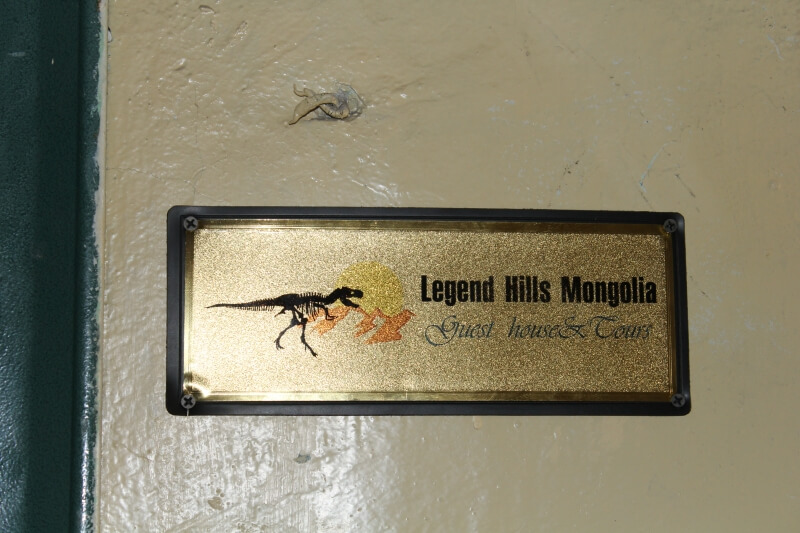

## Улан-Батор

### 17-18 сентября 2018, дни 30-31.

Здесь особо писать и не о чем: ел, пил, спал. Стирал шмотки, лечился, писал отчеты. Общался с населением хостела. Единственное, что сделал, так это купил билет на поезд – завтра вечером еду в Замын-Ууд, пограничный с Китаем городок.

