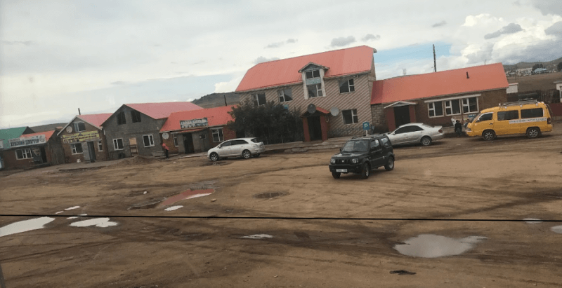
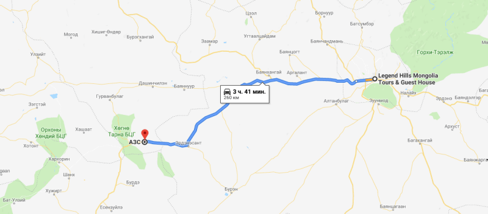

## Дорога в Хархорум (Каракорум)

### 11 сентября 2018, день 24.

Утром решил ехать в Хархорум – древнюю столицу Монголии. Это решение возникло только сегодня утром после беседы с Эриком (хозяином хостела) и рекомендаций проживающих путешественников.

В общем, решено! Упаковал рюкзак. Зашел в обменник поменять тугров в дорогу. Девушка в обменнике говорила по-русски. У нее узнал, как выехать в нужную сторону: указала путь до автостанции, но там же и выезд.

Поехал. От автостанции свернул не на ту дорогу. Пока это понял, пока вернулся назад, потратил часа 2. Нашел таки выезд. Стою, стоплю. Здесь полно таксистов! В Улан-Баторе вообще нормально, когда люди ловят машины в любом месте и те с удовольствием и за деньги их везут. Часто машины подъезжают к остановкам и зазывают пассажиров. Короче, таксисты.

На одной машине проехал пару километров в нужном направлении. Водитель другой сказал, что вывезет, но развернулся и привез на автостанцию. Вот засада – языковой барьер! Раз уж я вернулся на автостанцию, зашел узнать стоимость билета – дороговато. Иду опять на выезд.

В очередной остановленной машине смог объяснить парню, что мне нужно просто выехать из города в этом направлении. Вывез из города километров на 5 и на горке высадил. Наконец-то город с промзоной и пригородами позади! Впереди – только трасса! А позади внизу, в долине, раскинулась столица!

На трассе много отвороток, часто не обозначенных указателями. Одну я как раз и искал. На грузовичке еду дальше. Внезапно, мужичек вспоминает, что поворот на Хархорум мы проехали. Ну, ок. Выхожу. Для ясности (языковой барьер, все-таки), уточняю у водителя остановленной в том же направлении машины, выведет ли эта дорога в Хархорим? Однозначно – нет!

Перехожу на другую сторону, Остановил грузовичек с веселым парнем, который везет меня назад. Парень вполне понятно изъясняется на англо-монгольском суржике. Поболтали, но ехать всего 1,5-2км. На прощанье, дает мне туристическую карту Монголии (которая в дальнейшем мне очень пригодилась). Я, в подарок, сыплю ему пригоршню украинских монет.

На развилке – вагончик ГАИ. Уточняю направление: пока все верно! Иду по пустой трассе, а времени то уже 3 часа дня! Опять 

грузовичек. Похоже, отец с сыном. В кузове везут пару лошадей. Ребята, похоже, деревенские – в монгольских халатах с длинными рукавами, подпоясанные цветными поясами. Не понимают ни русского ни английского. Они ржут с меня, я с них. Так и доехали до развилки.

Кажется, из Улан-Батора есть еще дорога в Хархорум – более прямая. На нее, оказывается, я и попал. Ну, я то решил ехать в древнюю столицу только сегодня, так что не особо подготовился. В общем, развилка перед затяжным подъемом. Иду. Перед самой вершиной останавливает машина. С полуслова понимают мои намерения. С ними проехал километров 100. Вышел на развилке. Вокруг, до самого горизонта, голая степь без намеков на деревья и жилье.

Пока выбирался из Улан-Батора, потерял много времени. Сейчас уже вечереет. Не особо хочется оставаться в голой степи на трассе. Вечером довольно холодно и ветер, а вокруг ни деревца, ни кустика и никаких выступов рельефа, чтобы укрыться от ветра.

Стою, стоплю. Уже в темноте останавливает большой автобус. Вваливаюсь в открывшуюся дверь и с порога говорю о своих намерениях. Пассажиры и водитель никак не могут понять, что я от них хочу, но мелкая девочка, лет 12, сразу разобрала произносимое мной название города. Берут, едем. Присмотрелся: в автобусе всего 5 человек плюс водитель, остальное пространство, до самого потолка, утрамбовано тюками в пленке. Пристраиваюсь на одном из них. Рядом сидит парень, отлично знающий английский – выучил его, когда работал в ЮАР. Выспросил у меня буквально все! Выяснили, что батарея моего телефона села (пока выбирался, активно использовал GPS). Другой парень забрал его, полез куда-то за водительское сиденье, поставил на зарядку. Я, в свою очередь, узнал, что едут они через всю Монголию на запад и в Хархорум заходить не будут. Километров за 150 есть поворот на "трансмонгольскую" трассу.

Часов в 9 вечера останавливаемся у кафешки перекусить. На стол поставили пару термосов с чаем. Пока готовят еду, пьем, подливаем, снова пьем. Я заказал, как и большинство, гуляш. На гарнир лежала ложка риса и столько же картошки пюре. Остальное место большой тарелки до краев заполнено мясом. Вкусненько! Кстати, курятина здесь есть только в супермаркетах, блюд из курицы или другой птицы я не встречал.

Поели. За чаем англоговорящий парень сказал, что здесь сдается комната, а они, километров через 50 поворачивают, но там ничего нет, так что пришлось бы стоять мне на пустой трассе. Здесь же – единственное жилое место по пути. Соглашаюсь, тем более цена нормальная – 10 тыс. тугров. Хозяйка постелила постель в комнате. Сами же они живут в юрте, которая стоит во дворе. Там же, во дворе, удобства с выходом через кухню.

Всё, находился я сегодня, спать!

Уже заснул, как в комнату, дверь которой не запирается, ворвался мужик в монгольском халате. Похоже – это хозяин,

вернувшийся домой, которому сказали, что у них спит иностранец. Поинтересовался, откуда я и видя, что я уже сплю, ушел.

