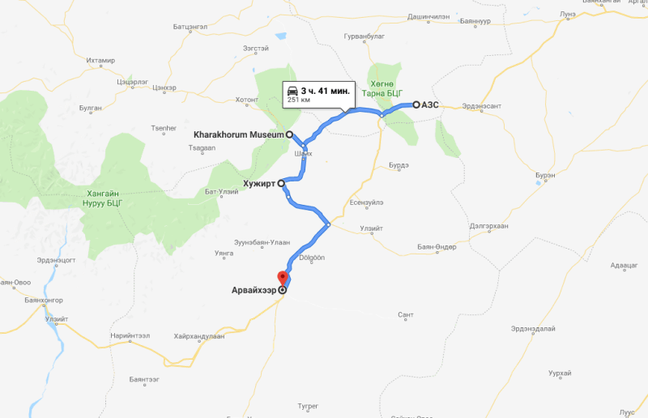
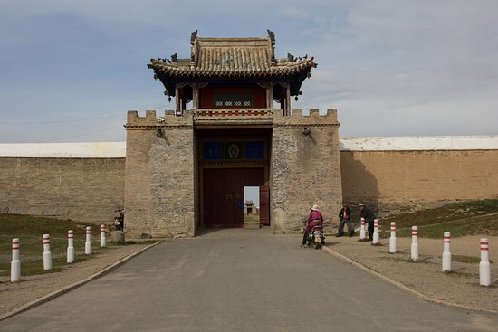
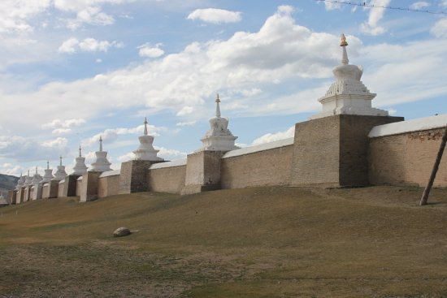
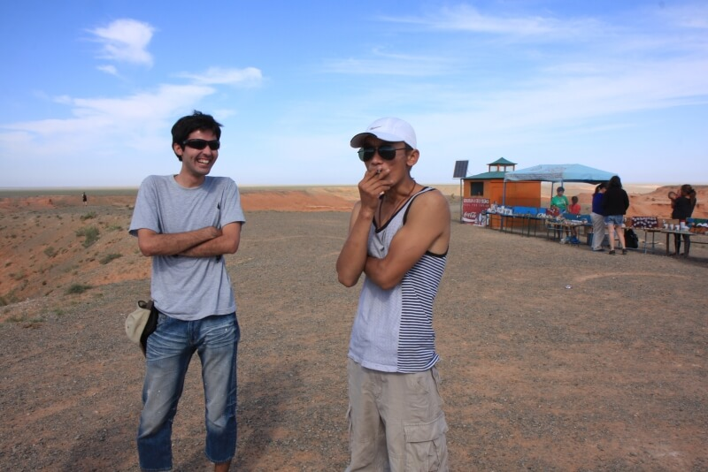
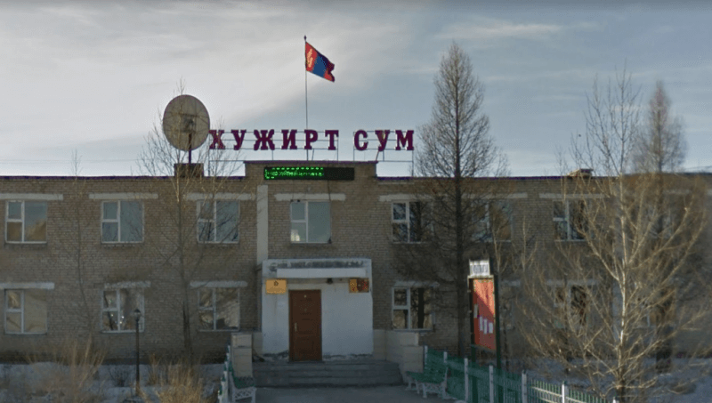
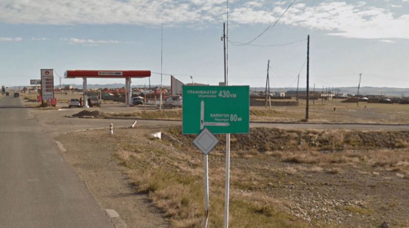
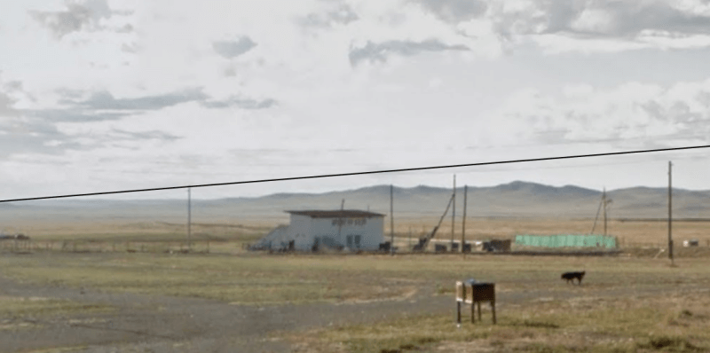

## Хархорум – Хужир – Арвайхир

### 12 сентября 2018, день 25.

Утром в комнате придорожного кафе я был разбужен хозяйкой, которая ворвалась в комнату, сказала, что пора вставать, открыла окно и скрылась. Собираюсь, трамбую рюкзак – сую туда ненужную днем куртку. Выхожу в зал. Говорят, чтобы я не спешил. Хозяева собирают в зале детишек в школу, туда же заходят утренние посетители – мельком смотрят на меня и занимаются своими делами. Никто ничему не удивляется (или просто делает вид): я – их халатам с рукавами до колен, они – моей немонгольской внешности и красному рюкзаку. Дозаряжаю телефон, меня поят чаем, двигаю дальше.

Первая же машина идет в Хархорум – круто!

Заднее сиденье завалено вещами, на которых сидят две девочки, лет 6-ти и 4-х. Еще один ребенок до года – впереди у мамы на руках. Старшая девочка скромничает, зато младшая разводит бурную деятельность: угощает всех конфетами, разувается, обувается, садится на бардачке возле КПП, возвращается на заднее сиденье. Родители совершенно не возражают и предоставляют ребенку самостоятельно решать, что делать. Неспеша, жестами, многократными повторениями на разных языках общаемся.

Остановились. Папа вышел по нужде. Младшая девочка тут же решила, что ей тоже надо. Помогаю ей обуться, пропускаю к выходу. Выходит, становится рядом с папой... Оказалось, младшая девочка – это мальчик!!! Тут уж я внимательнее присмотрелся. Что меня ввело в заблуждение – косички у мальчика. А вот одежда немного разная. Оба ребенка в штанах, но у старшей девочки длинная туника, а мальчик в джинсах, толстовке и кроссовках. Кроме того, у девочки прическа более аккуратная с цветными резинками.

Так мы и доехали до самого древнего дворца. Они тоже приехали на него посмотреть. Пошел и я. Походил по территории, пофоткал.

Думаю, что пора двигать дальше. За стенами дворца, уже в сувенирных лавках у парня с очень фотогеничным орлом уточняю маршрут до Южной Гоби (произносится как "Омнговь"). Тут уже на пальцах сложно и карта в телефоне не дает полного обзора. Достаю подаренную мне по дороге сюда бумажную карту. Определились с генеральным направлением на юг и первым населенным пунктом – Арвайхир. Уточнил направление к нему, иду по дороге. Останавливаю машину, водитель говорит, что это не та дорога. Вывез на трассу.

Стою, стоплю. Дорога довольно пустынная. Останавливает пожилая пара. Долго выясняли, что нам почти по пути. Сказали, что едут в Хужир, но оттуда есть дорога в Арвайхир.

Заехали в Хужир. Женщина вышла, на ее место села девушка в медицинском халате. Вообще, здесь всё происходит как-то загадочно, но при этом вполне естественно. Складывается впечатление, что все друг друга знают и, казалось бы, случайные встречи совсем не случайны. В общем, сказали, что вывезут в направлении Арвайхира.

Остановили в центре городка – магазин, банк, типа рыночек. Спрашиваю на месте, где же трасса. Тычут какими-то изгибами – непонятно. Иду по среднему направлению. Поднимаюсь к школе. С пригорка замечаю на другой стороне городка, за рекой, трассу. Чтобы зря не идти в обход к мосту, интересуюсь у водителя стоящей перед школой машины, можно ли по этой улице выйти на трассу. Тот подзывает какую-то училку. Она на сносном русском интересуется, куда я еду. Говорит, что эта машина тоже идет в Арвайхир, но нужно заплатить. Прикидываю, сколько налички у меня останется – цены на проезд здесь немаленькие. Торгуюсь, соглашаются везти бесплатно!

Сажусь. В машине уже сидит девочка со школьным портфелем. Подходит и садится впереди мужичек с папкой документов. Он почти всё время говорит по телефону. Едем. Приезжаем на какую-то базу в этом же городке. Подъезжают машины. Что-то загружаем к нам, что-то перегружаем им – ничего не понимаю. Меня тоже перегружают в тойоту круизера. Водитель уже другой, а мужик с документами – тот же и всё так же говорит по телефону.

Вроде, едем в Арвайхир. Свернули с асфальта на грунтовку. Тут я увидел, что значит дорога, обозначенная серой линией на карте! Странно видеть посреди степи между расходящимися веером грунтовками дорожные знаки! Колеи расходятся, но мы каким-то образом узнаем нужную и едем по ней. Я наблюдаю за окружающими пейзажами и живностью. Возле дороги, в степи, проложены тропинки-ниточки. Их натоптали степные грызуны, размером с крысу, но вполне симпатичные. При подъеме в горы встретили стадо яков – высокогорных, лохматых.

Мужичек с документами, оказалось, вполне сносно говорил по русски, а недостающие слова заменял английскими. Вполне нормально пообщались, в промежутках его длинных телефонных переговоров.

Километров 60 по грунтовке, 30 – по асфальту и мы в Арвайхире! Везут в центр города, но мне туда не нужно, говорят, там отель, автовокзал. Не-не-не! Прошу остановить, пока не заехали глубоко в город! Выхожу. На шиномонтаже у ребят уточняю свой следующий пункт – Баянгол. К нему тоже ведет серая ниточка на карте. Выяснил, где дорога. У других людей уточнил – вроде вот он правильный выезд. Захотел узнать, который час и сколько у меня еще светлого времени в запасе. И тут обнаружил пропажу – нет телефона! Он, скорее всего, выпал из кармана в машине при езде по грунтовке, а когда я оперативно высаживался, то на сиденье не глянул. Вот засада – тут как раз самое интересное начинается.

Немного расстроен пропажей второго за эту поездку телефона (про потерю первого см. дни 17-18). Но, что делать. Стою, стоплю. Здесь, на краю города, какое-то странное движение: дальше по дороге, на которой я стою, машины перепрыгивают бордюр и едут каждый по своей траектории к нужной улице. Чтобы отфильтровать этот ненужный трафик, отхожу дальше по дороге. Уже вечер, через 2-3 часа стемнеет. Понимаю, что по грунтовке никто в ночь 90км не поедет. Мои подозрения подтверждает женщина во встречной машине, которая сказала,что в Баянгол ехать нужно утром. До темноты часа два, в городе уныло. Всё еще надеюсь проехать часть пути в нужном направлении – должны же селяне из города домой возвращаться! Но, на всякий случай, присматриваю место где можно заночевать лагерем. Также приглядываюсь, на предмет вписаться на ночь, к жителям помещения, расположенного под трибуной бывшего стадиона (я у них уточнял направление).

И вот останавливается грузовичек. Водитель говорит, что в Баянгол не едет. Я пытаюсь убедить его, что часть пути – это тоже хорошо.

В общем едем.