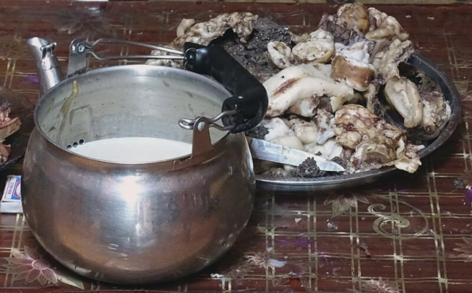

## Окрестности Арвайхира. В гостях у Эрика (утро).

### 13 сентября 2018, день 26 (утро).

Спать было тепло, а вылезать из спальника – холодно. Юрта остыла потому как для вентиляции (ведь еще не зима) нижняя часть войлока стены местами завернута. Лежим, дремлем. Хозяйка встала, растопила печь, поставила варить чай. Юрта согрелась. Вот тогда все остальные тоже стали выползать и пить чай. Кстати, мужичка, который вечером ложился спать рядом со мной, уже не было, а когда он ушел, я не слышал.

Кстати, вопреки ожиданиям, что за городом встают рано, проснулись совсем не на рассвете (светает часов в 6), а в начале 9го.

Выпили кумыса и приступили к утренним делам. Лошади еще с вечера ушли, кроме привязанных скаковых. Овцы же с козами особо не спешат вставать.

Эрик пошел стричь гривы коням, а обрезанные пряди сложил в пакет – он из них плетет довольно красивые шнуры. После этого перевязал коней по одному на пастбище. Затем оседлал коня и поскакал зачем-то в поле. Скакал – супер! Конь не скачет, стелется – всадника не трясет, спина коня идет по прямой! Очень круто!

Начали поднимать и гнать в степь овец. Подключилась мелкая. С криками: "Кош! Кош!", уверенным шагом пошла в стадо, которое уже отошло далековато. Стадо стало группироваться и двигаться. Тут ее усилия объединились с отцом и назад она вернулась довольная у него на руках.

Теперь Эрик пересел на мотоцикл и укатил за горизонт. Пока все это происходило, его жена успела помыться в юрте, помыла голову и сидела перед зеркалом красилась. Пришел мужик, напарник Эрика, куда ходил – не знаю. Зашли с ним в юрту, погрелись, выпили кумыса. Вернулся Эрик, пригнал жеребят, пошли с напарником их привязывать.

Вроде пока все собрались в юрте. Выпили по пиале чая из чайника, который стоял на краю печки, поэтому не остыл. Пришла очередь вчерашних потрошков. Жена Эрика, как и вчера, нарезала мясного ассорти, залила его чаем, подогрела на газовой горелке и пересыпала в пиалу. Так отдельно для каждого. Мужичек отказался, но подсел к блюду и сам стал отрезать и поедать особо приглянувшиеся кусочки холодного мяса, а чай пил отдельно.

Пришло мне время двигаться дальше. Попрощались. Они продолжили домашние дела а я пошел. Решил возвращаться в Арвайхир, т.к. юрта Эрика находится в стороне от дороги на Баянгол. Дорога эта где-то близко, но она расходится колеями веером по степи, а понять, которая из них моя, без опыта я пока не могу.

Иду. Перешел одну речку вброд до грузовичка Эрика, перешел вторую, оделся. Иду дальше. По дороге зашел еще в одну юрту, уточнить дорогу. Вроде пока все правильно. Мужик держит вместо лошадей коров, а овцы и козы есть у всех – даже у тех, что держат верблюдов в пустыне. Мужик что-то делал с деревянной конструкцией – похоже, сбивал масло. Пообщались, иду дальше.

На повороте, за горой, поймал машину до Арвайхира. Проехав метров 200 прорезали острым камнем колесо. Быстро поставили запаску, поехали.

И вот я снова в Арвайхире.