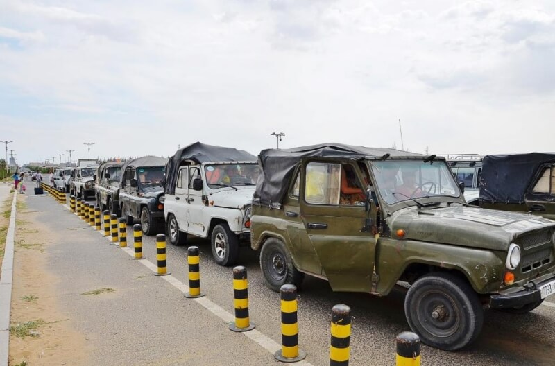

## Замын-Удэ – Эренхот – Датун

### 20 сентября 2018, день 33.

Утром поезд прибыл в пограничный с Китаем монгольский городок Замын-Удэ. Город совсем маленький – я обошел его весь минут за 15. Пошел к таможне и начал разбираться с системой перехода границы. Короче, переход здесь автомобильный и на этом построен бизнес. Людей, едущих на своей машине в Китай, я не заметил. Едут одни таксисты – перевозят толпы пешеходов. Вписался в один из УАЗиков. Неожиданность – для перехода монгольской таможни нужно брать талон за 5 тыс. тугров – и это для того, чтобы выйти из страны!

Китайская таможня – огромное роскошное здание, отделанное черным и белым мрамором. Таблички, хоть и на китайском, но с вполне понятными пиктограммами, так что ясно, куда идти и что там делать. На паспортном контроле отсканировали отпечатки пальцев и сетчатку глаз.

Монгольский УАЗик довез до автовокзала в Эренхот – уже китайского приграничного городка. Все, я в Китае!

Мои первые впечатления: вывески прочесть уже не могу; люди, включая полицию, все говорят только по-китайски; дороги все широкие в 2-3 полосы, а переходить по светофору у меня не очень получилось – хоть горит и зеленый, но кто-то все равно едет и нужно смотреть в оба; по местам, идентифицированным мной как тротуары, едут машины; город большой и очень многоэтажный – это тебе не Монголия. Телефона с картой нет (о понесенных мной потерях см. день 25), куда ехать – не знаю. Жесть! Куда я попал?

Подавив приступ паники, начал осваиваться: у уличных менял поменял немного юаней, купил и съел какой-то фастфуд. По городу ходят новенькие большие автобусы, но спросить, на каком мне ехать не у кого, а вывески я не могу прочесть. Поэтому иду пешком, ориентируясь по солнцу, на юг через город, предположительно в сторону выезда. Погода не очень способствует беззаботной прогулке: очень сильный холодный ветер, а на окраинах – тучи песка, которые несет ветром из окружающей пустынной степи. Достал заготовленные дома бумажные таблички, спрашиваю по пути у населения о выезде из города.

Долго ли, коротко ли, добрался я до окраины и остановил фуру. Сую водителю таблички с нужными фразами на китайском. Он их внимательно изучает, но, вижу, не въезжает в смысл. Однако, в кабину зовет. Едем по окружной с черепашьей скоростью, наблюдая справа всё новые и новые кварталы города. Водитель всё время говорит по телефону и, похоже, не по-китайски. В промежутке между звонками выяснил, что он – монгол. Заехали на какую-то базу (всё еще в этом городе). Я начинаю думать, в какую сторону теперь выбираться? Но мой водитель зовет меня в подъехавший китайский джип. За рулем – девушка. Водитель фуры просит показать мои таблички ей. Девушка сразу поняла, что я хотел сказать и вывезла меня к выезду из города на трассу.

Почти сразу останавливаю машину. Правда, куда ехать и сам не знаю (карты Китая то у меня нет), в чем честно признаюсь водителю на русском и, частично, английском. Тот, понятное дело, ничего не понял, но дорога здесь одна (ответвление на Пекин было раньше), поэтому едем. По дороге как-то понял, что парень едет в Татроо (по карте позже уточнил, что это – город Датун), очень хвалил его красоту и очень рекомендует. Долго не раздумываю (других вариантов то у меня нет) и еду с ним. Парень очень рад моему выбору. По дороге все время о чем-то болтаем. От него узнаю, как произносится Украина по-китайски – "Укля".

Здесь, сразу от границы Монголии, начинается провинция Китая – Внутренняя Монголия. Однако, это уже не монгольская Монголия: лошадей и овец пасут, но уже очень мало, зато много полей с кукурузой и картошкой. Юрты встречались тоже очень редко, зато проезжаем города – с многоуровневыми дорожными развязками, скоростными поездами, трубами ТЭЦ (в каждом городе) с громоздкими охлаждающими градирнями и трубами еще каких-то заводов. Города – гигантские, пешком отсюда не выйдешь.

Пока едем, записываю в блокнотик маршрут, по которому едем, чтобы представлять, куда я заехал и как отсюда выбираться: доехали до платной трассы G55 и проехали по ней до указателя 351км, здесь перешли на трассу G208 и проехали в южном направлении еще около 100км.

Когда съехали с платной трассы, то пейзаж у дороги из степи постепенно перешел в холмы с постоянными зигзагами, спусками и подъемами, с очень живописными рощами, долинами, с маленькими сельскими поселками, кукурузными и картофельными полями, с крестьянами, везущими на осликах какой-то груз.

По дороге, в каком-то поселке, заехали в хлебную лавку, где парень начал выбирать какие-то булочки – очень долго и очень много. Угостил меня одной. Я откусил попробовать – неимоверно вкусная!

Приехали в Татроо (Датун) уже в темноте. Едем в старую часть города, расположенную за рекой и окруженную крепостной стеной, очень аккуратно восстановленной или построенной заново. Пока едем, встречаем много старинных построек, улицы украшены круглыми красными китайскими фонариками.

Но сейчас меня больше волнует вопрос ночлега: устал за сегодня я прилично – пока выбирался из города. Да и, что греха таить, стресс от попадания в непривычную среду без средств коммуникации и навигации тоже малость подкосил. Парень предлагает отвезти меня в отель. Заехали в один в старом городе. Дорого – у меня сейчас всего 80 юаней. Едем через реку в другую часть города. Выходим, я на тротуаре остановился поправить рюкзак, парень торопит, мол, не стой здесь. Оказывается, за проезжей частью, отделенной бордюром и узкой клумбой, идет мото-вело дорожка, на которой довольно интенсивное движение. С этим разберусь позже, а сейчас идем к вахтерше. Парень говорит, что номер здесь стоит 40 юаней (это уже укладывается в мой бюджет). Даю вахтерше паспорт. Они с парнем, который меня сюда привез, пытаются найти, где написано мое имя. Попытался им помочь, но вахтерша записала в журнал только букву "S" из моего имени, взяла деньги и повела показывать комнату. Я попрощался с моим сегодняшним попутчиком и пошел догонять вахтершу.

Комната – в подвале, окон, соответственно, нет, но зато – отдельная: с телевизором, огромной кроватью, туалетом, но без душа. В комнате нахожу чайник, пью чай с мега вкусной булочкой, которой меня угостил водитель. Теперь – спать. Что мне делать дальше – буду решать завтра.