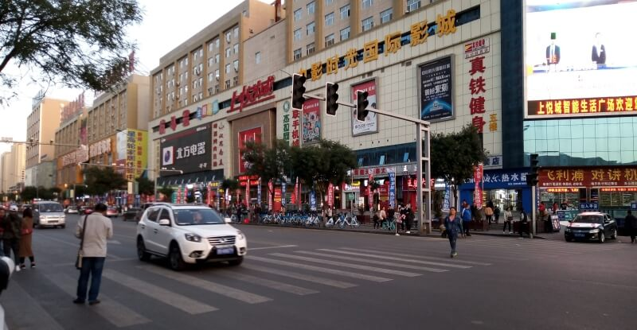
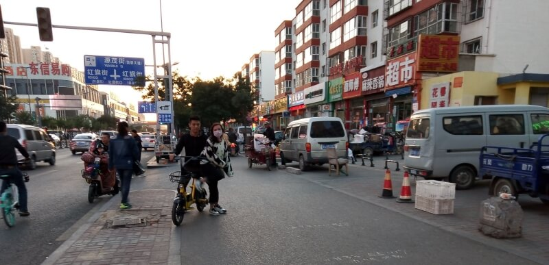
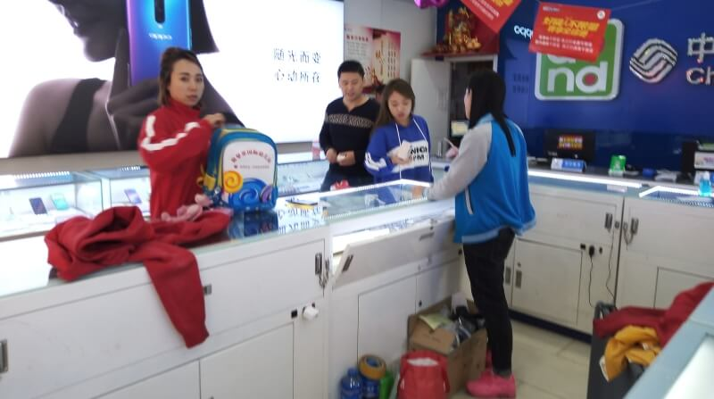
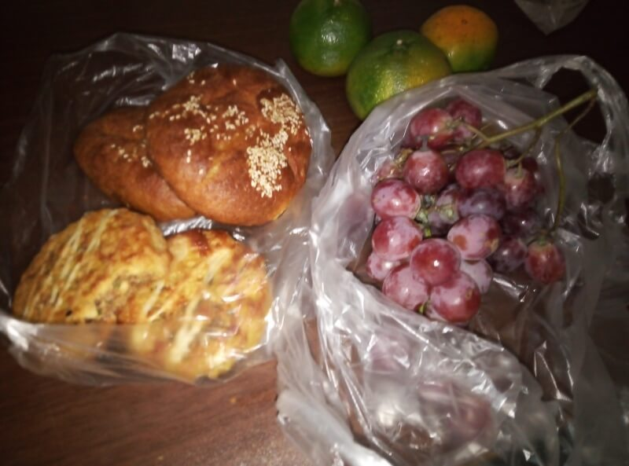
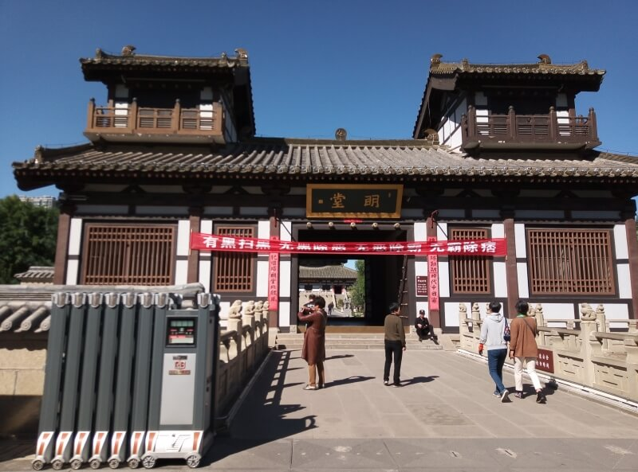
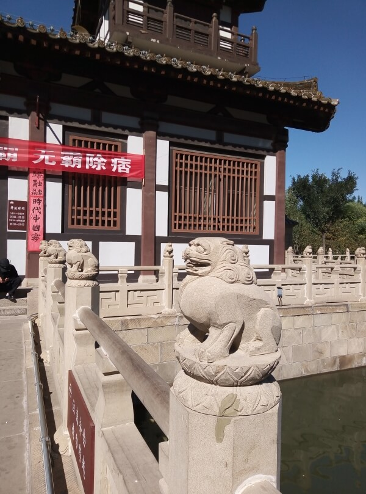
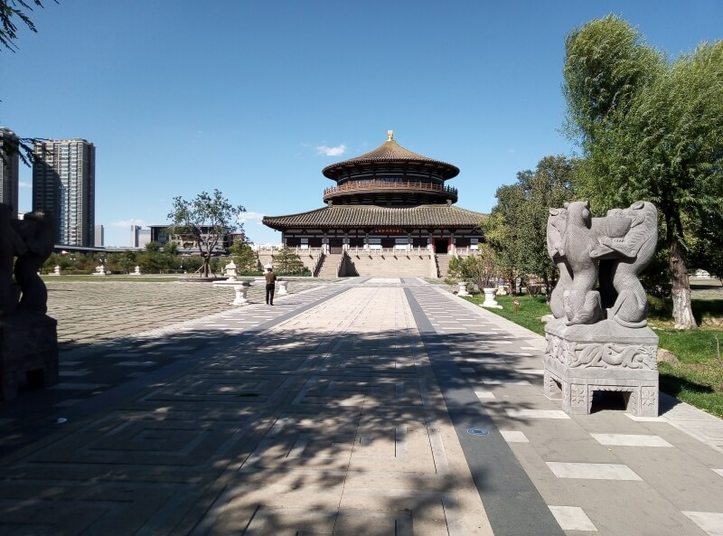
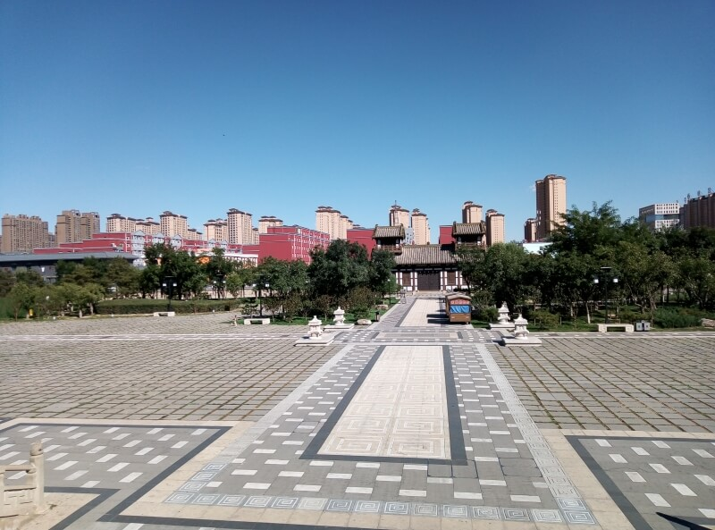

## Татроо (Датун)

### 21 сентября 2018, день 34.

Проснулся, времени не знаю, даже время суток определить сложно: в номере отеля темно – я в подвале. По ощущениям, выспался и в коридоре слышу приглушенные разговоры: наверное уже утро.

Сегодня решил подготовиться к путешествию по Китаю. Для начала, нужно поменять денег, купить карту и, может быть, телефон.

Рюкзак оставил на вахте. На мой вопрос, написанный на карточке, где поменять валюту, вахтерша неопределенно показала во всех направлениях. Попросил ее написать мне адрес места, где расположен отель, чтобы потом можно было его найти. В ответ получил визитку. ОК, теперь иду искать обменники.

Осмотрел округу. За домом, в котором расположен отель, обнаружил рыночек. Перекусил там длинной, жареной в масле, плюшкой, которую жарили при мне и тарелкой супа с сыром фондю (?). Вся еда обошлась в 4 юаня.

Иду дальше по улице. Менял, как в приграничном городе, не видно. Нашел банк, зашел туда. Пока жду, когда освободится менеджер в зале, наблюдаю картину общения мужичка с антропоморфным роботом: сначала они активно дискутировали, потом мужик резко закончил разговор и пошел прочь, а робот побежал за ним вдогонку, жалобно оправдываясь. Забавный сюжет ))).

Освободилась девушка (роботу таблички с вопросами решил не показывать). Сказала, что валюту у них в банке не меняют, но показала на карте в своем телефоне место где мы находимся и где есть банк, в котором мне смогут помочь. До него – всего два квартала.

Иду, вникаю в дорожное движение. На пешеходном тротуаре стоят припаркованные машины, поэтому пешеходы идут по велодорожке. Скутера и велики едут здесь же: маневрируют, сигналят. Иногда, по этой же дорожке, занимая всю ширину, проходят машины, заезжая или выезжая с парковки. Пешеходы и скутера пересекают перекрестки, не дожидаясь светофора. Для меня здесь – непривычно широкие дороги: по три полосы проезжей части и по велодорожке плюс газон в каждую сторону. А люди и скутера идут прямо в поток машин.

За вторым перекрестком нашел банк. Парень в зале на английском объяснил, что валюту может менять только Bank of China и подсказал, как пройти к ближайшему отделению – еще квартал, перпендикулярно к улице, по которой я пришел.

В отделении банка Китая подошел к офис-менеджеру. Она долго не могла идентифицировать доллары, а я то предполагал, что их узнают в любой стране (хорошо хоть у меня не евро))). Но, собрав небольшой консилиум, они справились с этой задачей. Девушка тут сообразила, что можно общаться через переводчик в ее телефоне. Началась уже более осмысленная беседа. Она спросила, что я хочу делать с моими деньгами, трижды уточнила, в каком направлении я хочу конвертировать валюту: видимо наличие у меня долларов и отсутствие юаней совсем никак не объясняло моих намерений. Попросила мой паспорт. Рассмотрев его и убедившись, что я, все-таки, не китаец, сказала, что они не могут идентифицировать мой документ, поэтому и деньги поменять не могут. Я спросил, где же все-таки я могу произвести обмен? Опять собрали консилиум, девушка сделала несколько звонков по телефону и, наконец, мне сказали, что мое желание может удовлетворить центральное отделение банка. Я начал интересоваться, как я туда могу добраться и попросил написать название этого места в мой блокнот.

После небольшого обсуждения с коллегами, мне торжественно заявили, что я могу доехать на такси. Хм, идея хорошая, но, не зная цен на такси и расстояние до цели, мне может не хватить китайских денег, а доллары я еще не поменял. Начинаю интересоваться, как мне доехать туда на общественном транспорте? Снова собирается консилиум, в котором уже принимают участие и посетители банка. В процессе обсуждения мне предлагали разные номера маршрутов и показывали пальцами в противоположные стороны. Наконец, похоже, что-то определилось и девушка зовет за собой на улицу. Выходим, идем по улице, видимо, к остановке. Посередине пути до перекрестка она останавливается и сажает меня в свою машину.

Едем на машине служащей банка в центральный офис. Круто! Пытаюсь запомнить маршрут, чтобы сориентироваться на пути обратно. Хм, а проехали мы всего-то 3-4 квартала. Девушка смело выруливает на велодорожку и едет по ней до парковки возле банка. Зашли в банк, здесь она, уже без моего участия, быстро объясняет сотрудникам мое желание поменять валюту. Затем, с ее же помощью меня отводят к кассовому окну и объясняют, мол, когда освободится, тебя примут.

Подошла моя очередь. Дал кассиру деньги и паспорт. Долго разбирались, где в паспорте мое имя, а где серийный номер. Наконец, дали бланк – полностью на китайском и на словах объяснили в какие поля что нужно заполнить. Вроде бы правильно запомнил положение и содержание и, соответственно, заполнил. Девочка-кассирша начала вносить данные в компьютер. Тут возникла проблема. Одним из полей, которые нужно было заполнить, был номер мобильного телефона. Я уточнил, могу ли заполнить мой украинский номер, сказали что да. Но компьютер пропускает только китайские номера, а поле является обязательным. Мне предложили купить китайскую симку и приходить снова. Попытался объяснить, что купить симку без денег, которых они мне еще не выдали, будет немного сложно. Через некоторое время и нескольких повторных объяснений уже другими словами, вроде бы, поняли. Как они решили коллизию с телефоном я не знаю, но, заполнив еще несколько бланков и поставив кучу подписей (здесь они называются сигнатурой и должны точно соответствовать написанному имени), я, наконец, получил на руки местную валюту.

Иду. Теперь уже с деньгами, а не с какими-то, непонятными здесь, зелеными бумажками. Иду пешком в обратном направлении – видел, что по дороге все первые этажи зданий заняты магазинами и, может быть, смогу найти подходящий, в котором смогу купить карту Китая или недорогой телефон. По вывескам понять, что находится внутри, я не могу – там только надписи, картинок нет. Поэтому иду и заглядываю в каждую витрину или дверь. Встречаются только магазины с разными бытовыми мелочами, но чаще всего – продуктовые магазины или харчевни. Так прошел три квартала и вышел на улицу, где был мой отель. Там я, еще на пути из отеля, приметил на противоположной стороне торговый центр. Там уж, думаю, что-нибудь точно найду. Захожу туда: на первом этаже торгуют сантехникой. На эскалаторе поднимаюсь на второй этаж – там мягкая мебель, еду на третий – спальни. Я начинаю понимать, что в торговом центре продают только мебель. Выбираюсь на улицу. Дальше вижу еще один торговый центр, в котором я остановился уже на втором этаже – здесь торгуют только обувью. Покружил по маленьким улочкам за торговым центром – там только еда.

Наконец, через дорогу, в проулке, заметил вывеску, на которой был нарисован ноутбук. Это уже близко к тому, что я ищу! Там кроме ноутов ничего полезного для меня не было, поэтому жестами объясняю, что хочу купить телефон. Один из парней неожиданно быстро понимает, что мне надо и направляет в соседнюю дверь. Захожу в рекомендованный магазин. Здесь на витрине – только чехлы, наушники и кнопочные телефоны. Начинаю объяснять, что мне нужен телефон с интернетом. Вроде бы поняли – интересуются, имел ли я в виду сенсорный? Тут, парнишка этого отдела, вспоминает про функции своего телефона. Просит говорить в его телефон, тот распознает мой язык и начинает вещать китайцам на их великом и могучем. Тут уж беседа пошла, но тоже не без сложностей: нужно еще подстроиться под то, как строить фразы, чтобы переводчик хотя бы примерно мог передать первоначальный смысл. Наконец они понимают, что я прошу не продать мне отсутствующий здесь телефон, а подсказать мне место, где я смогу найти то, что меня интересует. Спросили, знаю ли я, где расположен Восточный Сквер – ясно, что нет. Прошу написать мне это название для таксиста.

Поймал на улице такси, показал записку. Водитель кивает – едем. Довозит до какой-то улицы и показывает мне по крайней мере 7 магазинов мобильных телефонов.

Пошел смотреть. Только в 2х магазинах девочки быстро сориентировались и начали задавать вопросы через переводчик в телефоне. В остальных, не понимая того, что я у них спрашиваю на 2х языках, просто отморозились. Пока ходил и рассматривал витрины, заметил, что сотрудники магазинов меня втихаря фотографируют. Сказал им что-то вроде: "чего боитесь?". В итоге, с несколькими продавщицами сделали селфи на их телефоны.

Вернулся в те магазины, где можно как-то объясниться с персоналом. В первом предложили неплохой аппарат за 400 юаней, во втором такой же стоит 499, но я присмотрелся, а возможности установить русскую клавиатуру там нет – есть только китайская и английская. Но домой писать на английском – не очень хорошая идея. Мне предложили другой с большим выбором языков за 600 юаней. Здесь спросил про сим карту, просят паспорт. Мне говорят, что они могут продать симку только по китайскому ай-ди. Ну вот, оказалось не все так просто, поэтому я решил теперь сначала разобраться с симкой, а потом уже выбирать телефон.

В этом же магазине спросил девушку, где можно купить карту Китая? Она показывает направление, через дорогу, и очень сожалеет, что не может меня проводить, т.к. она работает. Прошу ее просто написать в блокнот название магазина, чтобы не запутаться, пока буду идти. Она написала и, к тому же, дописала предмет моих поисков. Перешел дорогу. По отдельным элементам сличаю иероглифы в блокноте с вывесками – вот и нужный магазин. Подаю продавцу записку. Тот сначала предложил настенную карту, но объясняю ему, что нужна маленькая. Он пошел искать. К поискам подключилась еще и девушка, работавшая здесь же. Начали предлагать разные карты, но все на китайском, так что прочесть название я не могу. Поинтересовался, есть ли карта на английском, оказалось тут такого не продают. Выбираю подходящую карту и прошу показать мне, где находится Татроо. Вот здесь я хотя бы узнал, куда меня занесло! Оказывается, я уже выехал из Внутренней Монголии и нахожусь в провинции Шаньси. Продавец уже несет мне глобус, чтобы я показал, откуда я приехал. Показываю, мы делаем селфи и я получаю карту в подарок! Приятно!

Возвращаюсь в первый магазин. Девчонки радуются моему возвращению. Работница отдела телефонов спрашивает, готов ли я покупать телефон, я же говорю, что сначала хочу купить симку. Кстати, ее китайцы так и называют "симка", так что все понятно. Иду к девочке, которая продает симки. Здесь тоже не могут продать по моему паспорту. Объясняю, что телефон без симки мне совсем не интересно брать. Продавщица телефонов, уже слега расстроенная, посовещавшись с продавщицей симок, спрашивает, правда ли, что я куплю у нее телефон, когда у меня будет симка? "Ну, естественно!" – успокаиваю я ее. Еще небольшое совещание и мне объясняют, что в салоне связи мне смогут сделать симку. Не успел я спросить, как туда добраться, как девочка из отдела сим карт зовет меня с собой.

Вышли на улицу, идем в офис оператора связи. Подошли к перекрестку. Девочка переходила дорогу, как будто на ней нет машин: с той же скоростью, что шла по тротуару и без суетливого оглядывания. Меня же взяла за руку, как ребенка.

В общем, дошли до офиса оператора. Девочка усаживает на кресло и говорит, что нужно подождать, а сама становится в очередь. Подошла наша очередь. Даю паспорт. Как и в банке, у них вызывает проблему определить из каких полей что писать. Девочка из магазина сфотографировала паспорт и прогнала фотку через переводчик. Я тоже подсказывал, что откуда переписывать. Дело пошло веселей. Здесь мою сигнатуру сократили только до имени. Общались сразу через 2 телефона – в одном они поставили русскую клавиатуру, чтобы я тоже мог писать. В общем, за 20 минут и за 50 юаней, я стал обладателем китайской симки с 1Гб интернета в день с абонплатой – 1 юань.

Возвращаемся в магазин, где я попадаю уже в лапки девочки из отдела телефонов. Говорю, что мне нужен телефон с русской клавиатурой. Приносит и говорит, что стоит такой 899 юаней. Говорю, что уж больно дорогой и больше чем за 600 такой не куплю. Соглашается на мою цену. Достаю деньги, понимаю, что остатка не хватит заплатить еще за ночь в отеле, а еще бы поесть. Торгуюсь еще. В общем, достался мне телефон за 570 юаней – это около $85 – норма! Пока расплачиваюсь на кассе, девочка наклеила защитное стекло – бесплатно, вставила мою симку. Попросил ее установить такой же переводчик, как и у нее. В Китае нет знакомого мне плей маркета, а в китайском магазине приложений почти все названия на китайском – понять что выбрать – сложно. У телефона батарея разряжена, тут же поставили зарядиться. Я пытаюсь освоить китайские приложения, а продавщица уже интересуется моей личностью. Девочку звать Йие, что переводится как листья. Поболтали, я поставил китайский WeChat, обменялись контактами, дружим!

Пока всем этим занимался, настал вечер – 6 часов (теперь у меня есть, где узнать время). Вернулся в гостиницу (по визитке таксист довез), заплатил еще за ночь. Посчитал остаток денег, пошел за едой. Купил понравившихся мне булочек, мандарины (зеленого цвета), виноград. Вернулся в отель, узнал у вахтерши (через переводчик), что душ есть, но он общий. Поел, принял душ, попил чаю. Теперь – спать. Завтра еще денег наменять надо.

### 22 сентября, день 35.

Проснулся поздно. Позавтракал вчерашней булочкой и мандарином.

Решил поменять еще денег: сегодня суббота, завтра это может быть проблемой. И, кроме того, здесь я уже знаю где менять и как менять, а в другом городе нужно начинать все сначала. Пошел в уже знакомый банк. Сегодня процедура заняла не так много времени, хотя обслуживала меня уже другая кассирша: одна из сотрудниц принесла ей подшивку моих вчерашних документов.

По дороге назад купил мороженое. По вкусу – вполне обычное, но зеленого цвета и с запахом базилика.

Как я уже говорил, на Байкале малость повредил спину и все это время шел на таблетках. Но вот уже два дня, как они закончились и боль снова вернулась. Вчера затея не удалась, но сегодня то у меня есть интернет! Открыл страничку с латинским названием. Зашел в одну аптеку – там с латынью совсем не знакомы. Зашел в другую, более крупную, на перекрестке, в которую вчера заходил. Здесь меня узнали. Показал сотруднице латинское название, сразу поняла и принесла. Здесь же распаковал и выпил капсулу, попросив в аптеке водички.

Немного прогулялся по городу, зашел в старинный дворец современной постройки. Вокруг стены ров с водой, в которой плавают красные рыбки, на территории – львы и драконы из бетона. Ничего особенного.

По дороге в отель, купил еще булочек, каого-то салата и ципленка табака. В номере перекусил, разобрался немного с телефоном. Что-то я засиделся в одном городе. Надо бы двигать дальше, но плана никакого нет (карта с отметками ушла вместе с первым телефоном еще в Иркутске). Нет также понимания, как выбираться из города. В общем, завтра буду решать.