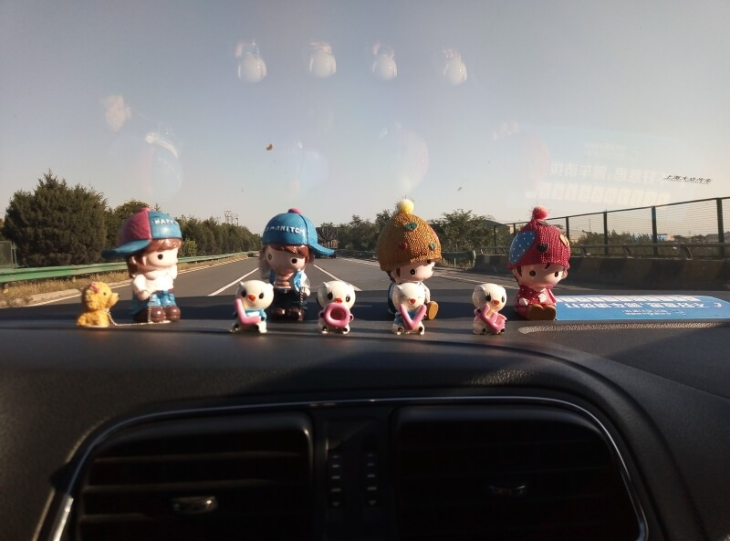

## Датун – Джин Ченг

### 23 сентября, день 36.

Утром проснулся все в том же отеле. Думаю, что сегодня уже пора двигаться дальше. Доедаю вчерашнего ципленка, салат, пью чай с плюшкой: в общем, завтракаю плотно. Параллельно изучаю карту и думаю, куда ехать дальше. Планировал ехать на юг – так и поступим. Выбрал подходящую трассу – ох и непростая это задача! Откройте в гугле карту Китая – увидите плотную паутину дорог, среди которых не понять, где заканчивается или начинается город. Короче, выбрал – еду в Наньян. Это более-менее крупняй город и название я смогу произнести без особенных ошибок (как же я ошибался). Прикинул по карте, где выезд из Датуна – недалеко, иду пешком!

На окраине заметил моторикшу. За рулем бабушка. Показал на карте, куда я хочу попасть, договорились о цене – за 7 юаней довезет. Заезжаем на территорию какого-то парка с динозаврами. Хм, а я думал, что мы поняли друг друга. Пытаюсь объяснить, что мне нужно не к достопримечательностям, а к вполне конкретному перекрестку – еще километра 3-5. Бабуся полностью выпала из беседы, но сообразила подвезти к полицейскому. Я ему показал место куда я хочу попасть, он почти сразу вник в тему и быстро объяснил бабуле цель нашей поездки. Так я и доехал до пункта оплаты дороги.

Прошел за турникет, стоплю. Останавливает такси с пассажиром. Прошу довезти до развязки. Везет. Бесплатно! Высадил в кармане аварийной остановки на трассе. Продолжаю стопить здесь.

Солце припекает, а моя машина еще не пришла. Случайно заметил идущего ко мне сзади парня. Совсем не ожидал: трасса со сплошным ограждением и деревень вдоль трассы здесь не наблюдается. Оказывается, он заметил меня и остановился в следующем кармане, а оттуда вернулся пешком за мной. Теперь уже вдвоем вернулись к его машине. Проехали километров 90. На съезде с трассы прошу меня высадить.

Возвращаюсь на трассу – понимаю, что мне нужно спуститься с моста на перпендикулярную дорогу. Спускаюсь по инженерной лестнице с насыпи и иду через лес к дороге – ищу удобный выход на трассу. Перебрался через ограждение на дорогу, прошел до разгонной полосы на слиянии дорог – похоже, удобное место.

Стою, стоплю. Сразу же остановился микроавтобус. Водитель очень беспокоился – как это я тут оказался и что меня нужно немедленно отсюда забрать. Забрался на заднее место, пытаюсь объяснить мои цели. Пока передаю водителю записки и фразы на телефоне, весь автобус учавствует в этой беседе. А впереди горы! Дорога идет по узким каньонам, по карнизам, долинам. На одном из хребтов увидел Великую Китайскую Стену!

Высадили меня в зоне обслуживания на трассе. Здесь, в отличие от других стран, все объединено в единый комплекс: заправка, кафе, магазин, отель – вот тебе и преимущество централизации. Здесь я с помощью табличек пытаюсь вписаться в машину. На оранжевой спортивной машине едем дальше. На съезде с трассы не остановили, а завезли на въезд в город – к пункту оплаты дороги.

Перехожу на выезд – он за разделительной клумбой. Иду за турникеты, но контроллер меня остановил и не пускает дальше. Говорит, что на скоростную автостраду нельзя ходить пешком – это очень опасно и вообще – запрещено! Около часа объяснял, что я не собираюсь идти по трассе, а хочу пройти метров 20 за турникет – там есть зона остановки. Сложно все! В общем, решили: стопить я могу, но не за турникетами, а перед ними. Очень неудобно!

Хожу между полосами, пытаюсь застопить машину. Ох уж эта китайская правильность – ужасно неудобно! Но зато у контроллера попросил водички – налил два стакана кипятка.

Наконец, из одной из машин мне машет парень – мол, подходи за турникет – там подожду. Сажусь к нему. Трогаемся. Сразу за турникетами – развилка: мне направо, а он едет прямо. Останавливаемся. Я объясняю, куда еду, он говорит, что едет в Пекин, зовет с собой. Заманчиво, но не сейчас. На листочках из блокнота пишет мне иероглиф региона – провинции Хэнань, рисует схему дорог. Пообщались, обменялись контактами в WeChat. В итоге, проехал с ним метров 20, но зато я уже за турникетом! Оборачиваюсь – контроллеры на меня не смотрят – замечательно. Иду к моему повороту, стопю здесь.

Останавливает мужичек. Говорю ему, что еду в сторону Наньяна, он в ответ называет город, куда едет. Я понятия не имею где это, т.к. смог запомнить только название города по этой трассе, куда хочу добраться. Но он едет по нужной мне трассе в нужную мне сторону – неплохо. Сажусь в машину. На навигаторе замечаю, что ехать ему до цели 80 км.

Едем, общаемся через переводчик в телефоне. Я объясняю, откуда я и как сюда добрался. Он мне рассказывает о себе: про детей, работу, дом. Болтаем почти без остановки. В итоге, он говорит мне, что так как мы интернациональные друзья, то он довезет меня до сервисной станции на трассе, которая немного дальше его города, а потом он вернется назад. Приятно! Спасибо! Заезжаем на станцию, я уже открываю дверь, но он меня останавливает. Я тебя, говорит, доставлю до следующего города. И едем мы с ним еще 400 км! По дороге продолжаем болтать.

Заезжаем в город Джин Ченг. Уже темно – часов 9 вечера. Я спрашиваю его об отеле, т.к. ночью из города выбираться не лучшая идея. Он мне говорит, мол, не беспокойся: главное – вместе поесть китайской еды и выпить белого алкоголя, но сперва, конечно, поселимся в отель. В общем, паркуемся, идем в отель. Я даю администратору свой паспорт, ей он не особо понравился, так что мой новый товарищ оформляет все на себя. Поднялись в свои комнаты. Он мне говорит, что скоро зайдет за мной. Да, отель из богатых – я бы в такой точно не поселился!

Вскоре мой товарищ зашел за мной. Спустились на улицу, из его машины достали бутылку и пошли в кафе. Он очень уверенно шел к определенному заведению. Оказалось, что здесь он бывает часто. В кафе заказали кучу блюд, плюс от шефа презент – лунный пирожок в честь завтрашнего праздника середины осени.

Здесь уже познакомились – моего товарища зовут Ван Тю Фэй, он также написал иероглифами мое имя. В процессе все время о чем-то говорим. Китайцы едят очень быстро. Так что кучу заказанной еды и бутылку водки приговариваем минут за 40. Кстати, полбутылки пили на равных, а потом он начал лить мне полную чашку, а себе половину – объяснил, что китайский организм плохо принимает большие дозы алкоголя.

В общем, поели, попили и вернулись в гостиницу. День был продуктивный – пора и спать.

