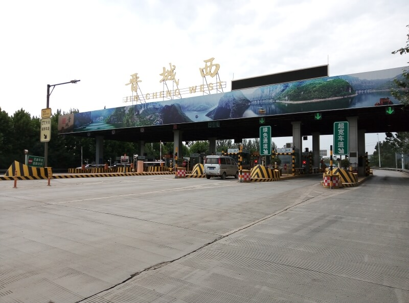

## Джин Ченг

### 24 сентября, день 37.

Часов в 7 утра проснулся от стука в дверь. Мой товарищ, Ван Тю Фей, принес завтрак: 2 пакета с rаким-то хлебом, 2 вареных яйца и 2 250-граммовых пакета молока. Спасибо. Я, еще не вполне трезвый после вчерашнего, выгрузил все на столик и досыпать пошел. Через время снова слышу стук – он же, спрашивает о моих планах. Говорю, что на денек можно остаться в городе. Пообщались, оказалось в городе ничего особо примечательного нет – все как в большинстве современных китайских городов. Рассмотрели два варианта: оставаться здесь или ехать дальше. Я все-же склоняюсь остаться, но отель, похоже, дорогой и я хочу найти дешевле. Ван Тю Фей сказал, что это вообще не проблема и еще один день он мне оплатит – пошел общаться с боссом.

Прошло минут 40. Я за это время оделся, собрал вещи. Возвращается мой товарищ и говорит, что иностранцев они не селят. Он говорил и с администратором и с директором отеля – они совершенно не хотят брать на себя такую ответственность. Вот этого я не ожидал, теперь надо учитывать и такой вариант. В общем, остается только вариант ехать дальше. Ван Тю Фей предложил вывезти на трассу: он поедет домой, а я дальше – на юг.

Доехали до пункта оплаты. Здесь повторяется вчерашняя история – долгое объяснение с девушкой-контроллером, выяснение, что за турникеты и шагу нельзя, зато перед турникетами – можно! Девушка самую малость говорила по-английски. Я, уже имея небольшой опыт объяснения своих намерений, справился с этой задачей меньше чем за час! Она пошла в свою кабинку дальше работать, я – стопить перед выездом на магистраль.

Постопил немного – безрезультатно! Смотрю карту: вижу метров через 500 за турникетами развязку и решаю обойти этот пост по природной среде. Осматриваюсь – не так все просто: город в долине между гор а по сторонам крутые скалистые склоны и обрывы. Отошел немного назад – здесь сразу у дороги глубокий скалистый овраг – метров 15 с почти отвесными стенами. Вернулся ближе – слева от дороги перед каким-то зданием небольшой парк, который продолжается в нужную мне сторону. Иду по нему. Дорожка ведет немного ниже уровня трассы. Вверху уже вижу кабинки пункта оплаты и радуюсь, что нашел неплохой обход. Оттуда по лестнице спускаются на дорожку смена контроллеров, а с ними уже знакомая мне девушка. Притворяюсь, что интересуюсь красотой окрестного пейзажа. Девушка говорит, что дальше пройти нельзя – я и сам уже замечаю между кустов натянутую сетку. Зовет с собой. В зданиях среди парка, оказалось, располагается дорожная полиция. Девушка предлагает пойти с ними поесть. Отказываюсь: во-первых, я не голоден, а во-вторых и так уже полдня потерял, надо двигаться дальше. Тогда она просит немного подождать. Во дворе общаюсь с еще одной китаянкой с ребенком. Той было интересно, откуда я здесь такой. Быстро показал ей возможность общаться посредством электронного переводчика. У нее вопросы не заканчивались. В это время замечаю полицейский патруль, заходящий во двор. Повернули к нам. Я уже не удивляюсь – почти все полицейские интересуются моей персоной. У старшего на груди висит онлайн камера. Он смотрит мои документы, снимая их на камеру, много вопросов не задает, а просит пройти с ними. Выходим к дороге, на которой стоит патрульная машина. Оказалось, что они здесь не случайно, а специально по мою душу – видимо, девушка из дорожной полиции очень обо мне беспокоилась.

Садимся в машину и едем в отделение полиции. Оно расположено в очень интересном районе – город очень многоэтажный, а здесь кварталы двухэтажных домиков с узкими улочками. Я с большим интересом рассматриваю людей на улицах, людей в окнах, дома. Вот ради этого стоило ехать в полицию. Поездка поднимает мне настроение.

Приезжаем в отделение. Патрульные сдают меня дежурному и, освободившись от ответственности, переключаются в бытовой режим – кто-то сгонял за какими-то пирожками и поедает их, кто-то дремлет на скамейке задержанных, кто-то залипает в телефоне. Дежурный еще раз проверил мой паспорт, сфотографировал его телефоном, выяснил мои намерения и пошел заниматься другими делами. Меня просит подождать. Я интересуюсь, чего мне нужно ждать. Говорит, что, так как я иностранец, то необходимо присутствие переводчика, которого они вызвали.

Приехал переводчик, я еще раз рассказал свои планы. Они вдвоем с дежурным (оба молодые, общительные, позитивные парни) пересмотрели мои таблички, с помощью которых я смог доехать сюда, а потом долго не могли разобрать название города – моей следующей цели. Здесь с топонимикой очень большая проблема! Во-первых, электронный переводчик не может адекватно переводить названия городов. Во-вторых, часто, на русских и английских картах названия пишутся по-разному, а на китайском произносятся в третьем варианте! Кроме того, есть много китайских городов, названия которых произносятся одинаково, но записываются иероглифами они по-разному. Я пытался произнести название города Наньян разными способами с ударением на разные слоги, с ударением на оба слога, но собеседники так и не смогли меня понять. Тогда я вспомнил, что в телефоне есть карта на китайском языке. Нашел там трассу, по которой планировал ехать, а на ней – характерную развязку дорог вокруг Наньяна – указал в три иероглифа названия. Дежурный, для общения со мной, пользовался моим телефоном. Увидев название города, он написал мне: "Ты теперь хочешь ехать в Южную Сахару?" – вот так электронный мозг перевел название Наньяна! И в таких условиях мне приходилось общаться! Посовещавшись о чем-то, переводчик ушел, а вернулся, держа в руках лист бумаги, на котором крупными иероглифами что-то было напечатано. Дали его мне и сказали, что это поможет в моем путешествии. Я включил в переводчике режим распознавания текста, который мне выдал что-то вроде: "Я еду в Южную Сахару". Ну ладно, попробую. Парень-переводчик на своей машине вывез меня к тому же пункту оплаты, откуда меня забрали, и, попрощавшись, уехал.

Стою опять перед въездом на магистраль – пустынно и неудобно. Решаю стопить подальше – на подъезде к пункту оплаты, сразу за перекрестком. Здесь уже веселее, даже останавливают. Показываю полученную в полиции табличку, но никто в Наньян не едет, а дальнейшие мои предложения довезти до ближайшего города, просто игнорировали. Я не очень силен в китайской грамоте, но начинаю догадываться, что на моей новой табличке написано, что я хочу доехать до Наньяна в форме, не допускающей вариантов. Поэтому мои беседы с водителями заканчивались очень быстро. Решил спрятать эту очень полезную табличку, а пользоваться своими не очень определенными, но вполне работающими табличками, а название я уже научился произносить вполне понятно для китайского слуха. Постопил еще немного. Те, кто останавливали, ехали совсем недалеко – километров 15, так что не было смысла уезжать с вполне удобной позиции.

Времени уже 3 часа дня. Я уже малость проголодался и не отказался бы что-нибудь перекусить. К тому же мои кеды, после монгольских походов, сегодня начали окончательно разваливаться. Решаю возвращаться в город за новой обувью. Вышел на дорогу в город и остановил там такси. Попросил таксиста отвезти меня к месту, где я смогу купить себе новую недорогую обувь. С ценами я еще не очень успел разобраться, но надеюсь купить обувь не дороже 80-100 юаней. За 10 юаней он привез меня в торговый квартал. Показал на улицу, где я смогу купить обувь, сожалея что проехать туда не может, так как улица ремонтируется. Действительно, вся проезжая часть отгорожена забором, а на месте дороги там – глубокий котлован. Вместо раздельного ремонта дороги и коммуникаций, как делают во всем цивилизованном мире, дикие китайцы зачем-то вскрыли всю дорогу и меняют там сразу все трубы канализации, водопровода, укладывают новые кабели и закатывают все это новым асфальтом, а попутно, приводят в порядок фасады домов! Отсталый народ!

По узкому тротуару пробираюсь между удивительно невысокими 3-х этажными домами с витринами и лавками в первом этаже и отгороженной забором ремонтируемой дорогой. В некоторых местах, между стойками строительных лесов, могу пройти лишь сняв рюкзак и пропихнув его отдельно. По дороге, увидел дедушку, торгующего чаем, который он наливал из огромного дровяного котла, уточнил у него, есть ли здесь место, где можно купить обувь. Он покивал и показал дальше по улице. Нашел лавку с китайской обувью. Начал рассматривать. Большинство кед и кроссовок довольно хлипкие, с пластмассовой подошвой, которые в условиях моего похода долго не протянут, хотя, довольно дешевые – порядка 15 юаней. Но тут замечаю не очень примечательные внешне кеды, но с хорошей резиновой подошвой. Они лежат, плотными штабелями на стеллажах, крепко связанные попарно шнурками и обмотанные упаковочной бумагой. Подошла тетка-продавец, быстро распеленала мне одну пару на примерку и сказала, что эти стоят 20 юаней (3 доллара). Перемерял несколько пар, пока не нашел подходящий размер. Шнурую и повторно примеряю выбранную пару и, расплатившись, иду уже в них, оставив свои раздолбанные кеды на память продавщице.

На обратном пути, увидел, как мальчик лет 8-ми поедает аппетитный кисель у знакомого мне уже дедушки с самоваром. Попросил себе такого же. Дедушка начал сыпать в пиалу большое количество каких-то ингредиентов, разбавляя это все кипятком из самовара. Приготовив явство, он торжественно подал мне пиалу, а сам сел напротив смотреть, как я буду это есть. Оказалось, что ем я неправильно и он мне показал как нужно черпать кисель, чтобы было вкусно. Дедушка интересуется, откуда я приехал. Говорю, что из Укли. Видно, что он очень горд, что кормит путешественника из такой дали. Поев, спрашиваю стоимость его угощения – 5 юаней. Пока я копаюсь в кармане в поисках денег, он приносит мне табличку с QR-кодом и говорит, что я могу расплатиться телефоном. Я уже знаю, что к китайскому WeChat'у можно привязать банковскую карту и даже в автобусах, наряду с электронными проездными, рядом с терминалами, висят таблички с кодом для оплаты за проезд. И так как у меня банковской карты не привязано, расплачиваюсь традиционным для цивилизованного мира способом – деньгами.

Вышел из ремонтируемого квартала, взял яблоко у бабушки из большой кучи, лежащей в кузове грузового мотороллера. Пока стоял и поедал огромное яблоко, наблюдал, как происходит торговля. К бабушке подошла девушка, очень громко (многие китайцы разговаривают довольно громко и эмоционально и иногда кажется, что они вот-вот сцепятся в драке) спросила цену. Отобрала в пакет яблок, потом еще немного поругавшись (поторговавшись), согласовали приемлемую для обеих сторон стоимость. После этого, девушка отсканировала телефоном QR-код с таблички, воткнутой в кучу яблок, и пошла дальше по своим делам.

Иду по торговой улице. Здесь в каждом доме в первом этаже устроен торговый лоток. Торгуют практически всем: фрукты, вещи, птицы в клетках, мелкий ремонт мото-вело техники, дедушка, зашивающий туфлю девушке, сидящей рядом во второй, целой. Но чаще всего продают еду. Очень много совсем маленьких, на один-два столика, харчевен и заведений покрупнее. Или же еду просто готовят, причем, в очень больших количествах, прямо на тротуаре, или в оборудованном кузове грузового мотороллера. Или еду не готовят, а продают уже готовую и горячую из больших бидонов, стоящих во все тех же мотороллерах. Кстати, для владельцев мото-вело техники предоставляются любые услуги – от подкачки шин и регулировки тормозов до переборки двигателя бензиновых скутеров и точечной сварки элементов питания в батареи их электрических собратьев. Причем самые простые услуги – подкачка шин, соединение порванной цепи, регулировка тормозов – предоставляются почти на каждом перекрестке всех китайских городов, где я был.

Вечереет – часов 5 уже. Думаю поискать жилье. Спросил местных жителей. Те показали гостиницу. Оказывается, я был неподалеку от того места, где мы ночевали сегодня с Ван Тю Феем. Спрашиваю местных о другой гостинице. Те удивляются, чем мне не подходит эта? Объясняю, что я был уже в ней и что иностранцев туда не селят. Они еще больше удивляются и уходят в обсуждение местных (бес)порядков. Причем, когда я задаю кому-то вопросы, вокруг нас очень быстро образуется толпа и в обсуждение включается все большее количество народа. Других мест, где можно заночевать мои советчики не знают. Постепенно перехожу в другой квартал. Здесь вижу кучкующихся моторикш и появляется идея ехать к выезду на трассу, ставить палатку и там ночевать. Подхожу к ним, спрашиваю, кто подвезет меня к выезду из города. Интересуются, какой выезд меня интересует. Я показываю примерное направление, откуда я приехал. Они не очень поняли. Тогда я включаю китайскую карту, чтобы показать им место, но тут я сам понимаю, что, доверившись своему товарищу, попал не на самый удачный выезд, чтобы ехать в Наньян. Из города есть, по крайней мере, четыре выезда на объездную и я стоял на северо-западной, при том, что мне нужно на юг! Неудивительно, что я не нашел попутчиков! Здесь же, выбираю подходящий выезд и показываю моторикшам. Те заламывают цену в 20 юаней, я понимаю, что придется ехать в другой конец города и отказываюсь. Начинает моросить дождик а я углубляюсь в узкую улочку. Купил еще уличной еды и, попутно, спрашиваю людей о ночлеге. Тут, очередная продавщица еды, на вопрос о жилье, показывает в противоположную от сегодняшней гостиницы сторону.

Иду по улице в поисках жилья, попутно уточняю направление. Большинство указывает в ту сторону, куда я иду, так что есть надежда! Смеркается, а я из торговых рядов попадаю в спальный район. В очередной раз уточняю направление в мелком магазинчике. Здесь девочка слегка говорит по-английски и с удовольствием, к тому же. Но у нее мало получается. Даже отдельные слова она на слух почти не воспринимает (а может у меня с дикцией что-то не так?). Прибегаю к проверенному и надежному электронному переводчику, а батарейка то уже на исходе! В общем, она сказала, что таки есть неподалеку гостиница, я поделился своими опасениями, берут ли они иностранцев. Её брат вызвался меня проводить.

Из спального района вышли на ярко освещенную улицу. Зашли в одну гостиницу. Я начал переживать, хватит ли моих денег на номер здесь: возле входа мраморные колонны, отделанные золотом, холл тоже весь в мраморе, бархатные диваны, стойка администратора из богатого дерева, персонал в фирменной одежде. Мой провожатый что-то быстро обсудил с администратором и, молча кивнув мне, пошел к выходу. На улице я стал его расспрашивать, но парень был не особо разговорчивый, он просто сказал: "Пошли". Он был прям классический китаец: матерчатые остроносые туфли, черные прямые брюки, рубашка с воротником стоечкой и совершенно китайский пиджак. К тому же, шел он спокойно, без суеты, заложив руки за спину, как медитирующий монах, хотя мне, чтобы держаться рядом, приходилось постоянно маневрировать среди людей, машин, мопедов.

Перешли широкий проспект и идем по уже знакомой мне торговой улице. Подходим к гостишке, где я сегодня ночевал. Говорю парню, что здесь тоже иностранцев не берут. У меня уже пропала надежда найти сегодня ночлег, но парень уверенно повел дальше. И, внезапно, он заговорил по-английски! Начал спрашивать, откуда я приехал, что мне понравилось в Китае и т.д. Я спросил, как его зовут? "Ченг", – сказал парень, а потом уточнил: "мистер Ченг". Я, чтобы не забыть, повторил его имя вслух и заметил, что парню понравилось, что я его так назвал. Но я то немного в курсе, поэтому спросил: "А какое твое китайское имя?". Парень назвал (китайские имена очень трудно запомнить – для нас это просто набор звуков), но просил называть его европейским именем.

В общем, дошли мы с мистером Ченгом до улицы, на которой ремонт, пошли по ней. По пути я кивнул уже знакомому мне дедушке с самоваром, идем дальше. Здесь, мой попутчик повернул и зовет меня подниматься по железной лестнице наверх. Поднялись. В маленькой комнатке он поговорил с девочкой-администратором, сказал мне, что жилье стоит 50 юаней. Девочка засуетилась, начала что-то тараторить. Мистер Ченг убедился, что меня берут, попрощался и степенно удалился!

Гостиница простенькая: отдельная комната с обязательным телевизором, но общие туалет и ванная. Но, похоже, в этой гостинице сегодня кроме меня никого нет. Попытался поговорить с девочкой, которая меня заселяла, но она от телефона шарахается, но по-китайски очень бодро тараторит. Показала мою комнату, показала батарею термосов, и сказала, что чай пить отсюда, угостила лунным пирожком (сегодня же праздник середины осени), для надежности, притащила один термос ко мне в номер. Я попил чаю с пирожком и пошел к девочке уточнить про вай-фай. Она уже немного успокоилась, даже читала сообщения, которые я ей показывал в телефоне, но в ответ говорила по-китайски. Я ей написал, что не понимаю её, тогда она взяла бумагу и начала мне что-то писать. Да уж, интересная логика: раз я не понимаю китайскую речь, то иероглифы прочесть смогу! Наконец, объяснил ей, как пользоваться переводчиком в телефоне и тут совсем легко стало. Оказалось, что она здесь не работает, а это отель её отца. Дальше было много китайских идиом, из которых я понял, что она очень рада познакомиться со мной, благодарит, что я доверяю ей и так далее.

В общем, ставлю уже дохлый телефон на зарядку и спать!

### 25 сентября, день 38.

Утром проснулся часов в семь. Особого желания ехать дальше не было, но ехать надо. Заставил себя встать. Выглянул в окно – идет неслабый дождь. И я, с чистой совестью, пошел досыпать дальше.

Проснулся во второй раз. Дождь все так же льет. В телефоне погодный виджет показывает "небольшой дождь". Ну не знаю – как по мне, приставка "не" здесь лишняя – дождь льет неслабо.

На завтрак поел из продуктов, которые получил вчера от моего товарища в гостинице – бутерброд с джемом, вареное яйцо и фруктовое молоко. Молоко очень понравилось! Никогда не пробовал такого сочетания!

А дождь все льет. До вечера провалялся в номере – устроил себе выходной. Вечером, часов в 7, дождь уже прекратился и я вышел за покупками. Еды готовой уже нет (ужин, на китайских улицах, подают с пяти до шести), магазины тоже закрываются, да и людей на улицах почти нет. Походил по переулкам, вернулся к своей гостинице и, в ближайшем круглосуточном магазине, кепил еды на вечер и утро. Кстати, сосиски здесь продают поштучно и без холодильника, прямо в коробках на полках насыпом – у них герметичная вакуумная оболочка и куча консервантов, так что испортиться они не могут при всем желании.

На сегодня все!