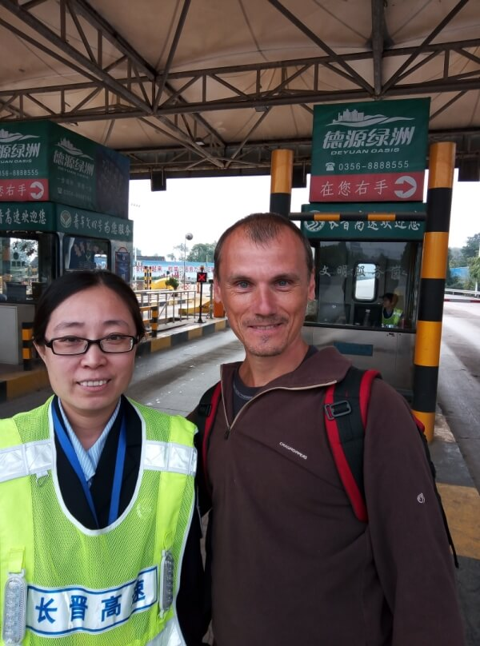
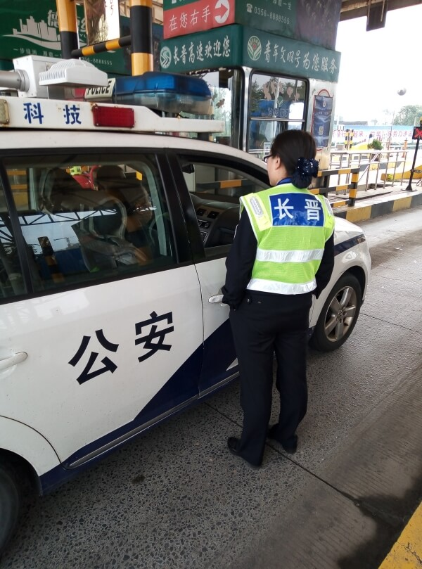

## Джин Ченг – путь в Наньян

### 26 сентября, день 39.

Сегодня проснулся рано. Позавтракал, упаковал рюкзак. Вчера я уже понял, что выезжал из города не в ту сторону. Сейчас выбрал нужный выезд – там вероятность уехать в нужную сторону выше. По китайской онлайн карте (я уже начал разбираться, на какие кнопки нужно жать) узнал, на каком маршруте автобуса туда выехать.

Попрощался с хозяином гостиницы, прошел ремонтируемую улицу до конца, уточнил у аборигенов, где останавливается мой автобус. Из-за ремонта улицы, остановка малость сместилась, но, поплутав немного, нашел, таки, нужное место и поехал на 23 маршруте. Нужную мне остановку мониторил по GPS.

В общем, доехал, потом дошел до поста оплаты дороги. Здесь нет длинного подъезда – с перекрестка, почти сразу, въезд к турникетам. По полученному уже опыту, за них не суюсь, стоплю сразу за весовой для грузовиков. Пока пусто.

Я стою спиной к турникетам, поэтому не сразу заметил идущую ко мне девушку в форме дорожной полиции. Ну вот, думаю, опять объяснять! Без этого, конечно, не обошлось. Уже имея опыт, правильно подбирая фразы, где-то за полчаса объясняю свои цели. Кажется, пришли к пониманию. Она ведет меня к турникетам. Говорит, стой здесь, я тебе помогу уехать. Ушла. Я пытаюсь стопить отсюда. Девушка вернулась. Говорит, что мне не нужно стопить, а нужно отдыхать, а она обо всем позаботится. Интересуюсь, в чем это будет выражаться? Говорит, отправим тебя в Наньян на нашей машине. Прикольно! Подошел ее начальник, послушал нашу беседу, покивал, сфотографировал меня, я, в свою очередь, попросил сфоткать меня с его сотрудницей. Ушли, я стою, жду. Девушка, и вправду, останавливает патрульные машины и о чем-то беседует с коллегами.

Проехало около трех патрулей, наконец, подзывает меня. Рядом стоит городское такси. Начинаю осознавать, что не все так просто. Пытаюсь выяснить, куда такси меня повезет и за чей счет? Полицейский босс говорит, что все нормально – денег не надо. Я, на всякий случай, им уточняю, что автовокзал меня категорически не устраивает! Уверяет, что такси вывезет меня до сервисной станции на трассе. Не очень то доверяю их словам, но выбора большого нет – они теперь меня не оставят без навязчивой опеки до следующей смены на посту или же сдадут локальной полиции, чтобы те оказали более эффективную помощь.

В общем, сажусь в такси, которое разворачивается в сторону города! Помощнички, блин! Проехали автобусную остановку, на которой я выходил, едем дальше. Таксист показывает мне развязку на бесплатную трассу. Может еще не все потеряно? Но, проехав развязку, заруливаем на автовокзал, таки. Водитель ведет меня к дежурной, что-то рассказывает ей. Я наивно предполагаю, что они хотят ближайшим автобусом закинуть меня на сервис. Девочка объяснила, что ей нужно позвонить, а меня пока посадили за столик в кафе, здесь же, в здании автовокзала.

Все надежды рухнули, когда подошла группа полицейских. У одного из них на груди камера – наряд. Уже стандартная процедура проверки документов, выяснение целей, уточнение, чем меня не устраивает самолет, автобус, поезд, ракета, блин! Эти были настроены жестко. Говорит: или билет на автобус или депортация! Выяснять причину и аргументы для депортации сейчас не было никакого желания – я уже устал от долгих объяснений, от ненужной помощи, от этого города! Говорю главному, что я совсем не нищий и интересуюсь стоимостью билета – 115 юаней – и это за 200 км! Полицейский покупает мне билет, весь наряд провожает меня до автобуса. Появилась предательская мысль: может это и правильно, а то я из этого города никогда не выберусь.

В итоге, еду в Наньян, наслаждаюсь видами: горы, ущелья, горные деревеньки, длинные тоннели. По пути пересекаем горные реки, одна из которых была Хуанхэ. Тут же, впервые увидел то, о чем раньше только слышал: кукуруза, которую сушат на одной из полос автострады, отгороженной полосатыми пирамидками. Правда, на платных трассах этого нет, но на бесплатных – очень много.

По пути думаю, как выбираться из Наньяна. Изучаю русскую и китайскую карты и нашел, километров за 5 до города, сервисную станцию. Прошу водителя высадить меня здесь. Он интересуется, долго ли ждать моего возвращения? Говорю ему, что ждать не надо, я уже приехал. Он, все-таки, интересуется, какова же моя конечная цель? Говорю, что здесь и смываюсь.

На сервисной станции подхожу к заезжающим сюда водителям. Большинство даже не смотрят на мои карточки с просьбой подвезти по трассе. Такое ощущение, что они думают, что я что-то продаю. Некоторые смотрят, выясняют детали, вокруг собирается толпа, но, в итоге, все равно не берут – либо едут близко, либо нет мест, либо еще что-то. Решаю идти к выезду – там можно перехватить еще те машины, которые на стоянку не заходят, а только на заправку.

Тут уже повеселее – ты с водителем один на один, не надо никого просить, объяснять. Машины даже останавливались, но ехали все недалеко. Наконец, остановил парень. Объяснил ему, что еду на юг. Он уточняет, куда именно, отвечаю, что на самый юг Китая, а город – любой. Он называет свой город (название мне ни о чем не говорит – я не запомнил ближайших городов) и говорит, что это километров 100. Меня такой вариант вполне устраивает – это уже нормально, вдали от влияния довольно крупного города Нвньян. По дороге прошу его высадить меня на ближайшей к его городу сервисной станции.

Стемнело. Во время поездки я сосредоточился на общении со своим попутчиком, но тут, случайно, глянул на свою карту и заметил, что едем мы уже не на юг, а на запад! Пересекаем развязки, уходящие к югу. Прошу парня высадить меня на развязке. Он в ответ улыбается и показывает на дорожный указатель – до сервиса осталось 6 км. Ох уж эта китайская правильность!

Высаживаюсь на сервисе и думаю, что нужно бы вернуться и с развязки повернуть снова на юг. По подземному переходу иду на другую сторону и стоплю на выезде с сервисной зоны. Здесь трафик совсем никакой да и темно уже, хотя я в светоотражающем жилете. Облизываюсь, глядя на трафик по трассе и думаю, что до развязки все по-любому едут. Решаюсь выйти на трассу. Одеваю на голову фонарь и иду на трассу. Стою, стоплю, результата нет. В это время думаю о судьбе. Может меня сюда занесло не для того, чтобы возвращаться? А дорога на запад – это дорога к дому, к тому же, меня уже ранее посещали мысли валить из Китая – я, видимо, еще не созрел для него.

Через переход возвращаюсь на другую сторону, иду к выезду с сервиса. Тут же прикидываю варианты ночевки. Сразу за трассой лес, но к нему почти отвесный спуск, высотой метров 10. Стою, стоплю. Останавливает машина. Я объясняю водителю свое желание ехать в Сиань – город на западе. Он что-то уточняет и предлагает отъехать в сторону – обсудить все в безопасном месте. Отъезжает метров на 10 в сторону, я подхожу, он выходит из машины. Пытаюсь выяснить, куда он едет. Оказалось, никуда он не едет, а работает здесь в дорожной полиции, увидел меня и решил выяснить обстановку.

Полицейский проверяет паспорт, сомневается в валидности моей визы, убеждаю его в обратном. Возникает вопрос о транспорте, на котором я приехал сюда, целях и как я собираюсь ехать дальше. Пытаюсь объяснить очередному китайцу преимущества автостопа. Тот все твердит про какие-то опасности. Блин, я на территории сервисной зоны, а не на трассе – здесь даже детям можно бегать. Что-то меня эти объяснения начинают утомлять и я уже думаю о том, что никуда я сегодня уже не хочу, а буду здесь ночевать и продолжу свой путь завтра. О последнем заключении сообщаю собеседнику в надежде, что в этом случае его интерес ко мне поостынет. Но не так все просто. Он предлагает обсудить мой путь в еще более безопасном месте. Ну все, думаю, опять встрял. Он в машину меня не садит, а говорит, что должен отогнать её на стоянку, а я должен подойти ко входу в кафе и подождать его там. Убедившись, что я иду в нужном направлении, полицейский поехал на стоянку перед полицейской конторой, которая находится за зданием сервиса. Я подхожу к зданию кафе, снимаю светоотражающий жилет, а мента всё нет. Решаю, что добровольно сдаваться – не самая здравая идея и отваливаю от кафешки в темное место. Для ночевки места не видно. На территории станции только узенькие газончики с жиденькими кустиками, там обрыв, здесь ограждающая стена. Думаю о том, что если меня будут искать, то скорее всего на выезде, поэтому я пошел на въезд. Под сервисную зону сделали насыпь на краю обрыва, а территория загорожена каменным забором. На краю вижу большую стоянку для грузовиков, а за ней, перед забором, за которым обрыв, бамбуковые заросли, довольно густые. Их глубина – метров 5 от асфальта стоянки до забора, но меня спрячут. Пробираюсь вглубь, до самого забора, нахожу подходящий участок. Тут и падаю спать!