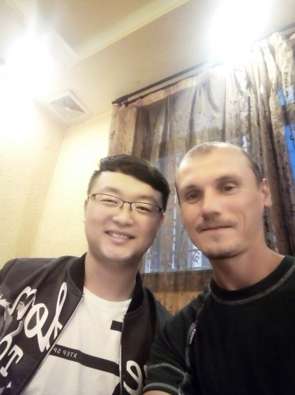

## Где-то за Наньяном – на пути в Урумчи

### 27 сентября, день 40

Хотя до югов я ещё не добрался, но и здесь ночью было очень тепло, как для конца сентября: спал без флиски и спальник не застёгивал. Немного доставали комары или другие летучие твари, но их было совсем мало. Проснулся на рассвете. Как раз в это время, с ближайшей к моему ночлегу стоянки, начали выруливать дальнобойщики. Быстро упаковался, опросил водителей фур: кто отказал, а остальные едут километров на 20, а мне до города Сиань нужно больше 300км. Иду на стоянку легковых. Некоторые предлагают обратиться за помощью (сдаться) к полиции – странные советы – они, наверное не в курсе, что наши люди так просто не сдаются. Тут же наблюдаю утренний развод полиции. Здесь я очень приметный, но на меня они, пока, не обращают внимания: видимо, вчерашний чувак не поднимал кипишь. Зашёл в магазин прикупить что-нибудь перекусить: сегодня завтракаю кукурузным консервированным супом и сухариками.

Позавтракав, иду к выезду с сервисной станции, ибо только там реально легко уехать. И точно: очень скоро от заправки отъезжает машина, водитель говорит, что едет километров 70 в нужную сторону. Едем. Мой водитель очень много говорит по телефону, управляет которым через зеркало заднего вида! В промежутках между звонкими попросил высадить меня на сервисной станции, по указателям – километра за 2 до его города (XiXi по-английски на дорожных указателях, Сися на русскоязычных картах). Наконец, интенсивность телефонных звонков упали и удалось немного пообщаться. Мужичёк очень положительный, немного говорит по-английски, а там, где не хватает слов ему или мне, пользуемся переводчиком. Предлагает мне заехать в город – он хочет познакомить со своими друзьями, а они точно что-нибудь организуют, чтобы отправить меня в Сиань. Соглашаюсь – едем в город.

Едем по улицам города. Мой попутчик показывает местные достопримечательности. Обращаю внимание, что мы уже в центре города: широкие площади, фонтаны. Он подтверждает эту догадку и показывает расположенное в глубине сквера здание гос. администрации. Тут же признается, что он работает в народном правительстве Китая, вешает на лобовое стекло пропуск и мы заезжаем на территорию правительственного здания.

На стоянке нас уже встречала девушка: видимо, звонки моего товарища касались и моего визита. Нас представляют: это очень талантливая девушка, которая может решить любую проблему. Ну, я то уже примерно понимаю, как решают вопросы в Китае, но, люди то приятные, полицию никто не зовёт, да и просто любопытно, как работает китайское правительство. Босс, который меня подвёз, перед подчинённой не опускается до пользования переводчиком, поэтому, его дальнейшие намерения были высказаны на каком-то китайско-английском суржике, который я не особо понял. В итоге, поехпл он по своим правительственным делам дальше, а меня оставил на попечении девочки, которая провела меня через строгую охрану в здание правительства, в кабинет, где кроме неё работало ещё три сотрудника. Она как-то представила меня (всё это было на китайском), налила чаю (цяй – горячая вода из чайника), предложила присесть на диванчике, а сама продолжила заниматься своими (и, возможно, моими) делами.

Молодой парень, лет 20-22, имя которого звучит как Марит, быстро сориентировался, настроил в своём телефоне переводчик и переводил все общение между мной и остальными сотрудниками, которые игнорировали мои попытки использовать переводчик. В итоге, Марит стал моим штатным переводчиком.

В общем, сижу я на диванчике в местном правительстве, мне постоянно подливают чай, иногда мы с Маритом о чем-то говорим. Девочка решает кучу вопросов: приходят какие-то люди, что-то долго с ней обсуждают, потом глубоко задумавшись уходят. На их место приходят другие, которых эта энергичная девушка инструктирует и тоже куда-то отправляет. Марит, мой переводчик-атташе, бегает по её заданиям: приводит каких-то людей, куда-то их отводит, печатает некоторым посетителям какие-то инструкции. В общем, какая-то жёсткая движуха происходит. При этом, два других сотрудника офиса не принимают какого-то участия в этой активности: один постоянно курит за столом (в Китае нет запрета на курение в общественных местах), другой громко и часто кликает мышкой.

А я всё сижу, пью чай, наблюдаю за процессом. Прошло часа полтора. Наконец дошло дело и до решения вопроса о моей транспортировке в Сиань. Девочка куда-то позвонила и через Марита сообщила, что можно прямо сейчас ехать на машине за 1500 юаней. Предложение, конечно, заманчивое, но я прикидываю по своим финансам: китайских юаней у меня около 300, а сумма, что они мне предложили за 300км соответствует моему бюджету для возвращения домой! Интересуюсь, есть ли вариант подешевле: поезд или автобус? Они, понимающе, кивают. Снова какая-то суета. Наконец, в переводчике Марит пишет, а я читаю дословный перевод: стоимость составляет эквивалент 50 свободно конвертируемых единиц, предпологаю, долларов. Прикидываю, что это вся моя наличка, но соглашаюсь. Они искренне рады! Предлагают детали решить уже после обеда. Ещё где-то полчаса рабочей суеты и мы выдвигаемся.

Марит, переводчик-атташе на своей машине, с ним девочка и я выезжаем в город. По дороге осматриваем пару мест, наконец, выходим у одного из ресторанчиков – из тех, что расположены во двориках с фонтанчиком и кучей растений в горшках. Поднимаемся на второй этаж, заходим в отдельный зал. В зале по центру стоит большой круглый стол с вращающейся центральной частью. Меня усаживают в центре – напротив двери. Работники ресторана что-то решают с моими попутчиками, раскладывают приборы, что-то пересчитывают. Наконец, выясняется, что нам здесь будет тесно (должны подъехать ещё другие работники правительства) и мы перемещаемся в другой, более просторный, зал. Начинают подтягиваться остальные правительственные сотрудники. Мои спутники, при их появлении, встают, кланяются, представляют меня им и наоборот. Марит пишет в переводчике мне их должности и имена, но при машинном переводе их имена звучат, что-то типа: Камень В Бурном Потоке, так как иероглифы переводчик транслирует дословно. Кстати, так как моё имя они для себя транслируют в созвучные иероглифы, каждый из которых несёт некоторый смысл, то и запоминают они его с первого раза, в отличие от меня: имена китайцев я воспринимаю как набор звуков без всяких смысловых ассоциаций и, поэтому, хоть и могу повторить имя, когда они представляются, но сразу его забываю.

Наконец, подошёл самый главный (и самый старший) правительственный босс. Это было видно по почтению, с каким приветствовали его все остальные в зале. Теперь уже начали подавать блюда: выставляют на центральную вращающуюся часть, на которой каждый подкручивает к себе желаемое блюдо и насыпает в свою пиалу – очень удобно. Сидим, едим, общаемся: я больше с Маритом, а остальные, в основном, между собой. Я так понял, что мой переводчик попал в такую компанию впервые, благодаря мне, так как чувствовал он себя не очень уверенно. Все пытались предложить мне что-нибудь особенно вкусное, а я особо и не отказывался – перепробовал всё. Я то думал, что вся еда уже на столе, но начали подъезжать новые блюда: тушёная рыба, пельмени, булочки с соусом, лапша. В процессе нам постоянно подливали чай (кипяток) из металлических графинов и обновляли сок в бутылочках (сок зелёный, похоже, из киви).

Поели. Боссы стали расходиться. Марит попросил меня подождать, а они с девочкой пошли их провожать. Пора и нам уже ехать. Мне в дорогу дали бутылку сока (очень вкусный), а про еду я не беспокоился – наелся так, что до завтра не проголодаюсь. Меня довезли до ж.д. вокзала, помогли купить билет – его цена оказалась всего 50 юаней (около $7,5), показали, где производится регистрация на посадку, попрощались, уехали. Спасибо! Очень приятные и гостеприимные люди!

Сел на лавочку в ожидании поезда. Рядом со мной сидела девушка, которая наблюдала сцену прощания. Она говорит по-английски. Спросила меня откуда я и как здесь оказался, я, соответственно, поинтересовался куда направляется она. В общем, обычная беседа на вокзале. На соседней лавочке сидел мужчина, который заинтересовался нашей беседой, подошёл. Оказалось, несколько лет назад он был в Украине. Я достаю китайскую карту, он показывает, что был в Одессе – почти земляки! Парень был моряком и заходил в одесский порт. Начали подходить ещё люди. И вот, вокруг нас стоит уже десяток человек и расспрашивают девушку. Она, смеясь, мне переводит, что эти люди думают, что после 5-минутного общения она знает всё обо мне и должна им рассказать. Ну что поделать, городок маленький, провинциальный (размером с Одессу), иностранцы сюда не заезжают, так что я – диковинка.

Мы с моряком, оказывается вместе едем в Сиань, да ещё в одном вагоне и, к тому же, на соседних местах. Мне это тоже удобно – смотрю что делает он и повторяю его действия. А ведь процесс посадки на поезд в Китае не такой простой, как в Украине! Сначала прошли первый контроль, где у нас проверили документы и соответствие с сигнатурой (именем) в билете. Затем прошли контроль безопасности: вещи прогнали через рентген, нас проверили металлодетектором. Здесь у меня в рюкзаке обнаружили и попросили оставить нож (маленький, китайский, купленный как раз для того, чтобы не жалко оставить, ну и колбасу порезать). Далее, мы сидели в зале ожидания – на перрон начинают пропускать за 5 минут до прибытия поезда. Ещё раз проверяют билеты, компостируют и по подземному переходу пропускают дальше. Перед подъёмом на перрон стоит ещё один работник станции и на перрон не выпускает. Все ждут, я тоже жду. Слышу, как прибывает наш поезди понимаю, что задача этого человека – не выпускать людей до остановки поезда. Наконец, последняя проверка билетов проводником вагона и мы оказались в поезде!

У нас с морячком номера мест последовательные, но оказались в разных рядах – не пообщаешься. Так что, примерно полпути, наслаждаюсь пейзажами. А посмотреть есть на что: вокруг горы, поезд идёт то через тоннели, то по узким карнизам, то через мосты. Вокруг красивые виды гор, среди которых прилепились китайские деревни. Заметил, также активное строительство новых дорог, тоннелей. Наконец, когда часть людей вышла на своих станциях, мы с моряком смогли сесть рядом. Имя его, Юн Хуань Чен Ян, мой переводчик перевёл как храбрый. Сначала, пытались общаться через переводчик, но это оказалось не очень удобно – парень не мог сразу правильно составить фразу, чтобы я понял смысл или говорил очень быстро и часть терялась. Нашли другой способ: я отсканировал его профиль в WeChat, добавил его в контакты, написал ему сообщение по-русски и показал как можно в окне чата переводить на свой язык. Вот тут уже беседа пошла! В общем, сидим напротив друг друга, печатаем сообщения в чат, хохочем, нервничаем, когда в тоннелях нет связи и сообщения не отправляются. А тоннелей здесь реально очень много и они очень длинные! Бывало, что минут 15 ехали без связи: выезжаем из одного тоннеля и метров через 100 ныряем в следующий. Минут за 40 до прибытия, я задал шкурный вопрос – где он будет ночевать в Сиане и не знает ли дешёвых отелей? Юн Хуань на это начинает ржать! Я уж думаю, что неправильно составил фразу и переводчик что-то накосячил, но он уже пишет ответ – он ночует в больнице. Тут уже и я ржу, говорю, что этот вариант мне пока не подходит. В общем, пообщавшись, договорились по приезду выпить пива, но сначала я уточню в кассе время отправления поезда на Урумчи (я, таки, окончательно решил валить из Китая) и стоимость билета (чтобы знать, сколько денег у меня остаётся).

Приехали в Сиань около 9 часов вечера. Юн Хуань сказал, что подождёт меня возле входа на вокзал – у него была пара небольших, но очень неудобных коробок, одну я помог ему дотащить. Пока я искал кассу, мой товарищ уже догнал меня здесь. Цена на билет в сидячем вагоне оказалась очень приятная, только отправление через 20 минут! Беру билет, понимая, что вечером в большом неизвестном городе искать ночлег у меня уже нет желания. При этом, оба мы расстроены, что наше общение закончилось так быстро. Прощаемся, он проводил меня до первого контроля, я пошёл грузиться в поезд.

Процедура уже знакомая, но людей и платформ в Сиане значительно больше. Примечаю пассажиров моего поезда и иду за ними на свою платформу, чтобы не блудить. Но и без этого, здесь вполне внятные буквенно-цифровые указатели, так что найти свой поезд несложно. Зашёл в свой вагон – почти все места заняты, так что особо не поспишь. Думаю, что два дня в такой тесноте будет очень некомфортно. Но, часам к 12 ночи 2/3 пассажиров вышли из вагона. Я занял три места и улёгся спать.