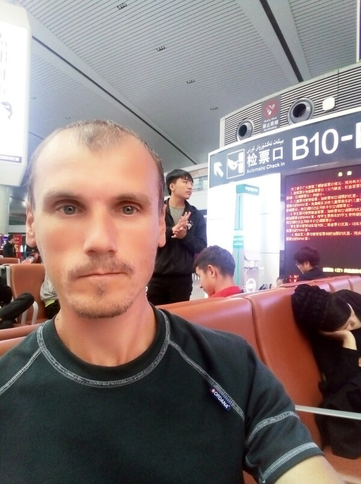

## Урумчи – путь к Харгоси

### 29 сентября, день 42

Приехали в Урумчи в 8 утра, но ещё темно – весь Китай живёт по пекинскому времени, а, по астрономическому времени, здесь на 2 часа раньше. Пока выходил с платформы до выхода из вокзала, прошёл кучу проверок.

У одного из охранников узнал, где билетная касса. Но туда так просто не пройти: паспортный контроль, сканер биоданных, объяснение охране, почему я без билета хочу попасть в здание вокзала, сканирование рюкзака, ощупывание карманов специальным человеком в резиновых перчатках. Наконец, я в здании. Купил билет до Харгоси – это пограничный с Казахстаном город.

Чтобы лишний раз не проходить досмотр, решил осмотреться в здании: на втором этаже есть зал ожидания, в который пускают только при наличии билета. Здесь же: продуктовые и сувенирные магазины, стойки для зарядки телефонов, автоматы с напитками. Отсюда же производится регистрация на поезд и выход на платформу. На следующем этаже – куча кафешек и других питательных заведений. Но всё это детально изучу потом, а пока нужно посмотреть город.

Вышел из вокзала, но, при спуске в подземный переход, ещё один сканер вещей. На другой стороне перехода – автостанция. Сажусь на автобус, который, судя по висящей рядом катре с маршрутом, идёт в центр города. Едем. Город расположен в долине, которую окружают заснеженные горы – пейзаж впечатляет, посмотрим, что будет в городе.

Город построен на склонах: районы города расположены на разных уровнях по высоте, их разделяют довольно крутые спуски и подъёмы, есть даже немаленький тоннель через гору. Пока ехал на автобусе, пытался рассмотреть интересные мнста, чтобы выйти, но вокруг только многоуровневые развязки, кварталы новых высоток и новые стройплощадки, под которыми угадываются руины старых кварталов. Так ничего и не приметив, доехал до конечной остановки – междугородний автовокзал. Тут тоже нарвался на проверку. Проверяли не всех, а выборочно – видимо, моё лицо ещё не окитаилось, так что, предъявил документы и иду дальше. Взбираюсь по очень крутой улочке, осматриваюсь – вокруг, в основном, новые спальные районы, в которых уже нет китайского колорита старых низкоэтажных кварталов.

Возвращаюсь. Зашёл в магазин, купил немного еды. Недалеко от автовокзала, на ступеньках, присел перекусить. Рядом бабульки, похоже, предлагают жильё приезжим. Посматривают на меня. Самая смелая подошла спросить, откуда я такой нерусский. Пообщались немного, меня угостили каким-то печёным корнеплодом, от моих предложений поделиться едой отказались.

Смотреть на стандартный бетонный пейзаж нет никакого интереса, поэтому, возвращаюсь на вокзал, в зал ожидания. Здесь попытался пробиться к стойке, чтобы зарядить телефон. На каждой стойке около десятка портов, но все заняты, а рядом ещё стоят ожидающие своей очереди. Стоять в очередиособого желания нет – и так перебьюсь: выключил телефон – так заряда точно хватит. В магазине купил, полюбившееся уже, фруктовое молоко, чтобы перекусить с остатками печенья.

В поезде – о, чудо, рядом сидел первый (и, скажу наперёд, последний) китаец, который говорил по-русски. Я сначала подумал, что он казах, но нет – китаец, просто учился в Казахстане, где и выучил язык. Поболтали немного.

В поезде, в основном студенты – 1 октября – всенародный праздник – день освобождения, после котрого весь Китай неделю отдыхает. Таможня, кстати, тоже будет закрыта, так что, если я завтра не пройду, то прийдётся ещё на неделю зависнуть в Китае.

Около часа ночи, в поезде почти пусто. Ложусь на 3х сиденьях спать.