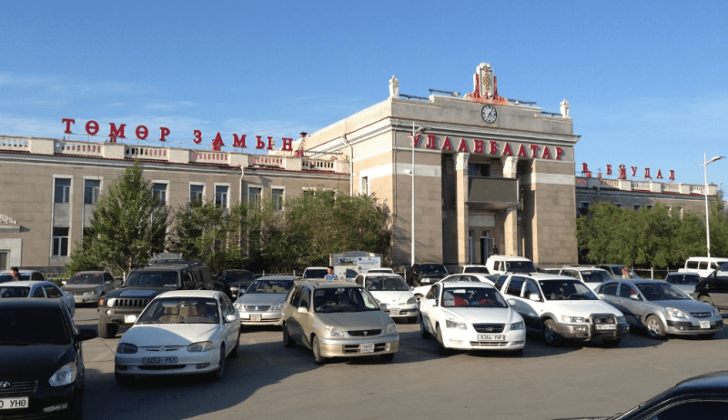

## Улан-Батор – путь в Китай

### 19 сентября 2018, день 32.

Мой поезд отправляется в 17:20. Поэтому днем еще дописываю дневник. Упаковал рюкзак, пообедал и пошел на вокзал. Иду пешком – благо от хостела до вокзала всего пара километров.

Билет на сидячее место в общем вагоне. Вагон – обычный совковый плацкарт. Сразу лезу на верхнюю полку и засыпаю. Всё остальное будет завтра.

