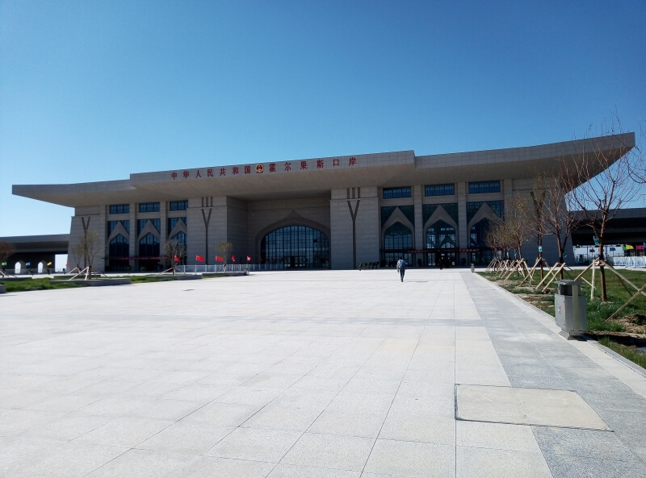
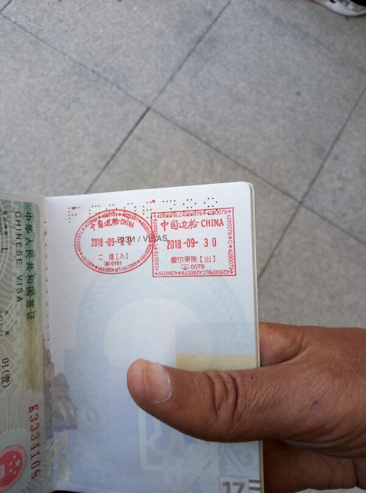

## Харгоси – таможня – Алматы

### 30 сентября, день 43

Поезд пришёл около 8 утра, но на улице ещё совсем темно (см. день 41). Вышел из вокзала в приграничном городке Харгоси. На площади перед вокзалом толпились встречающие поезд таксисты, частники. Здесь же нашёл автобус, который за 2 юаня довёз меня до таможни. По дороге, при въезде в город, на пограничном посту, меня высадили из автобуса, повели в домик пограничников, проверили вещи, документы, задали стандартные вопросы о целях визита. Всё это время автобус, со всеми пассажирами, стоял и ждал моего возвращения!

Таможня, как и всё в Китае, очень большая. Перед ней две очереди: одна – для китайцев, вторая – для остальных. Я – во второй. Таможня ещё закрыта, все ждут перед дверьми: все из китайской очереди строем стоят внутри ограждения, а мы, на просторной площадке, расселись в хаотичном порядке на вещах.

Начали запускать. Тут уже никакого порядка – все ломятся вперёд. Внутри – сканер паспорта и биоданных. Привычно сую в щель паспорт, смотрю в глазок камеры – турникет открыт. Дальше – сканируют вещи – тоже всё в порядке. Последний пункт – паспортный контроль сотрудниками таможни. Проверяют, пропускают. На выходе, когда вышел из бегущей и толкающейся толпы, посмотрел паспорт, а там нет штампа о выезде. Т.е. меня просто проверили и пропустили. Подхожу к пограничнику и интересуюсь, почему мне не поставили штамп. Он даже не пытался говорить со мной и пользоваться переводчиком в телефоне, а просто вылавливал из толпы казахов, говорящих по-русски. Ну как, говорящих? Они говорили: "Здравствуйте" и переходили на казахский. Пообщавшись с четырьмя-пятью казахами, я начал понимать, что это не международный пропускной пункт, а только для граждан смежных стран, т.е для казахов и китайцев, и здесь мне штамп не поставят, а пограничник хочет найти человека, который отведёт меня на другую, международную таможню. С одной женщиной, знающей слов 10 по-русски, я, наконец, свалил от пограничника.

В нейтральной зоне оказался целый город беспошлинных магазинов, огромных торговых центров, дешёвых закусочных. Здесь даже местный транспорт есть: такси, автобусы, рикши; на перекрёстках моргают светофоры. Все те люди, с которыми я проходил через китайскую таможню, не собираются ехать в Казахстан. Они закупают баулы дешёвых ништяков и тащат всё это назад – продавать в Китае. Женщина, которая провожала меня от таможни, так до конца и не поняла, чем же мне нужно помочь. Она подвела меня к стоянке. Здесь люди садились в такси и открытые электровагончики. Ещё раз пытаюсь выяснить, как мне попасть на другую таможню. К разговору подключилась девушка, которая посоветовала ехать вместе с ними на одном из вагончиков. Едем, водитель высаживает всех около торгового центра, я тоже встаю, но он меня останавливает, говорит, что мне ехать дальше. Доехали до другого торгового центра, водитель показал на стоянку такси.

Я подошел к таксистам около торгового центра в нейтральной зоне и начал выяснять, как мне отсюда выбраться. Один парень очень хорошо говорил по-русски: как же это приятно опять общаться на знакомом языке! Он начал спрашивать что я ищу, куда мне нужно и пообещал вывезти меня. Сажусь к нему в машину, едем. Выезжаем из торгового города и едем по дороге в степи. Таксист звонит кому-то, говорит, чтобы готовились пропускать клиента. Подъезжаем к пропускному пункту в степи, водитель говорит, чтобы я сидел в машине. Он вышел, поговорил с пограничником, тот только взглянул через окно машины на меня. Вернулся водитель, сказал, что всё в порядке, можно ехать дальше. Я снова интересуюсь по поводу штампа в паспорте. Водитель выходит к погранцу, выхожу и я. Спрашиваю у него про штамп в паспорт. Он поинтересовался, в какой такой паспорт мне нужен штамп, я показал ему свой загран. Да, это оказалась уже казахская таможна тоже для местных и штампы они не ставят. Я мог быть уже в Казахстане, правда, нелегально, но я подумал о том, как мне потом выезжать без официального въезда, и, кроме того, мне китайцы не поставили выезд, что плохо скажется на повторном получении визы.

Таксит спрашивает, что я решил, говорю, чтобы вёз меня назад в Китай. Вернулись в беспошлинный город, там я отыскал выход из нейтральной зоны. Пограничник на входе в пропускной пункт сортировал людей: тех, кто затарился и шел с огромными сумками, баулами, коробками, тележками отправлял налево, остальных, и меня с ними, направо. Внутри – стандартная автоматическая процедура: паспорт в щель, глянуть в камеру, рюкзак на ленту – и вот я снова в Китае. Уже на этой стороне спрашиваю у пограничников, где мне найти международную таможню? Собрался, по обычаю, консилиум. Нашёлся англоговорящий парень, который написал на листке необходимые шаги, для реализации моей цели. Всё очень чётко: по пунктам, с необходимыми деталями! Написал он, правда, на китайском. Беру листок, интересуюсь, что же мне делать то? Таможенник удивляется, мол, здесь же всё написано! Я спрашиваю, в какую сторону мне хотя бы идти? Снова небольшой консилиум и я, в полицейской машине, еду на автовокзал. По пути выясняю, что пешеходного международного перехода здесь нет, только автомобильный, но из Харгоси в Казахстан ходят автобусы. Пограничник передаёт меня полицейскому на автовокзале, тот ведёт меня к кассе. Здесь я показываю кассирше мой, написанный на листке, план. Она кивает, берёт мой паспорт, деньги и вот у меня в руках билет в Казахстан.

Прохожу очередной сканер и выхожу на платформу автовокзала. Нашёл пожилого мужчину, у которого пытаюсь спросить, как мне определить мой автобус. Тот, на русском (!) языке объясняет, где у меня в билете написан номер автобуса. На платформе нашёл небольшой магазинчик, покупаю там печеньки – сегодня ещё не ел, а на часах уже третий час дня! Поедаю печеньки и наблюдаю, что происходит вокруг: французский турист пытается засунуть разобранный велосипед и седельные сумки в багажник "Спринтера", уже знакомый мне дедушка вяло общается с каким-то парнем. Подхожу к ним, интересуюсь, в какой город едет автобус? Оказалось – в Жаркент. Поболтали немного с парнем. Он едет на первом автобусе, я – на следующем. Надеемся, что ещё встретимся на таможне.

Наконец, небольшой "Спринтер" выезжает с автовокзала. Едем по голой, плоской степи, посреди которой стоит гигантское здание китайской таможни. Подъезжаем на площадь перед таможней. Рядом ещё пара автобусов и больше никакого транспорта: ни легковушек, ни грузовиков. Выясняется, что китайцы пока не пропускают, нужно ждать. Автобус переезжает в тень – солнце жарит по-летнему, я засыпаю.

Проснулся от суеты: все выходят из автобуса, берут вещи, куда-то идут. Беру свой рюкзак, иду со всеми. Быстро проходим китайскую таможню: здесь уже штамп стоит, как и положено! Выходим на стоянку, ждём, когда пропустят наши автобусы. Тут я увидел моего недавнего знакомого – парня с автовокзала, с ним ещё три девушки. Стоим, болтаем. Они – студенты-лингвисты, учат китайский язык, едут домой, ведь завтра праздник с неделей выходных, приглашают меня в гости в Киргизию, в Бишкек. На часах уже 5 вечера. Наконец, подъезжают автобусы, тут выясняется, что есть ещё автобус – до Алматы с небольшой доплатой. Мои знакомые пересаживаются в него, я тоже решил ехать в бывшую столицу. Вторую таможню проходим очень быстро, почти без остановок и едем по казахской пустынной степи, по пути весело общаемся.

Приехали в Алматы. Мои знакомые идут искать автобус на Бишкек. Прошаемся. Здесь уже другой часовой пояс, т.е. выехали мы из Китая в 5 вечера, а заехали в Казахстан в 3 дня! Но, пока доехали до Алматы, уже был вечер. Я начинаю искать жильё. Опросив таксистов, выясняю примерный адрес хостела. Денег местных очень мало, но, предполагаю, что на одну ночь должно хватить. Пытаюсь выяснить у аборигенов и водителей автобусов, как добраться до нужного мне места на городском транспорте: никто не знает. Наконец, молодые ребята нашли в смартфоне по карте нужный мне маршрут. Жду на остановке свой автобус, но, пока я всё это выяснял, уже настало 9 вечера, и, оказывается, в это время он уже не ходит. Вижу, как местное население ловит машины и разъезжается с остановки, я делаю так же и вот я уже еду за 500 тенге до нужной мне улицы. Выхожу на перекрёстке. Здесь, в местном магазинчике, уточняю местонахождение хостела, заодно, закупаю продукты для ужина.

Нашёл хостел, вписался и, наконец, помылся – последний раз это было 4 дня назад, в Джин Ченге! Все грязные вещи сложил в пакет и отдал администратору – они сами стирают, поужинал и спать.