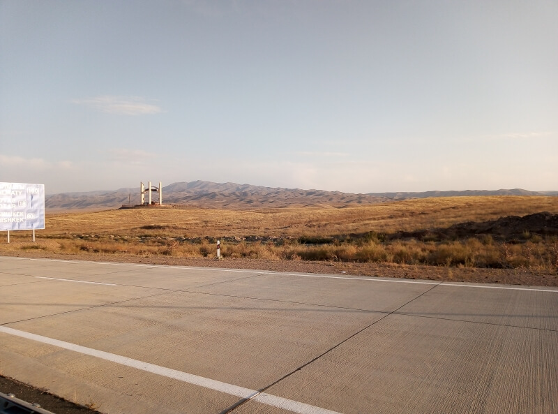

## Алматы – Тараз – Нурлыкент

### 1 октября, день 44

Утром проснулся в хостеле. Оказалось, что мои вещи стирали утром, часов в 6, и они ещё сохнут. Сижу в комнате, ожидаю, думаю, что делать дальше. Часов в 12 дня принесли мои вещи. Я к этому времени решил не задерживаться в Алматы и ехать дальше. На вахте узнал, как добраться до нужного мне выезда – рынок Алтын Орда. На рынке обменял оставшиеся 20 юаней и ещё 5 долларов – в кармане 2800 тенге. Здесь же перекусываю пирожком и иду к выезду из города.

Понемногу, небольшими перегонами, выбираюсь из города, фильтруя таксистов – здесь популярно ездить не на автобусе, а с частниками, которые так зарабатывают. Добрался до развилки на Бишкек, проехал ещё километров 100 до поворота на Шу. От развязки иду километра 3 пешком: дальше, за поворотом, заметил стоянку с придорожной торговлей. Уже начинает темнеть. Пока иду, пытаюсь стопить. Остановилась маршрутка до Тараза, но без денег не берут. Дошёл до стоянки – уже совсем стемнело. Здесь одеваю светоотражающий жилет и начинаю стопить с позиции. Со стоянки выезжает недавняя маршрутка. Для прикола, машу рукой: останавливает. Водитель интересуется, откуда я здесь такой и почему ещё не уехал? Берут бесплатно.

По дороге изучаю карту: вокруг Тараза есть две объездных дороги. Пока решаю, на какой из них лучше выйти, проезжаем первую. Вторая кажется совсем неперспективной и я решаю ехать в город – конечная остановка – "Горбольница". Вышел. Недалеко, километрах в пяти, есть автовокзал Жансая, за ним – нужный мне выезд из города. Уже 11 вечера, иду пешком через город. Прошёл автовокзал, иду дальше. Постепенно заканчивается городская застройка, прохожу торговые центры на выезде. По дороге пытаюсь стопить – все или по городу или таксисты. Думаю, что нужно дойти до удобной позиции, а там уже заночевать.

Иду по пустынной трассе, по дороге пытаюсь стопить редкие машины. И вот, останавливается "Ауди". Говорю водителю, что еду прямо, т.к. здесь везут только до конкретной точки, иначе вовсе не берут. Без лишних вопросов берут. Проехали минут 15. Водитель уточнил, куда мне всё-таки нужно? Объясняю, что еду в Ташкент и меня устроит максимальное расстояние по трассе в этом направлении. Понимает сразу. На повороте в Нурлыкент высаживаюсь.

Слева вдалеке виднеются огни города, справа – пыльная степь с редкими пучками травы. Ищу место, где травы побольше, а пыли поменьше и расстилаю свой лагерь, забираюсь в спальник. Уже в полудрёме понимаю, что нужно ещё утепляться – очень похолодало. Вылезаю, дополнительно одеваю флиску, застёгиваю до конца спальник. Теперь можно спать.