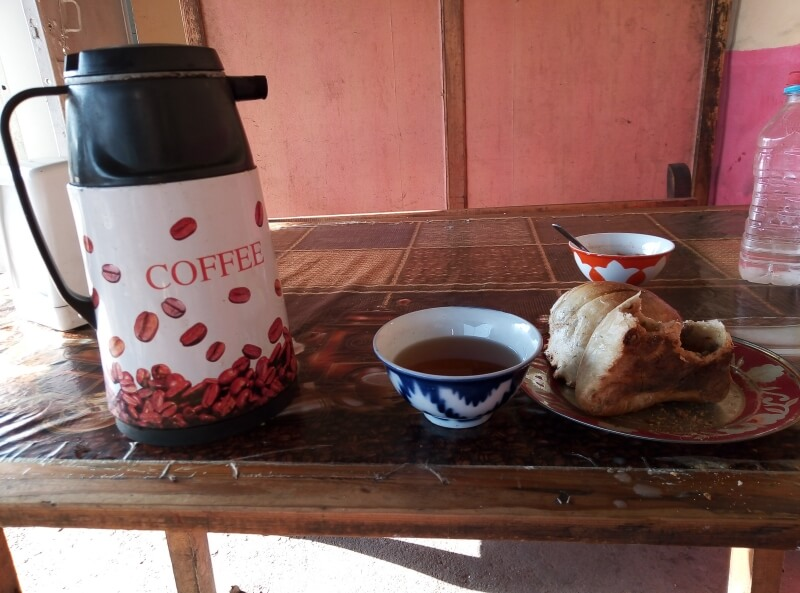
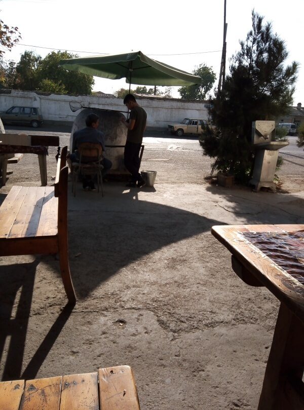

## Ташкент

### 3 октября, день 46

Утром проснулся в квартире брахмана. Позавтракали лепёшками и сладостями. Я решил поселиться ещё на ночь в хостеле, чтобы получить регистрацию. Прощаюсь с брахманом, тот даёт мне с собой лепёшек, огурцов, сладостей. До хостела – пара километров, но пока дошёл, вспотел: в 8 утра температура +27 градусов.

"Тапчан-хостел" очень приятный, плюс по утрам подают завтрак с местными овощами, арбузами, дынями. Мой завтрак будет завтра, поэтому ем свои лепёшки и пью узбекский, очень вкусный зелёный чай. Заселение в хостел с двух часов дня, поэтому, моё место ещё не готово. Пока же сижу в холле, пишу заметки. Замечаю странное движение: носят кровати, матрацы, народ перетаскивает вещи. Здесь хостел очень гибкий – происходит уплотнение населения: женскую комнату переселяют в меньшее помещение, общую комнату – в большее, при этом, последнюю максимально уплотняют. Мне, кстати, постелили матрац на полу, а некоторых разместили в общей комнате, тапчане, на коврах.

Пошёл прогуляться в город. Понял, насколько я не люблю столицы и вообще крупные города: здесь всё большое, найти интересные места, даже зная направление, очень сложно. Но обнаружил и приятный момент: это пока первая страна, где бесплатно, при заказе даже самой дешёвой самсы, на столик возле тандыра тебе ставят целый чайник вкуснейшего свежезаваренного зелёного чая.

Находился, утомился. Зато решил как буду выбираться из города. Самый удобный, быстрый и дешёвый способ преодолеть притяжение мегаполиса и миновать города-сателлиты – это ехать на электричке. Поэтому, я заехал на Южный вокзал и купил билет до станции Нау. Вернулся в хостел, поужинал. Пора спать – завтра рано на электричку.