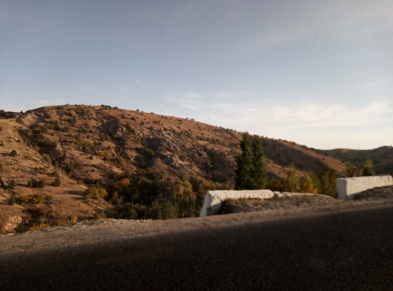

## Ташкент – аул в Гузарском районе

### 4 октября, день 46

Утром, в общей комнате хостела, нехилый движ. Народ разъезжается: кто на экскурсию, кто совсем съезжает. Встаю и я. Выпил чаю с лепёшкой и сыром, собрался. Пора!

На маршрутке доехал до Южного вокзала, нашёл свою электричку, у дедушки на платформе узнал конечный пункт её назначения – Гулистан. Посмотрел по карте, решил ехать до станции Шарузяк: от неё до удобной развилки всего пара километров. Поехали. Подошёл кондуктор, поинтересовался, куда мне ехать и взял с меня ещё 3 тысячи сомов – в итоге вышло 5 тыс. Рядом сидят рыбаки, обсуждают рыбалку на Сырдарье, я смотрю в окно на окружающие пейзажи – в основном пыльные степи и хлопковые поля. Переезжаем по мосту Сырдарью, разлившуюся на сотни протоков и заросшую камышом. Кондуктор, кажется, знаком со всеми пассажирами: здороваются, что-то обсуждают.

На станции Шарузяк вышел я один. Рядом трасса. Иду по глубокой, мягкой пыли, в сторону развязки. Вдоль дороги тянется арык. Как здесь принято, сразу за поворотом развязки, стоит кучка местных – ловят такси. Бизнес не отстаёт – тут же развернулась торговля: фрукты, лепёшки, напитки. Я же прохожу дальше: во-первых, чтобы не смешиваться с желающими ехать на такси, во-вторых, метров через 300 вливается ещё одна трасса, так что вероятность уехать больше.

Останавливаю машину, в ней сидят трое, обещают довезти до Самарканда. Сидящий рядом со мной на заднем сиденье попутчик, по-русски не говорит и вообще очень молчалив, водитель тоже не особо разговорчив. Их обоих компенсирует передний пассажир, Али, который активно интересуется заработками в Украине, моим путешествием и т.д.

Заехали на заправку. Надо сказать, что Узбекистан очень бюрократическая страна и люди, чтоб было меньше хлопот, уже издавна привыкли соблюдать правила. Так вот, на заправке все пассажиры обязательно выходят из машины и идут на специально оборудованную площадку. Там, бывает, образовывается местная торговля. Вот и здесь был мини-рынок. Али купил огромный гранат и разделил его со мной и нашим молчаливым попутчиком. Гранат был очень большим и очень сладким!

Едем дальше, болтаем. Мои попутчики едут из Ферганской долины в Карши и уже несколько дней не были дома. Али, по приколу, предлагает ехать с ними. Я, по приколу, соглашаюсь. В итоге, Самарканд проходим по объездной. На окраине заехали на базар – все набирают хлеба, и, периодически, торгуются за большое керамическое блюдо, но, похоже, не сходятся в цене.

Начался подъём в горы, а дальше – горный серпантин с узкой дорогой, крутыми поворотами, отвесными обрывами и нависающими валунами. Красотища! Ребята восторгаются вместе со мной. Признаются, что есть другая, равнинная дорога, но по этой поехали, чтобы мне показать. Сразу за перевалом, перед спуском, заехали в чайхану, которая взбирается ярусами на скалу – места на серпантине мало. Поднялись на третий ярус: пейзаж, открывшийся с перевала, просто сказочный! В меню много овощей и фруктов – то что надо! Поели, едем дальше. На спуске много маленьких аулов, прилепившихся на крутых склонах: здесь играют детишки, сидят на лавочках старики, пасутся коровы, бараны, ослики. Дорога очень красивая, но, как говорят мои попутчики, зимой эти места надолго отрезаны от мира.

И вот мы снова на равнине. Меня спрашивают, интересно ли мне посмотреть место, где родился Тамерлан? Что за вопрос – конечно! И мы заезжаем в Шахрисабз. В городе немного поплутали, но, уточнив у местных дорогу, выезжаем к большому комплексу Амир Тимур. Уже смеркалось, но мы взяли по мороженому и пошли прогуляться по территории. Узбеки очень уважительно относятся к своей истории и её героям. Али очень много и подробно рассказывал о Тимуре и вообще об истории Средней Азии. Внутри комплекса, из древнего только остатки сарая – Аксарай: две башни, высотой метров по 40-50, украшенные древней мозаикой а также остатки мозаичного покрытия площади. Остальное: мечети, гостиницы, фонтаны, парки – уже современной постройки. Парки активно освоены местной молодёжью. После, примерно, часовой прогулки, с помощью советов местных и навигатора в моём телефоне, выбираемся из города на трассу и дальше едем уже в темноте.

Приехали в аул. Возле ворот одного из домов высаживаем молчаливого мужичка. Вскоре, выгружаемся и мы с Али возле его дома. Из ворот выбежали встречать двое детишек, вышла жена. Младший сынишка тут же получил подарок – игрушечный пистолет, купленный на базаре в Самарканде. Все вместе заходим в дом и, сложив вещи, идём в отдельную комнату, где смотрела телевизор мама моего попутчика. При нашем появлении она передвинулась к стенке, а мы с Али уселись на подушках по центру комнаты, с двух сторон от скатерти, расстеленной на полу (дастархан). Его жена приносит нам суп, чай, лепёшки, фрукты.

Папа, устроившись поудобнее на подушках, тискает сынишку, лет пяти, а старшая дочь, девочка лет семи с медно-рыжими волосами, сидит рядом с бабушкой. Замечаю, что девочка тихо плачет, по щекам густо текут слёзы. Подозреваю, что причина – отсутствие подарка для неё. Выгребаю из кармана горсть сувенирных украинских монет и сую в ладошку девочки. Надо сказать, что в Узбекистане все деньги бумажные и монеты для них в диковинку. У девочки слёзы, вроде, капать перестали, она пересыпает монетки из одной ладони в другую, но всё равно сидит насупившись. Папа подзывает её к себе, обнимает, девочка, наконец, начинает что-то щебетать, но потом отстраняется и снова уходит к бабушке.

Мои попутчики в дороге очень устали, да и время уже позднее, так что особо не засиживаемся, идём спать. У них в каждой комнате лежит матрац, на котором они сидят, поэтому, мне предоставляют выбор комнаты, куда добавляют подушку с одеялом – постель готова. Раздеваюсь, ставлю на зарядку телефон и спать.

