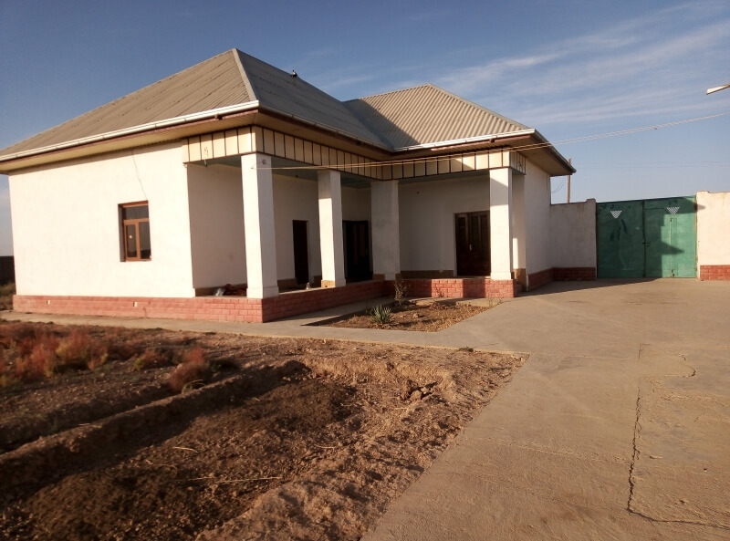
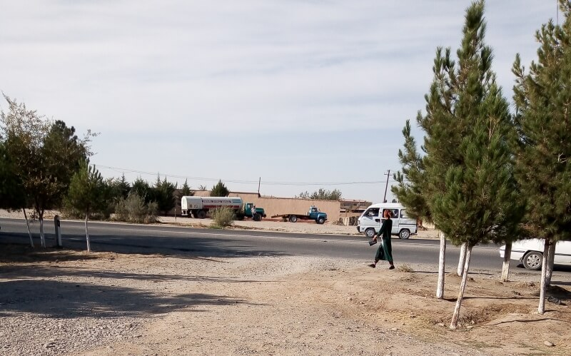
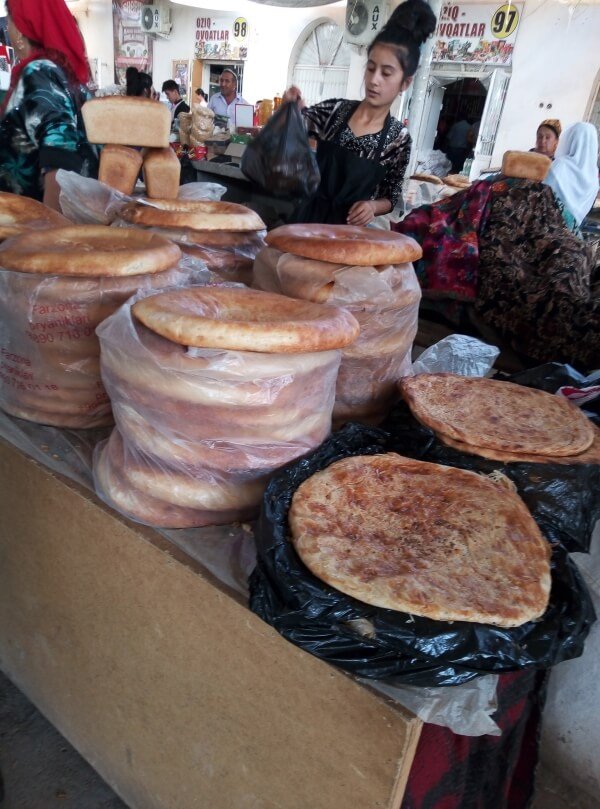
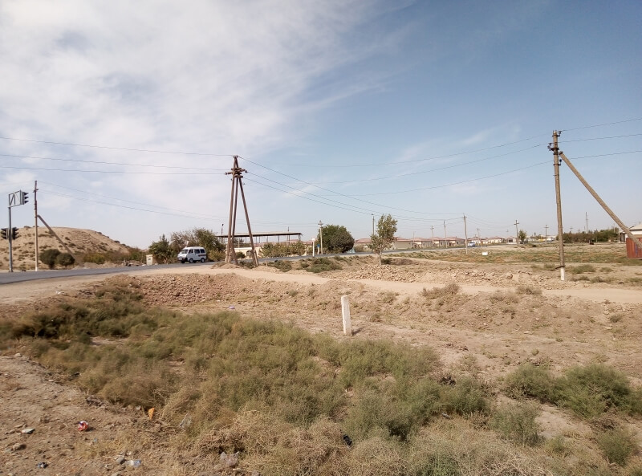

## Аул в Гузарском районе – Бухара

### 5 октября, день 48

Утром я вышел во двор. Там, типа, во флигеле, уже движение: Али пьёт чай, его жена хлопочет по хозяйству, дочка собирается в школу (она учится в первом классе). Я усаживаюсь на подушки к "столу" и мы завтракаем: чай, восточные сладости домашнего производства, лепёшки, сыр, виноград, дыня. Али пообещал довезти меня до города, но сначала он отвезёт дочку в школу. Пока он ездил, пришёл парнишка – наёмный пастух, выгнал из загона отару овец с козами и погнал их пасти.

Вернулся Али. Говорит, что ему нужно пройти техосмотр в райцентре, а потом, если всё будет в порядке, он отвезёт меня в областной центр – в Карши. По дороге Али переживает, как бы застать начальника ГАИ – сейчас время уборки хлопка и он может быть где-то на полях. Но переживания оказались напрасны – начальник на месте: курсирует между гаражом, где проверяют газовое оборудование, и контрой ГАИ, через дорогу. Механик быстро проверил нашу машину, а после этого Али начал ходить с бумагами по разным местам, мы несколько раз ездили в банк. И вот, наконец, все бумаги в порядке, техосмотр пройден.

Вся эта процедура заняла гораздо больше времени, чем мы рассчитывали, поэтому Али сажает меня на местное такси до Карши. Там я добрался до автостанции "Бухара", вышел за город и понемногу двигаюсь в сторону Бухары. По дороге познакомился с местным бизнесменом из Муборака. С ним мы объехали его магазины в городе, заехали на базар, а затем он довёз меня до границы области. В Бухару я въехал на автобусе со спортсменами, почти в самый центр.

Уже вечер, надо думать о ночлеге и регистрации – уже прошло 2 дня с даты последней регистрации, а больше 3х дней без неё нельзя. Иду по городу и навожу справки у аборигенов и таксистов, но все предлагают только дорогие отели. Наконец, на одном из перекрёстков, таксисты сказали, что есть здесь недалеко хостел и рассказали как туда добраться. Пробираюсь по узким улочкам старого города, нахожу ориентир, указанный таксистами – отель Al-Hilol.

Зайдя в холл, понимаю, что обстановка вокруг явно не дешёвого хостела. Ко мне вышел администратор, Али (везёт мне сегодня на это имя). Я начал спрашивать его о ценах, а он, вместо ответа, интересуется не я ли бронировал у него номер через букинг? Узнав, что бронировал комнату не я и что я путешествую автостопом, сказал, что номера в его отеле (он оказался ещё и директором) дорогие и повёл меня в дом своей мамы, который был по соседству. С ней договорились о комнате за 20 тысяч сомов. Али показал мне комнату, душ, включил бойлер. И, пока последний грелся, мы пошли в столовую отеля, куда был вход прямо со двора. Там я подключился к гостиничному вай-фаю, мы расположились на диване. Я написал пару сообщений, а потом мы с хозяином пили чай и болтали на совершенно разные темы. Подходили постояльцы: пара из России и девушка Эва из Чехии. Последняя посидела немного с нами. И Пока Али договаривался о машине для экскурсии в Хиву дла неё, Эва рассказала мне, что видела интересного в Узбекистане, показала бухарский сувенир – кованые ножницы в виде журавля, я немножко рассказал о своей поездке.

Через некоторое время пришла мама Али сообщить, что вода в бойлере нагрелась. После душа, я опять пошёл в отель по-пользоваться интернетом. Опять разговорились с хозяином. Позже, его мама позвала нас на ужин, но мы так увлеклись беседой, что она, видя, что нас трудно вырвать, принесла ужин к нам. Общались мы с Али на самые разные темы: о бухарских евреях (есть такой исторический феномен), путешествиях, о гостиничном бизнесе, вспоминали впечатления детства, подростковые приключения и т.д. Наконец, часа в 2 ночи пошли спать.