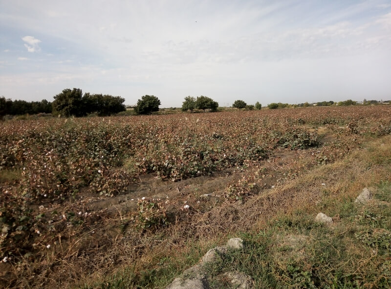
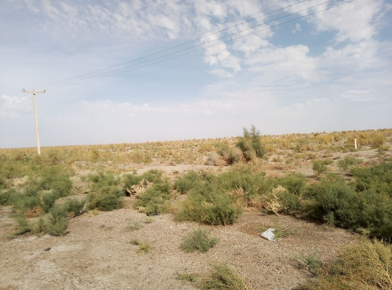
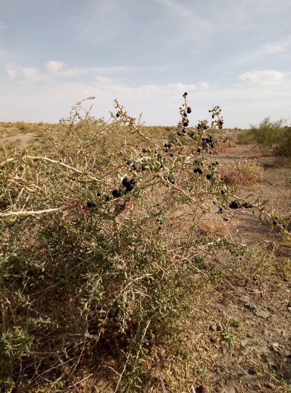
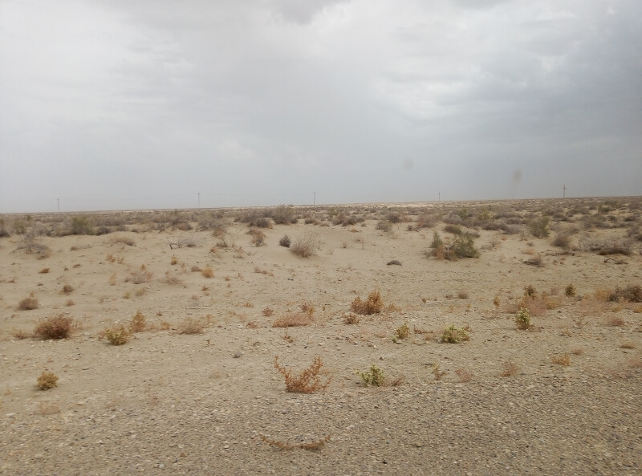
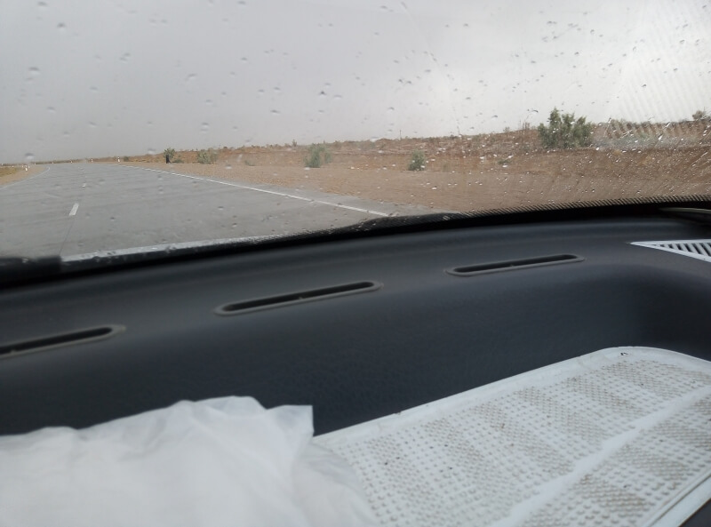
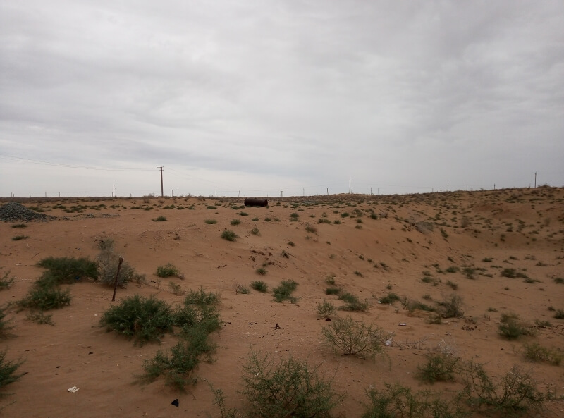

## Бухара – казахская таможня

### 6 октября, день 49

Вчера вечером узнал у Али, директора отеля Al-Hilol, как лучше выбраться из города. Доехал на автобусе до кольца на выезде, прошёл немного пешком – подальше от зоны таксистов. Сегодня цель – добраться до города Нукус – столицы Каракалпалкистана.

За Бухарой пошла уже пустыня-полупустыня: пески да верблюжьи колючки. На грузовичке проехали участок совершенно разбитой дороги – здесь и так дороги не особо хорошие, а тут ещё и строительство моста через железную дорогу, так что грузовиками покрытие окончательно убили. Хотя, меня уверяли, что в Каракалпакии дороги будут ещё хуже. Грузовичёк вёз аккумулятор для тягача, ставшего на трассе, поэтому выхожу прямо в пустыне. Дальше ехал с общительным дедушкой и его внуком, с которыми проехали километров 250. По пути нас застал дождь, который перешёл в песчаную бурю, потом снова доджь... Вышел я на повороте на Мискин – там, на ж.д. станции, они встречали поезд из России. Здесь я остановил Шевроле-дамас – любимую марку местных таксистов, поэтому сразу поинтересовался, довезут ли бесплатно? Да, конечно! Ребята обещают довезти до Беруни. По дороге болтаем о жизни. Заехали в город, подъехали к автостанции. Ребята попросили немного подождать. Пока я общался с водителем, второй парень вернулся и показывает на машину, стоящую неподалёку. Говорит, что дорогу до Нукуса они мне оплатили. Пока я грузил рюкзак в багажник и сам размещался, ребята принесли мне в дорогу пару пирожков, пакет печенья и бутылку воды. Ничего себе подвезли! Благодарю безымянных доброжелателей!

По дороге в Нукус, обдумываю варианты ночёвки. Али, в Бухаре, сделал мне регистрацию авансом на два дня, так что можно пока об этом не беспокоиться. Денег не так много, так что я склоняюсь к ночёвке в поле. Заехали в Нукус, завезли одного пассажира на окраину. Смотрю карту – совсем рядом нужный мне выезд из города, поэтому тоже выхожу. В город я не попадаю, но особо об этом не жалею. Иду в сторону выезда. По дороге перехожу мост через реку Амударья. Речка совсем небольшая, зато через шлюз, что отбирает воду в каналы, проходит воды значительно больше.

Вот и выезд. Вечер, но ещё не темно. Планирую отъехать немного от города, чтобы завтра легче стартовать к таможне. По карте вижу, что недалеко – сложный разъезд у Ходжейли перед прямым перегоном к границе – надеюсь миновать сегодня это препятствие. Здесь, на выезде, останавливаю Ладу-приору, говорю о своём намерении доехать до Ходжейли или немного дальше. Как только отъехали, меня спросили, куда я дальше еду? Оказывается, они едут к таможне, но тут же интересуются моей платёжеспособностью. Честно говорю, что у меня осталось около 60 тыс. сомов, на что они говорят, что до таможни (туда ещё больше 400 км) этого крайне недостаточно. Предлагаю вариант: подвезти меня, куда не жалко, бесплатно, а там уж я сам доеду. В итоге, еду до таможни!

А дороги в Каракалпакии действительно ужасные – гигантские выбоины, асфальт на большей части дороги давно выбит, а там где он ещё остался – сложился в огромные складки. Часто, лучший путь оказывается по обочине. И это, надо заметить, международная магистраль! Едем зигзагами, уворачиваясь от колдобин и встречных машин. Водитель попросил у меня телефон, вставил в него симку и всю дорогу с кем-то болтал. Мы слушаем узбекскую музыку, нас бросает по кабине, но едем вперёд. Около полуночи, водитель сказал, что устал и мы устроились спать. Через час двинулись дальше. Позже, ещё раз останавливались поспать. Наконец, к четырём утра, добрались до таможни.

Я вышел из машины и сразу почувствовал, что здесь уже не Ташкент – холодина. Выдыхая клубы пара, надеваю, поверх флиски, куртку, которую не доставал с самой Монголии! Прохожу таможню. Узбекский пограничник интересуется регистрацией. Выгребаю на стойку мои справки. Тот, не особо вникая, посмотрел на бумажки и поставил штамп в мой паспорт. Казахскую таможню прошёл легко. Я снова в Казахстане!

На выходе из таможни, в глубокой темноте, замечаю две-три чайханы, будку страхования и очередь из фур. Больше ничего не разглядеть. Пытаюсь фонариком подсветить окружающий пейзаж, но ничего нового не увидел – похоже, вокруг голая степь. Зашёл в одну чайхану, спросил чаю. Барышня заломила космическую цену, так что ем свои печеньки, запиваю водой. Когда рассвело, вышел, поменял в другой чайхане узбекские сомы на казахские тенге. Пора ехать дальше.