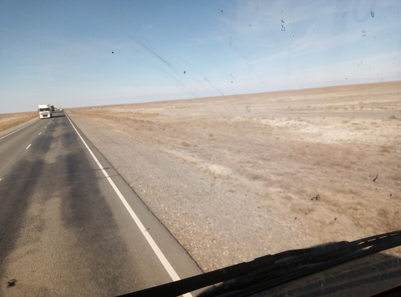

## Казахская таможня – Атырау

### 7 октября, день 50

Да, как мне в темноте и показалось, вокруг реально пустыня-полупустыня. Но к ночным впечатлениям добавилась совершенно разбитая дорога, рядом с которой, правда, начинают строить новую. Выезжаю от таможни по этой раздолбанной трассе до автосервиса. Отсюда, уже по новой дороге, на пикапе еду до поворота к посёлку. Рядом вижу заправку, иду по дороге туда. Перед заправкой стоянка, на площадке стоит фура, к которой как раз подходит водитель. Кричу ему с дороги, что еду в Россию и может ли он подвезти меня малость. Говорит, залезай, куда-нибудь довезу.

Водитель, Вадим, везёт груз до Уральска. Обсудили мой маршрут, сделали вывод, что вариантов у меня нет и он высадит меня на развилке в Атырау. Ехать больше 400 км. По дороге Вадим рассказывал о природе Казахстана – он заядлый охотник и рыболов и объездил всю страну. Перекусили в чайхане и дальше всю дорогу болтали на самые разные темы. В Казахстане, как и в Монголии, бараны пасутся сами и часто выходят на трассу и приходится через стада проезжать, расталкивая животных бампером. Но есть и специфика. Встречаются здесь верблюды, которые тоже иногда выходят на дорогу. Но, в отличие от мелких копытных, они не пугаются, а наоборот, любопытствуют и опускают голову, чтобы заглянуть в кабину нашей высокой фуры.

В Атырау я был часов в 5 вечера, до границы ещё около 300 км. Еду понемногу вперёд. Парень, бывший студент-энергетик, довёз 60 км до райцентра. Оттуда проехал малость на грузовичке, потом ещё 30 км с мужичком, у которого загорелась проводка, а я ему подсвечивал (уже стемнело) фонариком, пока он разбирался с проводами. На повороте к посёлку я вышел и решил здесь и заночевать.

Вокруг – плоское поле с редкими пучками травы, земля – глинистая. В темноте стало холодно, да ещё и ветер. Ищу какую-нибудь ложбинку, чтобы укрыться от ветра. Вроде что-то нашёл. Над головой яркие звёзды. Съел кусок лепёшки и полез в спальник.